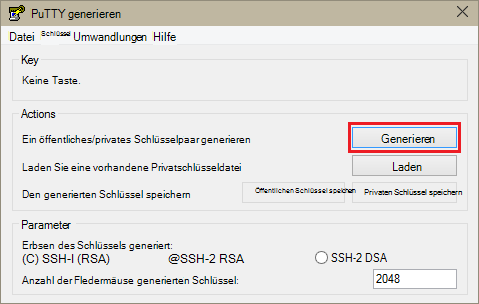
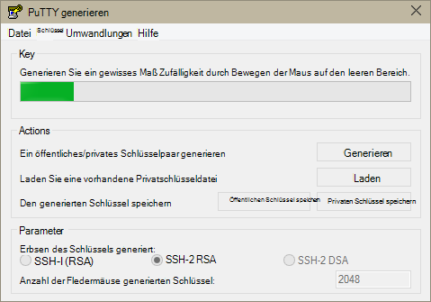
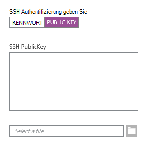
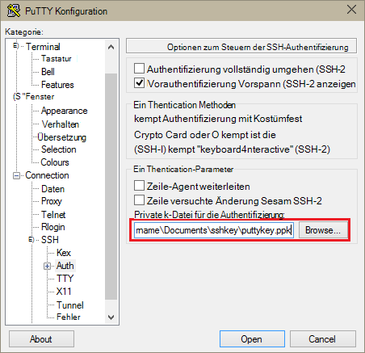
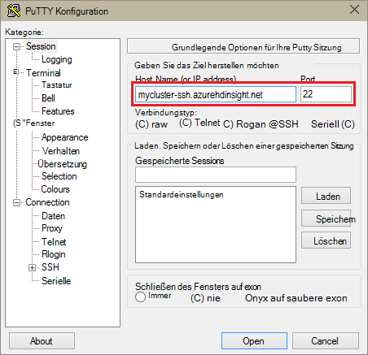
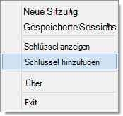
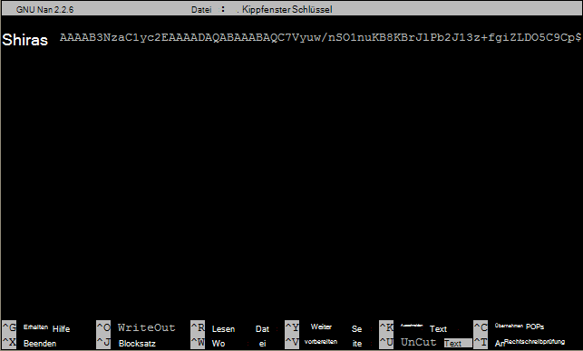

<properties
   pageTitle="Verwenden von SSH-Schlüssel mit Hadoop auf Linux-basierten Clustern von Windows | Microsoft Azure"
   description="Informationen Sie zum Erstellen und Verwenden von SSH-Schlüssel HDInsight Linux-basierten Clustern authentifizieren. Windows-basierte Clients über kitten SSH-Client, um Cluster zu verbinden."
   services="hdinsight"
   documentationCenter=""
   authors="Blackmist"
   manager="jhubbard"
   editor="cgronlun"
    tags="azure-portal"/>

<tags
   ms.service="hdinsight"
   ms.devlang="na"
   ms.topic="get-started-article"
   ms.tgt_pltfrm="na"
   ms.workload="big-data"
   ms.date="08/30/2016"
   ms.author="larryfr"/>

#Verwenden Sie SSH mit Linux-basierten Hadoop auf Windows HDInsight

> [AZURE.SELECTOR]
- [Windows](hdinsight-hadoop-linux-use-ssh-windows.md)
- [Linux, Unix, Mac OS](hdinsight-hadoop-linux-use-ssh-unix.md)

[Secure Shell (SSH)](https://en.wikipedia.org/wiki/Secure_Shell) können Sie Remote auf Linux-basierten HDInsight Cluster über eine Befehlszeilenschnittstelle ausführen. Dieses Dokument enthält Informationen zum Verbinden mit HDInsight von Windows-basierten Clients mit kitten SSH-Client.

> [AZURE.NOTE] Die Schritte in diesem Artikel angenommen, Sie verwenden einen Windows-Client. Bei Verwendung von Linux, Unix oder OS X-Clients finden Sie unter [Verwenden SSH mit Linux-basierten Hadoop auf HDInsight von Linux, Unix oder OS X](hdinsight-hadoop-linux-use-ssh-unix.md).
>
> Wenn Sie Windows 10 und [Bash auf Ubuntu unter Windows](https://msdn.microsoft.com/commandline/wsl/about)verwenden, können Sie die Schritte in [Verwenden SSH mit Linux-basierten Hadoop auf Linux, Unix oder Mac OS HDInsight](hdinsight-hadoop-linux-use-ssh-unix.md) -Dokument verwenden.

##Erforderliche Komponenten

* **Kitten** und **PuTTYGen** für Windows-basierte Clients. Diese Dienstprogramme sind [http://www.chiark.greenend.org.uk/~sgtatham/putty/download.html](http://www.chiark.greenend.org.uk/~sgtatham/putty/download.html)verfügbar.

* Einen modernen Webbrowser, der HTML5 unterstützt.

ODER

* [Azure CLI](../xplat-cli-install.md).

    [AZURE.INCLUDE [use-latest-version](../../includes/hdinsight-use-latest-cli.md)] 

##Was ist SSH?

SSH ist ein Dienstprogramm zum Anmelden und Remote auf einem Remoteserver Befehle ausführen. Linux-basierte HDInsight SSH richtet eine verschlüsselte Verbindung mit dem Cluster-Head-Knoten und stellt einen Befehl, mit dem Sie Befehle eingeben. Befehle werden dann direkt auf dem Server ausgeführt.

###SSH-Benutzername

Ein SSH-Benutzername ist HDInsight Cluster Authentifizierung verwendete Name. Bei Angabe ein Benutzernamens SSH während der Clustererstellung ist dieser Benutzer auf allen Knoten im Cluster erstellt. Nach Erstellung des Clusters können dieser Benutzername Sie HDInsight Cluster-Head-Knoten verbinden. Aus dem Head-Knoten können Sie dann einzelne Arbeitskraft Knoten verbinden.

###SSH-Kennwort oder öffentlichen Schlüssel

Ein SSH-Benutzer können entweder ein Kennwort oder öffentlichen Schlüssel für die Authentifizierung. Ein Kennwort ist nur eine Textzeichenfolge soll, während ein öffentlicher Schlüssel Teil ein kryptografisches Schlüsselpaar generiert, um eindeutig zu identifizieren.

Ein Schlüssel ist sicherer als ein Kennwort erfordert zusätzliche Schritte zum Generieren des Schlüssels, und Sie müssen die Dateien mit dem Schlüssel an einem sicheren Ort. Jeder Benutzer erhält Zugriff auf wichtigen Dateien erhalten sie Zugriff auf Ihr Konto. Oder wenn Sie wichtigen Dateien verlieren, Sie werden nicht auf Ihr Konto anmelden.

Ein Schlüsselpaar besteht aus einem öffentlichen Schlüssel (der HDInsight Server an) und einem privaten Schlüssel (der auf dem Clientcomputer gespeichert wird.) Beim Herstellen einer Verbindung mit dem HDInsight-Server über SSH verwendet SSH-Client den privaten Schlüssel auf Ihrem Computer den Server authentifiziert.

##Erstellen Sie einen SSH-Schlüssel

Verwenden Sie Folgendes, wenn Sie mit Ihrem SSH-Schlüssel verwenden möchten. Wenn Sie ein Kennwort verwenden möchten, können Sie diesen Abschnitt überspringen.

1. Öffnen Sie PuTTYGen.

2. Wählen Sie für den **Schlüsseltyp zu** **SSH-2 RSA**und klicken Sie auf **generieren**.

    

3. Bewegen der Maus im Bereich unterhalb der Statusanzeige bis die Leiste füllt. Bewegen der Maus generiert zufällige Daten, die zum Generieren des Schlüssels verwendet wird.

    

    Nachdem der Schlüssel generiert wurde, wird der öffentliche Schlüssel angezeigt.

4. Für zusätzliche Sicherheit können Geben Sie ein Kennwort im Feld **Passphrase Schlüssel** und geben den gleichen Wert im Feld **Kennwort bestätigen** .

    

    > [AZURE.NOTE] Es wird dringend empfohlen, dass Sie eine sichere Passphrase für den Schlüssel verwenden. Wenn Sie das Kennwort vergessen, gibt jedoch keine Möglichkeit, die Datenbank wiederherzustellen.

5. Klicken Sie auf den Schlüssel in einer **.ppk** Datei speichern **Speichern privaten Schlüssel** . Dieser Schlüssel wird zum Cluster HDInsight Linux-basierte Authentifizierung verwendet.

    > [AZURE.NOTE] Wie auf Linux-basierten HDInsight Cluster verwendet werden kann, sollten Sie diesen Schlüssel an einem sicheren Ort speichern.

6. Klicken Sie auf den Schlüssel als **txt** -Datei speichern **Speichern öffentlichen Schlüssel** . Dadurch können Sie den öffentlichen Schlüssel in Zukunft wiederverwenden, wenn Sie zusätzliche HDInsight Linux-basierten Cluster erstellen.

    > [AZURE.NOTE] Der öffentliche Schlüssel wird auch am Anfang der PuTTYGen angezeigt. Sie können mit der rechten Maustaste hier kopieren Sie den Wert und fügen es in ein Formular ein Cluster über das Azure-Portal.

##Erstellen Sie einen Linux-basierten HDInsight-cluster

Beim Erstellen eines Linux-basierte HDInsight-Clusters müssen Sie den zuvor erstellten öffentlichen Schlüssel angeben. Der Windows-basierten Clients sind zwei Methoden zum Erstellen eines Linux-basierten HDInsight Clusters:

* **Azure-Portal** - verwendet Web-basierte Portal Erstellen des Clusters.

* **CLI für Mac, Linux und Windows Azure** - verwendet Befehlen Erstellen des Clusters.

Jede dieser Methoden erfordert den öffentlichen Schlüssel. Vollständige Informationen zum Erstellen eines Linux-basierte HDInsight-Clusters finden Sie unter [Bereitstellung von Linux-basierten HDInsight-Cluster](hdinsight-hadoop-provision-linux-clusters.md).

###Azure-Portal

Verwendung der [Azure-Portal] [ preview-portal] zum Erstellen eines Clusters Linux-basierten HDInsight müssen Sie einen **SSH Benutzername**eingeben und ein **Kennwort** oder eine **Öffentliche SSH-Schlüssel**eingeben.

Wenn **Öffentliche SSH-Schlüssel**auswählen, können Sie entweder den öffentlichen Schlüssel einfügen (angezeigt der __öffentlichen Schlüssel zum Einfügen in OpenSSH autorisiert\_Schlüssel Datei__ PuttyGen, Feld) __SSH PublicKey__ -Feld oder auswählen __einer Datei__ durchsuchen und Auswählen der Datei, die den öffentlichen Schlüssel enthält.

Dies erstellt einen Benutzernamen für den angegebenen Benutzer und Kennwortauthentifizierung oder SSH-Schlüssel-Authentifizierung aktiviert.

###Befehlszeilenschnittstelle für Mac, Linux und Windows Azure

Können Sie einen neuen Cluster erstellen [CLI für Mac, Linux und Windows Azure](../xplat-cli-install.md) die `azure hdinsight cluster create` Befehl.

Weitere Informationen zum Verwenden dieses Befehls finden Sie unter [Bereitstellung Hadoop Linux-Clustern in HDInsight mit benutzerdefinierten Optionen](hdinsight-hadoop-provision-linux-clusters.md).

##Linux-basierte HDInsight Cluster verbinden

1. Öffnen Sie kitten.

    

2. Wenn Sie SSH-Schlüssel haben, wenn Ihr Benutzerkonto erstellt, müssen Sie den privaten Schlüssel verwenden, bei dem Cluster den folgenden Schritt ausführen:

    **Kategorie** **Verbindung**erweitern, Erweitern von **SSH**und **Authentifizierung**auswählen. Abschließend klicken Sie auf **Durchsuchen** und wählen Sie die Datei .ppk, die Ihre privaten Schlüssel enthält.

    

3. Wählen Sie **Kategorie** **Sitzung**. Die **Standardoptionen für die PuTTY Sitzung** eingeben der SSH-adressedes Ihres Servers HDInsight im **Host-Namen (oder IP-Adresse)** . Es gibt zwei mögliche SSH Adressen beim Verbinden mit einem Cluster verwenden können:

    * __Head-Knoten-Adresse__: Verwenden Sie zum Verbinden mit dem Head-Knoten des Clusters der Clustername dann **--SSH.azurehdinsight.NET**. Z. B. **MeinCluster-SSH.azurehdinsight.NET**.
    
    * __Rand Knotenadresse__: Wenn Verbindung ein R-Server auf HDInsight Cluster Herstellen der R Rand Serverknoten mit der Adresse __RServer.CLUSTERNAME.ssh.azurehdinsight.net__, wo CLUSTERNAME der Name des Clusters ist. Beispielsweise __RServer.mycluster.ssh.azurehdinsight.net__.

    

4. Um die Verbindungsinformationen für die zukünftige Verwendung speichern möchten, geben Sie einen Namen für diese Verbindung unter **Sessions gespeichert**und dann auf **Speichern**. Verbindung wird die Liste der gespeicherten Sitzung hinzugefügt werden.

5. Klicken Sie auf **Öffnen** mit dem Cluster herstellen.

    > [AZURE.NOTE] Ist dies das erste Mal mit dem Cluster verbunden, erhalten Sie eine Warnung. Dies ist normal. Wählen Sie **Ja** RSA2 Schlüssel des Servers weiterhin zwischengespeichert.

6. Geben Sie bei Aufforderung des Benutzers, den beim Erstellen des Clusters eingegeben. Wenn Sie ein Kennwort für den Benutzer angegeben haben, werden Sie aufgefordert, auch eingeben.

> [AZURE.NOTE] Die oben aufgeführten Schritte Angenommen Sie Port 22 verwenden, die mit der primären Hauptknoten auf HDInsight Cluster verbinden. Verwenden Sie Port 23 verbindet Sie mit der sekundären. Weitere Informationen zu den Hauptknoten finden Sie unter [Verfügbarkeit und Zuverlässigkeit von Hadoop Cluster in HDInsight](hdinsight-high-availability-linux.md).

###Arbeitskraft Knoten verbinden

Workerknoten sind nicht direkt von außerhalb der Azure-Rechenzentrum von Cluster-Head-Knoten über SSH zugegriffen werden

Wenn Sie SSH-Schlüssel Wenn Ihr Benutzerkonto erstellt haben, führen Sie die folgenden Schritte aus, um den privaten Schlüssel verwenden, bei dem Cluster Knoten Arbeitskraft herstellen möchten.

1. Installieren Sie Wahl von [http://www.chiark.greenend.org.uk/~sgtatham/putty/download.html](http://www.chiark.greenend.org.uk/~sgtatham/putty/download.html). Dieses Dienstprogramm wird zum kitten SSH-Schlüssel zwischengespeichert.

2. Führen Sie Kostümfest. Es wird ein Symbol im Statusbereich minimiert. Maustaste auf das Symbol, und wählen Sie **Schlüssel hinzufügen**.

    

3. Erscheint im Dialogfeld Wählen Sie die .ppk-Datei, die den Schlüssel enthält, und klicken Sie auf **Öffnen**. Dies fügt den Schlüssel zu, die es bei der Verbindung mit dem Cluster auf kitten ermöglicht.

    > [AZURE.IMPORTANT] Wenn Sie SSH-Schlüssel verwendet, um Ihr Konto zu sichern, müssen Sie die vorherigen Schritte, bevor Sie Arbeitskraft Knoten herstellen können.

4. Öffnen Sie kitten.

5. Verwenden Sie SSH-Schlüssel zur Authentifizierung im Abschnitt **Kategorie** erweitern Sie **Verbindung** **SSH**, und wählen Sie **Auth**.

    Aktivieren Sie im Abschnitt **Parameter** **Zulassen-Agenten weitergeleitet**. Dadurch kitten Head Clusterknoten Arbeitskraft Knoten Verbindung automatisch die Zertifikatauthentifizierung über die Verbindung übergeben.

    

6. Verbindung zum Cluster wie zuvor beschrieben. Wenn Sie SSH-Schlüssel für die Authentifizierung verwenden, müssen nicht den Schlüssel - Cluster authentifizieren zu hinzugefügten SSH-Schlüssel verwendet werden.

7. Nach dem Herstellen der Verbindung mit der im folgenden eine Liste der Knoten im Cluster abgerufen. Das Kennwort für Ihr Administratorkonto Cluster ersetzen Sie *ADMINPASSWORD* . Der Name des Clusters ersetzen Sie *CLUSTERNAME* .

        curl --user admin:ADMINPASSWORD https://CLUSTERNAME.azurehdinsight.net/api/v1/hosts

    Dies gibt Informationen im JSON-Format für die Knoten im Cluster einschließlich `host_name`, den vollqualifizierten Domänennamen (FQDN) für jeden Knoten enthält. Im folgenden ist ein Beispiel für eine `host_name` Eintrag **curl** -Befehl zurückgegeben:

        "host_name" : "workernode0.workernode-0-e2f35e63355b4f15a31c460b6d4e1230.j1.internal.cloudapp.net"

8. Haben Sie eine Liste der Arbeitskraft Knoten herstellen möchten, verwenden Sie folgenden Befehl aus der PuTTY Sitzung eine Verbindung mit einem workerknoten:

        ssh USERNAME@FQDN

    SSH-Benutzername und *FQDN* mit dem vollqualifizierten Domänennamen für die Arbeitskraft Knoten ersetzen Sie *Benutzernamen* . Z. B. `workernode0.workernode-0-e2f35e63355b4f15a31c460b6d4e1230.j1.internal.cloudapp.net`.

    > [AZURE.NOTE] Verwenden Sie ein Kennwort zur Authentifizierung der SSH-Sitzung, werden Sie aufgefordert, das Kennwort erneut einzugeben. Wenn Sie SSH-Schlüssel verwenden, sollte die Verbindung ohne Aufforderung abgeschlossen werden.

9. Nach Einrichtung der Sitzung ändern die Aufforderung für Ihre PuTTY Sitzung von `username@hn#-clustername` , `username@wn#-clustername` an, dass die Arbeitskraft Knoten verbunden sind. Zu diesem Zeitpunkt ausgeführten Befehle werden auf Arbeitskraft Knoten ausgeführt.

10. Nach dem Ausführen von Aktionen für die Arbeitskraft Knoten verwenden die `exit` Befehl zum Schließen der Sitzung an den workerknoten. Erhalten Sie die `username@hn#-clustername` aufgefordert.

##Weitere Konten hinzufügen

Benötigen Sie weitere Konten zum Cluster hinzufügen, führen Sie die folgenden Schritte aus:

1. Erstellen einer neuen öffentlichen und privaten Schlüssel für das neue Benutzerkonto wie zuvor beschrieben.

2. Fügen Sie aus einer SSH-Sitzung zum Cluster neuen Benutzer mit dem folgenden Befehl hinzu:

        sudo adduser --disabled-password <username>

    Erstellen eines neuen Benutzerkontos dies Kennwortauthentifizierung deaktiviert.

3. Erstellen Sie das Verzeichnis und Dateien zu den Schlüssel mithilfe der folgenden Befehle:

        sudo mkdir -p /home/<username>/.ssh
        sudo touch /home/<username>/.ssh/authorized_keys
        sudo nano /home/<username>/.ssh/authorized_keys

4. Beim Öffnen des Nano-Editors kopieren und Einfügen in den Inhalt des öffentlichen Schlüssels für das neue Benutzerkonto. Schließlich verwenden Sie **STRG + X** , speichern Sie die Datei und beenden Sie den Editor.

    

5. Verwenden Sie den folgenden Befehl an .ssh Ordner und Inhalt des neuen Benutzerkontos ändern:

        sudo chown -hR <username>:<username> /home/<username>/.ssh

6. Jetzt werden an den Server mit dem neuen Benutzerkonto und privaten Schlüssel authentifiziert.

##SSH-tunneling

SSH kann lokale Anfragen wie Webanfragen HDInsight Cluster Tunnel verwendet werden. Die Anforderung wird dann auf die angeforderte Ressource weitergeleitet auf HDInsight Cluster-Head-Knoten stammen hatte.

> [AZURE.IMPORTANT] SSH-Tunnel ist eine Voraussetzung für den Zugriff auf die Webbenutzeroberfläche für einige Dienste Hadoop. Z. B. der Auftrag Geschichte Benutzeroberfläche oder Ressourcenmanager UI nur möglich mit einem SSH-Tunnel.

Weitere Informationen zum Erstellen und Verwenden eines SSH-Tunnels finden Sie unter [Verwenden SSH Tunneling auf Ambari Webbenutzeroberfläche ResourceManager, JobHistory, NameNode, Oozie, und andere Webbenutzeroberfläche](hdinsight-linux-ambari-ssh-tunnel.md).

##Nächste Schritte

Damit Sie verstehen wie die Authentifizierung mithilfe eines SSH-Schlüssels, erfahren Sie MapReduce Hadoop auf HDInsight verwenden.

* [Struktur mit HDInsight verwenden](hdinsight-use-hive.md)

* [Verwenden Sie Schwein mit HDInsight](hdinsight-use-pig.md)

* [Verwenden Sie MapReduce Aufträge mit HDInsight](hdinsight-use-mapreduce.md)

[preview-portal]: https://portal.azure.com/
