<properties
   pageTitle="Überwachen und Verwalten von HDInsight Cluster mit Apache Ambari-Webbenutzeroberfläche | Microsoft Azure"
   description="Enthält Informationen zum Verwenden von Ambari zur Überwachung und Verwaltung von Linux-basierten HDInsight-Cluster. In diesem Dokument erfahren Sie, wie Sie Ambari Web-Benutzeroberfläche mit HDInsight enthalten."
   services="hdinsight"
   documentationCenter=""
   authors="Blackmist"
   manager="jhubbard"
   editor="cgronlun"
    tags="azure-portal"/>

<tags
   ms.service="hdinsight"
   ms.devlang="na"
   ms.topic="article"
   ms.tgt_pltfrm="na"
   ms.workload="big-data"
   ms.date="09/27/2016"
   ms.author="larryfr"/>

#Verwalten Sie HDInsight-Cluster mithilfe der Ambari Web-Benutzeroberfläche

[AZURE.INCLUDE [ambari-selector](../../includes/hdinsight-ambari-selector.md)]

Apache Ambari vereinfacht die Verwaltung und Überwachung von Hadoop Cluster mit leicht Webbenutzeroberfläche und REST-API verwenden. Ambari HDInsight Linux-basierten Clustern befindet und zum Überwachen des Clusters und Konfiguration ändern.

In diesem Dokument erfahren Sie, wie Sie Ambari Web-Benutzeroberfläche mit einer HDInsight.

##Was ist Ambari?

<a href="http://ambari.apache.org" target="_blank">Apache Ambari</a> macht Hadoop Management einfacher durch eine leicht zu bedienende Web UI bereitstellen, verwalten und Überwachen von Hadoop-Cluster verwendet werden kann. Entwickler können diese Funktionen mithilfe der <a href="https://github.com/apache/ambari/blob/trunk/ambari-server/docs/api/v1/index.md" target="_blank">Ambari REST-APIs</a>in ihre Anwendung integrieren.

Ambari Web-Benutzeroberfläche wird standardmäßig mit Linux-basierten HDInsight bereitgestellt. 

##Konnektivität

Ambari Web-Benutzeroberfläche steht auf Ihrem Cluster HDInsight HTTPS://CLUSTERNAME.azurehdidnsight.net ist der Name des Clusters durch __CLUSTERNAME__ . 

> [AZURE.IMPORTANT] Ambari auf HDInsight mit erforderlich HTTPS. Sie müssen auch authentifizieren Ambari mit Administratorkontonamen (der Standardwert ist __Admin__) und Kennwort, die Sie bei der Erstellung des Clusters angegeben.

##SSH-proxy

> [AZURE.NOTE] Zwar Ambari für Ihren Zugriff direkt über das Internet einige Links von der Ambari Web-Benutzeroberfläche (z. B. die JobTracker) werden nicht im Internet verfügbar gemacht. So erhalten Sie Fehler "Server nicht gefunden" beim Versuch, diese Funktionen zugreifen, wenn Sie einen Secure Shell (SSH) Tunnel zum Proxy Web-Verkehr auf dem Head-Knoten des Clusters verwenden.

Informationen zum Erstellen eines SSH-Tunnels mit Ambari arbeiten finden Sie unter [Verwenden SSH Tunneling auf Ambari Webbenutzeroberfläche ResourceManager, JobHistory, NameNode, Oozie, und andere Webbenutzeroberfläche](hdinsight-linux-ambari-ssh-tunnel.md).

##Ambari Web-Benutzeroberfläche

Beim Verbinden mit der Webbenutzeroberfläche Ambari werden Sie aufgefordert, die Seite authentifiziert. Verwenden Sie den Cluster Administrator (Standard Admin) und das Kennwort während der Erstellung des Clusters verwendeten.

Wenn die Seite geöffnet wird, beachten Sie die Statusleiste im oberen Bereich. Dieser enthält die folgenden Informationen und Steuerelemente:

* **Ambari Logo** - Öffnet das Schaltpult, die Überwachung des Clusters verwendet werden können.

* **Cluster Name # Ops** - zeigt die Anzahl laufender Ambari. Clusternamen oder **# Ops** auswählen wird eine Liste der Hintergrundvorgänge angezeigt.

* **# Alerts** - Warnungen oder kritische Warnungen für den Cluster. Hiermit wird eine Liste der Alarme angezeigt.

* **Dashboard** - zeigt das Dashboard an.

* **Services** - Informationen und Einstellungen für Dienste im Cluster.

* **Hosts** - Informationen und Einstellungen für die Knoten im Cluster.

* **Alerts** - Protokoll Informationen, Warnungen und Alarme.

* **Admin** - Stapel Dienstleistungen, die dem, Dienstkontoinformationen, und Kerberos-Sicherheit installiert sind.

* **Schaltfläche "Admin"** - Ambari Management Einstellungen und Abmelden.

##Überwachung

###Alarme

Ambari bietet zahlreiche Warnungen, die einen der folgenden Status haben:

* **Okay**

* **Warnung**

* **WICHTIGE**

* **UNBEKANNT**

Alerts als **OK** wird **# Alerts** Eintrag am oberen Rand der Seite Anzahl Alerts anzuzeigen. Wenn dieser Eintrag wird Alarme und deren Status angezeigt.

Alerts sind in mehrere Standardgruppen organisiert von **der Warnungsseite** angezeigt werden.

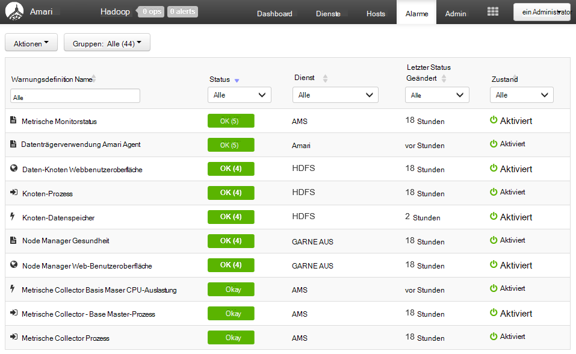

Indem das Menü **Aktionen** und **Warnungsgruppen verwalten**können Sie die Gruppen verwalten. Dadurch können Sie vorhandene Gruppen ändern oder neue Gruppen erstellen.

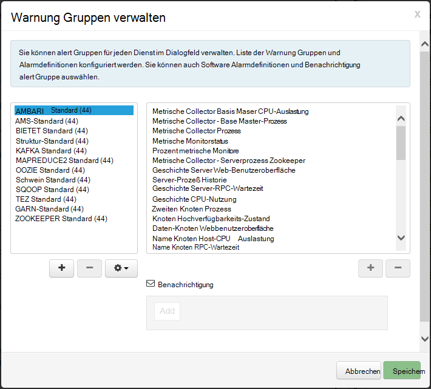

Benachrichtigung erstellen Sie aus dem Menü **Aktionen** . Dadurch können Trigger erstellen, die per **E-Mail** oder **SNMP senden** bei bestimmten Warnung-Schweregrad Kombinationen. Beispielsweise können Sie senden, dass eine Warnung als Warnungen **Aus Standard** -Gruppe **kritisch**ist.

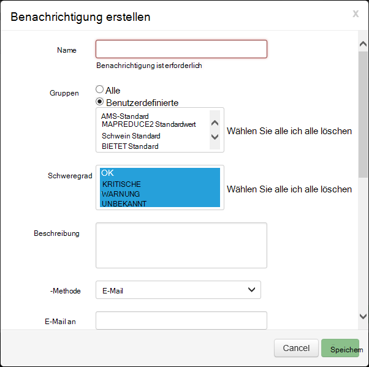

###Cluster

Die Registerkarte **Kriterien** des Dashboards enthält eine Reihe von Widgets, die den Status des Clusters auf einen Blick zu erleichtern. Widgets wie **CPU-Auslastung**, bieten zusätzliche Informationen.

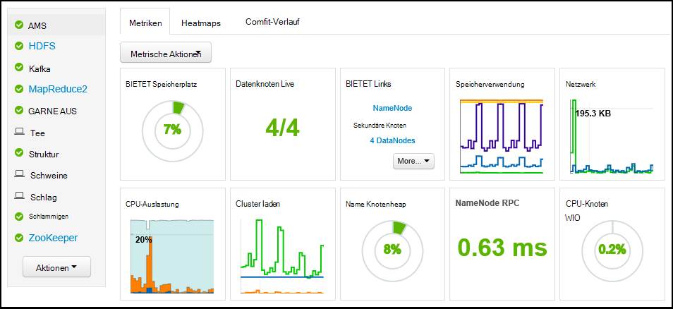

Registerkarte **Heatmaps** zeigt Metriken als farbigen Heatmaps Wechsel von Grün zu rot.

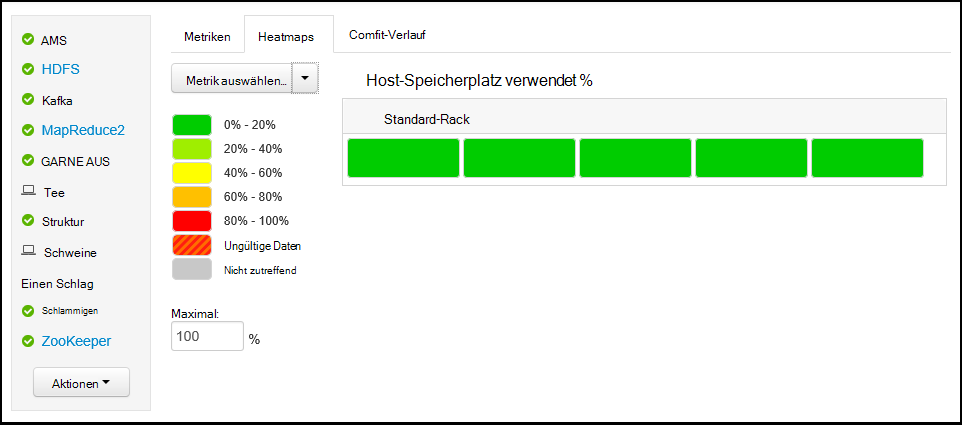

Wählen Sie für Weitere Informationen zu Knoten im Cluster **Hosts**, und wählen Sie den bestimmten Knoten, die, dem Sie interessieren.

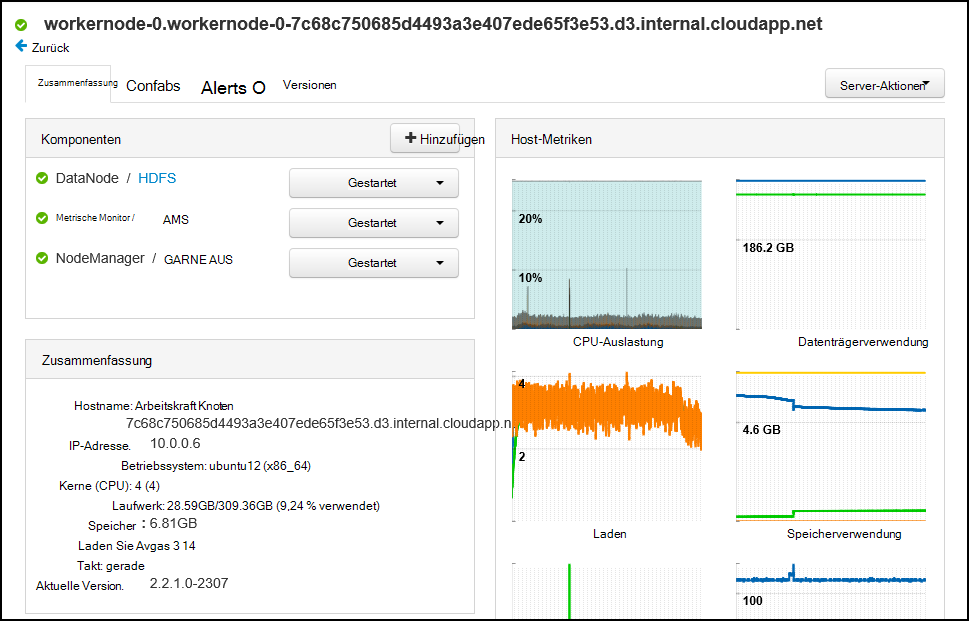

###Dienste

**Services** -Sidebar auf dem Dashboard bietet schnellen Einblick in den Status der Dienste auf dem Cluster ausgeführt. Status oder Maßnahmen sollte wie ein Gelb Recycling-Symbol, wenn ein Dienst wiederverwendet werden muss, werden unterschiedliche Symbole verwendet.

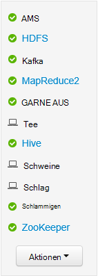

Einen Service auswählen zeigt detaillierte Informationen für den Dienst.

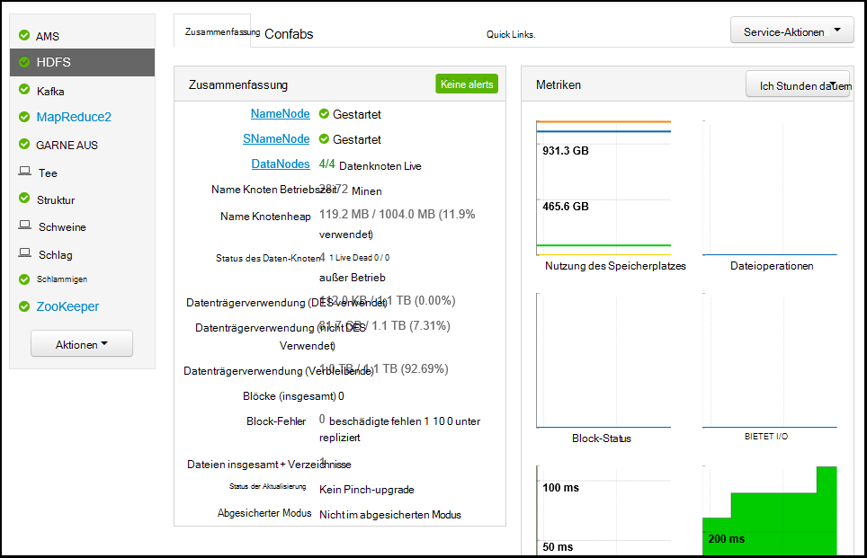

####Direktlinks

Einige Dienste **Quicklinks** -Link oben auf der Seite angezeigt. Hiermit können dienstspezifische Benutzeroberflächen, wie Internetzugriff:

* **Auftragsverlauf** - MapReduce Historie.

* **Ressourcenmanager** - GARN ResourceManager Benutzeroberfläche.

* **NameNode** - Hadoop Datei System (HDFS) NameNode UI verteilt.

* **Oozie Web-UI** - Oozie-UI.

Wählen einen der folgenden Links öffnet eine neue Registerkarte in Ihrem Browser die ausgewählte Seite angezeigt wird.

> [AZURE.NOTE] Ein **Quick Links** den Link für einen Dienst führt ein Fehler "Server nicht gefunden" nur einen Secure Sockets Layer (SSL) Tunnel zum Proxy Web-Datenverkehr mit dem Cluster. Dies ist da ASP.NET-Webanwendungen verwendet diese Informationen nicht im Internet verfügbar gemacht werden.
>
> Informationen über einen SSL-Tunnel mit HDInsight finden Sie unter [Verwenden SSH Tunneling auf Ambari Webbenutzeroberfläche ResourceManager, JobHistory, NameNode, Oozie, und andere Webbenutzeroberfläche](hdinsight-linux-ambari-ssh-tunnel.md)

##Management

###Ambari Benutzer, Gruppen und Berechtigungen

Verwalten von Benutzern, Gruppen und Berechtigungen sollten nicht mit HDInsight verwendet werden.

###Hosts

Die Seite **Hosts** zeigt alle Hosts im Cluster. Gehen Sie folgendermaßen vor, um die Hosts zu verwalten.

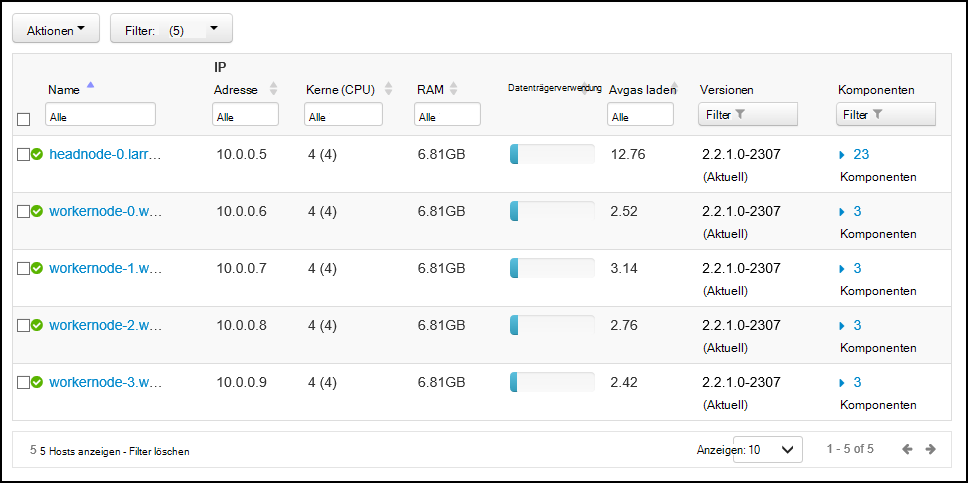

> [AZURE.NOTE] Hinzufügen, Stilllegung oder Wiederinbetriebnahme einen Host sollte nicht mit HDInsight verwendet werden.

1. Wählen Sie die Hosts, die Sie verwalten möchten.

2. Verwenden Sie im Menü **Aktionen** die Aktion auswählen, die Sie durchführen möchten:

    * **Alle Komponenten** – alle Komponenten auf dem Host starten.

    * **Alle Komponenten beenden** - beendet alle Komponenten auf dem Host.

    * **Alle Komponenten starten** - beenden und alle Komponenten auf dem Host.

    * **Aktivieren Sie den Wartungsmodus** - unterdrückt Warnungen für den Host. Dies sollte aktiviert werden, wenn Sie Aktionen, die erzeugt Alarme ausführen wie gestartet, die Dienste benötigen.

    * **Deaktivieren Sie den Wartungsmodus** - zurückgegeben Host normale Warnung.

    * **Beenden** - beendet DataNode oder NodeManagers auf dem Host.

    * **Start** - startet DataNode oder NodeManagers auf dem Host.

    * **Neu starten** - beenden und starten DataNode oder NodeManagers auf dem Host.

    * **Nehmen** – entfernt einen Host aus dem Cluster.

        > [AZURE.NOTE] Verwenden Sie diese Aktion nicht auf HDInsight-Cluster.

    * **Recommission** - wird bereits stillgelegten Host zum Cluster hinzugefügt.

        > [AZURE.NOTE] Verwenden Sie diese Aktion nicht auf HDInsight-Cluster.

###Dienste

Die Seite **Dashboard** oder **Dienstleistungen** Schaltfläche **Aktionen** am Ende der Liste der Dienste beenden und starten Sie alle Dienste.

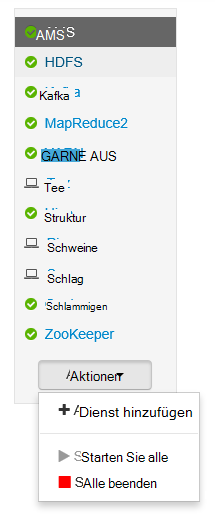

> [AZURE.WARNING] __Dienst hinzufügen__ in diesem Menü angegeben wird, sollte es nicht verwendet HDInsight Cluster Services hinzu. Neue Dienste sollten mit einer Aktion Skripts während der Bereitstellung Cluster hinzugefügt werden. Weitere Informationen zur Verwendung von Skript-Aktionen finden Sie unter [Anpassen HDInsight Cluster mit Skriptaktionen](hdinsight-hadoop-customize-cluster-linux.md).

Während die Schaltfläche **Aktionen** alle Dienste gestartet werden kann, soll häufig beenden oder einen bestimmten Dienst neu starten. Gehen Sie für einen einzelnen Dienst Aktionen ausführen:

1. Wählen Sie die Seite **Dashboard** oder **Dienstleistungen** Dienst.

2. Vom oberen Rand der Registerkarte **Zusammenfassung** **Serviceaktionen** -Schaltfläche und wählen Sie die auszuführende Aktion. Dadurch wird den Dienst auf allen Knoten neu gestartet.

    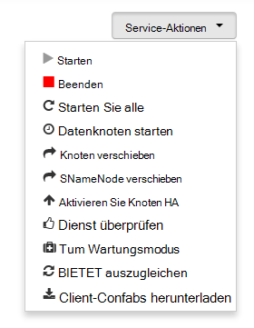

    > [AZURE.NOTE] Einige Dienste neu starten, während der Cluster ausgeführt wird, kann Alarme generieren. Um dies zu vermeiden, können Sie **Service** Aktivitätsschaltfläche **Wartungsmodus** für den Dienst aktivieren, bevor der Neustart.

3. Wählt eine Aktion wird **# Op** Eintrag am oberen Rand der Seite erhöht, um anzuzeigen, dass ein Hintergrundvorgang stattfindet. Anzeige konfiguriert, wird die Liste der Hintergrundvorgänge angezeigt.

    > [AZURE.NOTE] Wenn **Wartungsmodus** für den Dienst aktiviert, müssen Sie mithilfe der **Service-Aktionen** Schaltfläche nach Abschluss des Vorgangs deaktivieren.

Gehen Sie folgendermaßen vor, um einen Dienst zu konfigurieren:

1. Wählen Sie die Seite **Dashboard** oder **Dienstleistungen** Dienst.

2. Wählen Sie die Registerkarte **Konfigurationen** . Die aktuelle Konfiguration wird angezeigt. Eine Liste der vorherigen Konfigurationen wird ebenfalls angezeigt.

    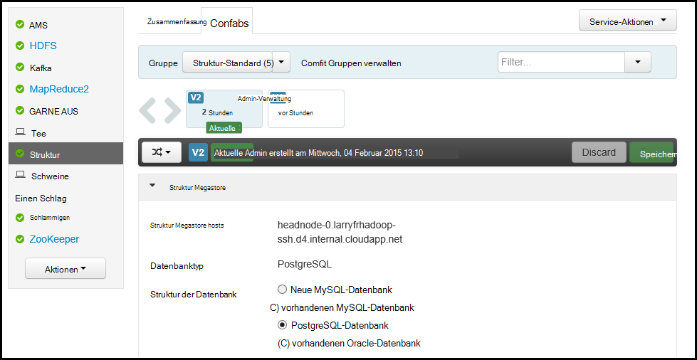

3. Die Felder angezeigt, um die Konfiguration zu ändern, und wählen Sie dann **Speichern**. Wählen Sie die vorherige Konfiguration oder **aktuellen** Rollback auf die vorherige Einstellung wählen.

##Ambari Ansichten

Ambari Ansichten können Entwickler die Webbenutzeroberfläche Ambari Benutzeroberflächenelemente anschließen mit [Ambari Ansichten Framework](https://cwiki.apache.org/confluence/display/AMBARI/Views). HDInsight enthält die folgenden Ansichten mit Hadoop Cluster:

* Garn-Warteschlangen-Manager: der Warteschlangen-Manager stellt eine einfache Benutzeroberfläche zum Anzeigen und Ändern von GARN Warteschlangen.
* Struktur anzeigen: Struktur anzeigen können Sie Struktur Abfragen direkt vom Webbrowser aus. Sie können Abfragen speichern, Ergebnisse, Ergebnisse für den Clusterspeicher speichern oder Ergebnisse auf Ihr lokales System herunterladen. Weitere Informationen über Ansichten Struktur finden Sie unter [Struktur Sichten mit HDInsight verwenden](hdinsight-hadoop-use-hive-ambari-view.md).
* Tez anzeigen: Die Tez-Ansicht können Sie besser verstehen und optimieren Aufträge anzeigen Informationen wie Tez Aufträge ausgeführt werden und welche Ressourcen von dem Projekt verwendet werden.
