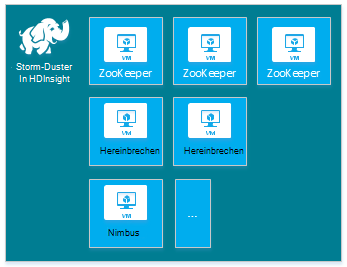
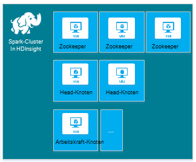
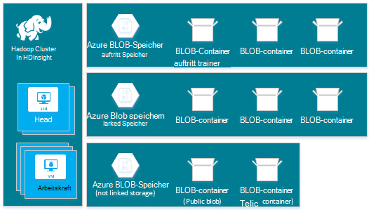
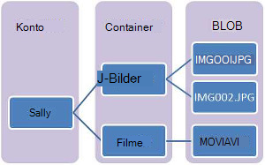

<properties
    pageTitle="Hadoop, HBase, Sturm oder Funken Cluster unter Linux in HDInsight erstellen | Microsoft Azure"
    description="Erfahren Sie, wie Hadoop, HBase, Sturm oder Funken auf Linux Cluster über einen Browser Azure CLI, Azure PowerShell, REST, HDInsight oder ein SDK."
    services="hdinsight"
    documentationCenter=""
    authors="mumian"
    manager="jhubbard"
    editor="cgronlun"
    tags="azure-portal"/>

<tags
    ms.service="hdinsight"
    ms.devlang="na"
    ms.topic="article"
    ms.tgt_pltfrm="na"
    ms.workload="big-data"
    ms.date="10/18/2016"
    ms.author="jgao"/>

# Linux-basierte Hadoop Cluster in HDInsight erstellen

[AZURE.INCLUDE [selector](../../includes/hdinsight-selector-create-clusters.md)]

Hadoop-Cluster besteht aus mehreren virtuellen Maschinen (Knoten), der für die verteilte Verarbeitung von Aufgaben im Cluster verwendet werden. Azure abstrahiert die Implementierungsdetails der Installation und Konfiguration der einzelnen Knoten haben Sie nur allgemeine Informationen bereitstellen. In diesem Artikel erhalten Sie Informationen über diese Einstellungen.

## Steuerelement erforderlich

[AZURE.INCLUDE [access-control](../../includes/hdinsight-access-control-requirements.md)]

## Clustertyp

Azure HDInsight bietet derzeit fünf verschiedenen Clustern mit Komponenten für bestimmte Funktionen.

| Clustertyp | Funktionen |
| ------------ | ----------------------------- |
| Hadoop       | Abfragen und Analysen (Stapelverarbeitungen)     |
| HBase        | NoSQL-Datenspeicher            |
| Sturm        | Echtzeit-Verarbeitung |
| Funken        | Verarbeitung im Speicher, interaktive Abfragen Micro-Batch-Verarbeitung |
| [Interaktive Struktur (Vorschau)](hdinsight-hadoop-use-interactive-hive.md) | Im Arbeitsspeicher Zwischenspeichern für interaktive und schneller Hive-Abfragen|
| R Server Spark (Vorschau) | Zahlreiche große Statistik Vorhersagemodellen und maschinelles lernen Funktionen |

Jeder Cluster hat eine eigene Nummer der Knoten im Cluster, Terminologie für Knoten im Cluster und VM Standardgröße für jeden Knotentyp. In der folgenden Tabelle ist die Anzahl der Knoten für jeden Knotentyp in Klammern.

| Typ| Knoten | Diagramm|
|-----|------|--------|
|Hadoop| Head-Knoten (2), Knoten (1 +)||
|HBase|Head-Server (2) Bereich Server (1), Master-Zookeeper Knoten (3)||
|Sturm|Nimbus Knoten (2), Supervisor Server (1), Zookeeper-Knoten (3)||
|Funken|Head-Knoten (2) Arbeitskraft Knoten (1 +) Zookeeper-Knoten (3) (kostenlos A1 lassen virtueller Speicher)||

Die folgende Tabelle listet die VM Standardgrößen für HDInsight:

- Alle Regionen außer Brasilien Süd und West Japan:

  	|Clustertyp                     | Hadoop               | HBase                | Sturm                | Funken                                                                 | R-Server |
  	|---------------------------------|----------------------|----------------------|----------------------|-----------------------------------------------------------------------|-----------------------------------------------------------------------|
  	|Head-Standard virtueller Speicher           | D3-v2                | D3-v2                | A3                   | D12 v2                                                                | D12 v2                                                                |
  	|Head-VM Größen empfohlen      | V2 D3, D4 v2 D12 v2 | V2 D3, D4 v2 D12 v2 | A3, A4, A5           | D12 v2 D13 v2, D14 v2                                                | D12 v2 D13 v2, D14 v2                                                |
  	|Arbeitskraft-Standard virtueller Speicher         | D3-v2                | D3-v2                | D3-v2                | Windows: D12 v2; Linux: D4 v2                                         | Windows: D12 v2; Linux: D4 v2                                         |
  	|Arbeitskraft-VM Größen empfohlen    | V2 D3, D4 v2 D12 v2 | V2 D3, D4 v2 D12 v2 | V2 D3, D4 v2 D12 v2 | Windows: D12 v2 D13 v2, D14 v2; Linux: D4 v2 D12 v2 D13 v2, D14 v2 | Windows: D12 v2 D13 v2, D14 v2; Linux: D4 v2 D12 v2 D13 v2, D14 v2 |
  	|Zookeeper – Standard virtueller Speicher      |                      | A3                   | A2                   |                                                                       |
  	|Zookeeper – empfohlen VM-Größen |                      | A3, A4, A5           | A2, A3, A4           |                                                                       |
  	|Edge - Standard-virtueller Speicher           |                      |                      |                      |                                                                       | Windows: D12 v2; Linux: D4 v2                                         |
  	|Edge - VM Empf.       |                      |                      |                      |                                                                       | Windows: D12 v2 D13 v2, D14 v2; Linux: D4 v2 D12 v2 D13 v2, D14 v2 |

- Brasilien Süd und nur Japan West (keine v2 Größen hier):

  	|Clustertyp                     | Hadoop      | HBase       | Sturm      | Funken                                          |R-Server|
  	|---------------------------------|-------------|-------------|------------|------------------------------------------------|--------|
  	|Head-Standard virtueller Speicher           | D3          | D3          | A3         | D12                                            | D12|
  	|Head-VM Größen empfohlen      | D3, D4, D12 | D3, D4, D12 | A3, A4, A5 | D12 D13 D14                                  | D12 D13 D14|
  	|Arbeitskraft-Standard virtueller Speicher         | D3          | D3          | D3         | Windows: D12; Linux: D4                        | Windows: D12; Linux: D4|
  	|Arbeitskraft-VM Größen empfohlen    | D3, D4, D12 | D3, D4, D12 | D3, D4, D12| Windows: D12 D13 D14; Linux: D4 D12 D13 D14| Windows: D12 D13 D14; Linux: D4 D12 D13 D14|
  	|Zookeeper – Standard virtueller Speicher      |             | A2          | A2         |                                                | |
  	|Zookeeper – empfohlen VM-Größen |             | A2, A3, A4  | A2, A3, A4 |                                                | |
  	|Edge-Standard VM-Größen          |             |             |            |                                                | Windows: D12; Linux: D4 |
  	|Edge-VM Größen empfohlen      |             |             |            |                                                | Windows: D12 D13 D14; Linux: D4 D12 D13 D14 |

Beachten Sie, dass Head für Clustertyp Sturm als *Nimbus* bezeichnet wird. Arbeitskraft bekannt als *Bereich* für die Cluster HBase und als *Supervisor* Clustertyp Sturm.

> [AZURE.IMPORTANT] Wenn Sie mit mehr als 32 Arbeitskraft Knoten Clustererstellung oder nach der Erstellung des Clusters skalieren möchten, müssen Sie eine Größe Headknoten mit mindestens 8 Kernen 14 GB RAM auswählen.

Diese einfachen Typen können mithilfe [Skriptaktionen](#customize-clusters-using-script-action)andere Farbton oder R hinzugefügt werden.

> [AZURE.IMPORTANT] HDInsight Cluster sind in verschiedenen Typen entsprechen den Arbeitslast oder Technologie Cluster abgestimmt ist. Es ist keine unterstützte Methode in einem Cluster, der mehrere Typen wie Sturm und HBase auf einem Cluster kombiniert. 

Erfordert Ihre Lösung Technologies, die unterschiedliche HDInsight Cluster verteilt sind, sollten Sie ein virtuelles Azure-Netzwerk erstellen und erforderliche Clustertyp innerhalb des virtuellen Netzwerks. Dies ermöglicht die Cluster und Ihnen direkt miteinander kommunizieren bereitgestellten Code.

Weitere Informationen über ein virtuelles Netzwerk Azure mit HDInsight finden Sie unter [HDInsight in Azure virtuelle Netzwerke erweitern](hdinsight-extend-hadoop-virtual-network.md).

Ein Beispiel mit zwei Cluster innerhalb eines virtuellen Netzwerks Azure finden Sie unter [analysieren Daten mit Sturm und HBase](hdinsight-storm-sensor-data-analysis.md).

## Cluster-Ebenen

Azure HDInsight bietet Cloudlösungen Datenverlustvorfalls in zwei Kategorien: Standard und [Premium](hdinsight-component-versioning.md#hdinsight-standard-and-hdinsight-premium). HDInsight Premium enthält R und andere zusätzlichen Komponenten. HDInsight Premium wird nur auf HDInsight Version 3.4.

Die folgende Tabelle listet die HDInsight Clustertyp und HDInsight Premium Support-Matrix.

| Clustertyp | Standard | Premium  |
|--------------|---------------|--------------|
| Hadoop       | Ja           | Ja          |
| Funken        | Ja           | Ja          |
| HBase        | Ja           | Nein           |
| Sturm        | Ja           | Nein           |
| R Server Funken | Nein | Ja |

Diese Tabelle wird aktualisiert, sobald weitere Clustertypen in HDInsight enthalten sind. Der folgende Screenshot zeigt Azure Portalinformationen für Cluster zu wählen.

## Grundlegende Optionen

Es folgen die grundlegenden Konfigurationsoptionen verwendet, um einen HDInsight-Cluster erstellen.

### Clustername ###

Clustername zur Identifizierung eines Clusters. Clustername muss eindeutig sein und müssen die folgenden Richtlinien beachten:

- Das Feld muss eine Zeichenfolge sein, die zwischen 3 und 63 Zeichen enthält.
- Das Feld kann nur Buchstaben, Zahlen und Bindestriche enthalten.

### Clustertyp###

[Cluster-Typen](#cluster-types) und [Cluster Ebenen](#cluster-tiers)anzeigen

### Betriebssystem ###

HDInsight-Cluster können auf eine der folgenden zwei Betriebssysteme:

- HDInsight unter Linux.  HDInsight bietet die Möglichkeit der Linux-Clustern in Azure konfigurieren. Konfigurieren Sie Linux-Cluster, wenn Sie Linux oder Unix Migration von einer vorhandenen Projektmappe Linux-basierten Hadoop kennen oder möchten Sie einfache Integration mit Hadoop Ökosystem Komponenten für Linux. Weitere Informationen finden Sie unter [Erste Schritte mit Hadoop auf Linux in HDInsight](hdinsight-hadoop-linux-tutorial-get-started.md).
- HDInsight unter Windows (Windows Server 2012 R2 Datacenter).

### HDInsight-version###

Hiermit wird bestimmt die Version des HDInsight für diesen Cluster benötigt. Weitere Informationen finden Sie unter [Hadoop Cluster Versionen und Komponenten in HDInsight](https://go.microsoft.com/fwLink/?LinkID=320896&clcid=0x409).

### Namen###

Ein Azure-Abonnement jeden HDInsight Cluster verbunden.

### Namen ###

Arbeiten mit Ressourcen in der Anwendung als Gruppe [Azure Resource Manager](../azure-resource-manager/resource-group-overview.md) hilft genannt Azure-Ressourcengruppe. Sie können bereitstellen, aktualisieren, überwachen oder alle Ressourcen für die Anwendung in einer einzigen koordinierten Operation löschen.

### Anmeldeinformationen###

Mit HDInsight können Sie zwei Benutzerkonten bei der Clustererstellung konfigurieren:

- HTTP-Benutzer. Der Standard-Benutzername ist *Admin* mit der grundlegenden Konfiguration der Azure-Portal. Manchmal spricht man von "Cluster Benutzer."
- SSH-Benutzer (Linux-Cluster). Hiermit wird über SSH herstellen. Nach Erstellung des Clusters Schritte [Verwendet SSH mit Linux-basierten Hadoop auf Linux, Unix oder OS X HDInsight](hdinsight-hadoop-linux-use-ssh-unix.md) oder [Verwendet SSH mit Linux-basierten Hadoop auf Windows HDInsight](hdinsight-hadoop-linux-use-ssh-unix.md), können Sie zusätzliche SSH-Benutzerkonten erstellen.

    >[AZURE.NOTE] Bei Windows-basierten Clustern können Sie ein RDP Verbindung mit RDP erstellen.

### Datenquelle###

Das ursprüngliche Hadoop verteilten Dateisystem (bietet) verwendet viele Festplatten im Cluster. HDInsight verwendet Azure BLOB-Speicher zum Speichern von Daten. Azure BLOB-Speicher ist eine stabile, allgemeine, die nahtlos mit HDInsight. Über eine Schnittstelle bietet kann strukturierte oder unstrukturierte Daten im BLOB-Speicher aller Komponenten im HDInsight betreiben. Speichern von Daten im BLOB-Speicher können Sie problemlos HDInsight-Cluster löschen, die für die Berechnung verwendet werden, ohne Datenverlust.

Während der Konfiguration müssen Sie ein Konto Azure-Speicher und einem Azure BLOB-Speichercontainer Azure Storage-Konto angeben. Einige Erstellungsprozesse benötigen Azure Speicherkonto und Blob-Speichercontainer vorher erstellt werden. Blob-Behälter wird als Standardspeicherort vom Cluster verwendet. Optional können Sie zusätzliche Azure-Speicherkonten (verknüpfte Speicher) angeben, die vom Cluster werden. Cluster kann BLOB-Speichercontainer zugreifen, die mit vollständigen öffentlichen Lesezugriff oder öffentlichen Lesezugriff für Blobs nur konfiguriert werden.  Weitere Informationen finden Sie unter [Zugriff auf Speicherressourcen Azure verwalten](../storage/storage-manage-access-to-resources.md).

>[AZURE.NOTE] Ein Blob-Speichercontainer bietet eine Gruppierung einer Gruppe von Blobs wie in der folgenden Abbildung dargestellt.

Wir empfehlen nicht den Standardcontainer BLOB-Speicher zum Speichern von Daten verwenden. Standardcontainer BLOB-Speicher wird nach jeder Verwendung Speicherkosten reduzieren wird gelöscht. Beachten Sie, dass der Standardcontainer Anwendung und System enthält Protokolle. Vergewissern Sie sich vor dem Löschen des Containers Abrufen der Protokolle.

>[AZURE.WARNING] Freigabe einer Blob-Speichercontainer für mehrere Cluster wird nicht unterstützt.

Weitere Informationen über sekundäre BLOB-Speicher finden Sie unter [Verwenden von Azure BLOB-Speicher mit HDInsight](hdinsight-hadoop-use-blob-storage.md).

Neben Azure BLOB-Speicher auch können [Azure See Datenspeicher](../data-lake-store/data-lake-store-overview.md) ein standardspeicherkonto für HBase-Cluster in HDInsight sowie verknüpfte Speicher für alle vier HDInsight Cluster Sie. Weitere Informationen finden Sie unter [Erstellen eines Clusters HDInsight mit dem Datenspeicher verwenden Azure-Portal](../data-lake-store/data-lake-store-hdinsight-hadoop-use-portal.md).

### Ort (Region) ###

HDInsight-Cluster und die standardmäßige Speicher müssen in Azure Speicherort befinden.

Eine Liste der unterstützten Regionen klicken Sie auf **Bereich** Dropdown-Liste [HDInsight](https://go.microsoft.com/fwLink/?LinkID=282635&clcid=0x409)Preisgestaltung.

### Preise Ebenen Knoten###

Kunden sind für die Verwendung dieser Knoten des Clusters Leben in Rechnung gestellt. Abrechnung beginnt, wenn ein Cluster erstellt wird und beendet der Cluster löschen. Cluster nicht aufgehoben oder zurückgestellt.

Unterschiedliche Typen haben unterschiedliche Knotentypen von Knoten und Knoten Größen. Beispielsweise hat ein Cluster Hadoop zwei _Hauptknoten_ und standardmäßig vier _Datenknoten_und ein Cluster Sturm zwei _Nimbus Knoten_, drei _Zookeeper Knoten_und standardmäßig vier _Supervisor Knoten_. Die Kosten für HDInsight-Cluster bestimmt die Anzahl der Knoten und virtuellen Maschinen Größen für die Knoten. Wenn Sie wissen, dass Sie Vorgänge durchführen, die viel Arbeitsspeicher benötigen, sollten Sie eine computeressource mit mehr Speicher auswählen. Zu, wird empfohlen, einen Datenknoten verwenden. Weitere Informationen zu HDInsight Preise finden Sie in der [HDInsight Preisgestaltung](https://go.microsoft.com/fwLink/?LinkID=282635&clcid=0x409).

>[AZURE.NOTE] Maximale Größe der Cluster variiert zwischen Azure-Abonnements. Den Support zu erhöhen.

>Die Knoten im Cluster verwendet zählen nicht als virtuelle Computer weil die virtuellen Bilder zum Knoten ein Implementierungsdetail des Dienstes HDInsight. Knoten verwendeten Prozessorkernen zählen gegen Prozessorkernen für Ihr Abonnement verfügbar. Sie sehen die Anzahl der verfügbaren Kerne und die Kerne, die vom Cluster im Abschnitt Zusammenfassung des Blades Knoten Preise Ebenen verwendet, wenn einen HDInsight-Cluster erstellen.

Verwendung das Azure-Portal den Cluster konfigurieren, kann die Knotengröße über __Knoten Preise Tier__ -Blade. Finden Sie unter Kosten mit den anderen Knoten. Der folgende Screenshot zeigt die Optionen für einen Linux-Basis Hadoop Cluster.

Die folgenden Tabellen zeigen die Größe von HDInsight-Cluster und Kapazität bieten sie unterstützt.

#### Standard-Stufe: A-Serie####

In der klassischen Bereitstellungsmodell sind einige VM-Größen geringfügig in PowerShell und CLI.
* Standard_A3 ist groß
* Standard_A4 ist ExtraLarge

|Größe |CPU-Kerne|Speicher|Netzwerkkarten (Max.)|Max. Festplattengröße|Max. Datenträger (1023 GB)|Max. IOPS (500 pro Laufwerk)|
|---|---|---|---|---|---|---|
|Standard_A3\Large|4|7 GB|2|Temporäre = 285 GB |8|8 x 500|
|Standard_A4\ExtraLarge|8|14 GB|4|Temporäre = 605 GB |16|16 x 500|
|Standard_A6|4|28 GB|2|Temporäre = 285 GB |8|8 x 500|
|Standard_A7|8|56 GB|4|Temporäre = 605 GB |16|16 x 500|

#### Standard-Stufe: D-Serie####

|Größe |CPU-Kerne|Speicher|Netzwerkkarten (Max.)|Max. Festplattengröße|Max. Datenträger (1023 GB)|Max. IOPS (500 pro Laufwerk)|
|---|---|---|---|---|---|---|
|Standard_D3 |4|14 GB|4|Temporäre (SSD) = 200 GB |8|8 x 500|
|Standard_D4 |8|28 GB|8|Temporäre (SSD) = 400 GB |16|16 x 500|
|Standard_D12 |4|28 GB|4|Temporäre (SSD) = 200 GB |8|8 x 500|
|Standard_D13 |8|56 GB|8|Temporäre (SSD) = 400 GB |16|16 x 500|
|Standard_D14 |16|112 GB|8|Temporäre (SSD) = 800 GB |32|32 x 500|

#### Standard-Stufe: Dv2-Serie####

|Größe |CPU-Kerne|Speicher|Netzwerkkarten (Max.)|Max. Festplattengröße|Max. Datenträger (1023 GB)|Max. IOPS (500 pro Laufwerk)|
|---|---|---|---|---|---|---|
|Standard_D3_v2 |4|14 GB|4|Temporäre (SSD) = 200 GB |8|8 x 500|
|Standard_D4_v2 |8|28 GB|8|Temporäre (SSD) = 400 GB |16|16 x 500|
|Standard_D12_v2 |4|28 GB|4|Temporäre (SSD) = 200 GB |8|8 x 500|
|Standard_D13_v2 |8|56 GB|8|Temporäre (SSD) = 400 GB |16|16 x 500|
|Standard_D14_v2 |16|112 GB|8|Temporäre (SSD) = 800 GB |32|32 x 500|    

Bereitstellungsaspekte berücksichtigen Wenn Sie planen, diese Ressourcen zu verwenden finden Sie unter [Größe für virtuelle Computer](../virtual-machines/virtual-machines-windows-sizes.md). Informationen über Preise der verschiedenen Größen finden Sie [HDInsight Preise](https://azure.microsoft.com/pricing/details/hdinsight).   

> [AZURE.IMPORTANT] Wenn Sie mit mehr als 32 Arbeitskraft Knoten Clustererstellung oder nach der Erstellung des Clusters skalieren möchten, müssen Sie eine Größe Headknoten mit mindestens 8 Kernen 14 GB RAM auswählen.

Abrechnung beginnt, wenn ein Cluster erstellt wird, und wird beendet, sobald der Cluster gelöscht wird. Weitere Informationen zu Preisen finden Sie [Preisinformationen HDInsight](https://azure.microsoft.com/pricing/details/hdinsight/).

## Zusätzlicher Speicher

In einigen Fällen möchten Sie zusätzlichen Speicher zum Cluster hinzufügen. Z. B. möglicherweise mehrere Azure-Speicherkonten für verschiedene geographische Regionen oder verschiedene Dienste, aber diese mit HDInsight analysieren möchten.

Sie können Speicherkonten hinzufügen, wenn Sie einen HDInsight-Cluster erstellen oder nach dem Erstellen ein Clusters.  [Anpassen von Linux-basierten HDInsight Cluster mit Skriptaktion](hdinsight-hadoop-customize-cluster-linux.md)anzeigen

Weitere Informationen zum sekundären BLOB-Speicher finden Sie unter [Verwendung von Azure BLOB-Speicher mit HDInsight](hdinsight-hadoop-use-blob-storage.md). Weitere Informationen zu sekundären Datenspeicher See finden Sie unter [Erstellen HDInsight-Cluster mit dem Datenspeicher Azure-Portal](../data-lake-store/data-lake-store-hdinsight-hadoop-use-portal.md).

## Struktur-Oozie-Metastore verwenden

Wir empfehlen die Verwendung einer benutzerdefinierten Metastore Struktur Tabellen nach HDInsight Cluster löschen beibehalten werden soll. Sie werden einen anderen HDInsight Cluster, Metastore zuordnen können.

> [AZURE.IMPORTANT] HDInsight Metastore erstellt einen HDInsight-Cluster-Version kann nicht bei verschiedenen HDInsight Cluster freigegeben werden. Eine Liste der Versionen HDInsight anzeigen Sie [HDInsight unterstützte Versionen](hdinsight-component-versioning.md#supported-hdinsight-versions)

Die Metastore enthält Struktur und Oozie Metadaten wie Hive-Tabellen, Partitionen, Schemas und Spalten. Die Metastore können Sie Ihre Struktur und Oozie Metadaten beizubehalten, müssen Sie nicht erneut erstellen Hive-Tabellen oder Oozie Aufträge beim Erstellen eines neuen Clusters. Struktur verwendet eine eingebettete SQL Azure-Datenbank zum Speichern dieser Informationen. Eingebettete Datenbank kann nicht die Metadaten beibehalten, wenn Cluster gelöscht wird. Beim Erstellen von Struktur-Tabelle in einem HDInsight-Cluster mit einer Struktur Metastore konfiguriert werden diese Tabellen beibehalten, wenn den Cluster mit derselben Struktur Metastore neu.

Metastore-Konfiguration ist nicht für HBase Cluster verfügbar.

> [AZURE.IMPORTANT] Verwenden Sie beim Erstellen einer benutzerdefinierten Metastore keinen Datenbanknamen, der Striche oder Bindestriche enthalten. Dadurch kann der Clustererstellung fehlschlagen.

## Azure virtuelle Netzwerke verwenden

Ein [Azure virtuellen Netzwerk](https://azure.microsoft.com/documentation/services/virtual-network/)können Sie eine permanente Netzwerk mit den Ressourcen für die Projektmappe erstellen. Mit einem virtuellen Netzwerk können Sie:

* Verbinden Sie Cloud-Ressourcen in einem privaten Netzwerk (nur Cloud) miteinander.

    

* Verbinden Sie Ihre Cloud-Ressourcen zu Ihrem lokalen Datencenter Netzwerk (zwischen Standorten oder Punkt-zu-Standort) mit einem virtuellen privaten Netzwerk (VPN).

| Standort-zu-Standort-Konfiguration | Punkt-zu-Standort-Konfiguration |
| -------------------------- | --------------------------- |
| Standort-zu-Standort-Konfiguration können Sie mehrere Ressourcen aus Ihrem Rechenzentrum Azure virtuellen Netzwerk verbinden mit Hardware VPN oder den Routing- und RAS-Dienst.  | Punkt-zu-Standort-Konfiguration können Sie eine bestimmte Ressource Azure virtuellen Netzwerk verbinden, mithilfe einer VPN-Software.  |

Windows-basierten Clustern erfordern eine v1 (klassisch) virtuellen Netzwerk, Linux-basierten Clustern v2 (Azure Resource Manager) virtuelles Netzwerk benötigen. Wenn Sie keinen richtigen Netzwerk werden verwendet beim Erstellen des Clusters.

Weitere Informationen zu einem virtuellen Netzwerk, einschließlich Konfiguration für das virtuelle Netzwerk mit HDInsight finden Sie unter [Funktionen mithilfe von Azure virtual Network HDInsight erweitern](hdinsight-extend-hadoop-virtual-network.md).

## Anpassen von Clustern mit HDInsight Cluster Anpassung (bootstrap)

Manchmal möchten Sie die folgenden Konfigurationsdateien konfigurieren:

- clusterIdentity.xml
- Core-site.xml
- Gateway.Xml
- Hbase env.xml
- Hbase site.xml
- bietet site.xml
- Struktur-env.xml
- Struktur site.xml
- Mapred-Website
- Oozie-site.xml
- Oozie-env.xml
- Storm-site.xml
- Tez site.xml
- Webhcat site.xml
- Garn site.xml

Halten Sie die Änderungen über die Lebensdauer eines Clusters können HDInsight Cluster Anpassung bei der Erstellung oder können Ambari in Linux-basierten Clustern. Weitere Informationen finden Sie unter [Anpassen HDInsight Cluster mit Bootstrap](hdinsight-hadoop-customize-cluster-bootstrap.md).

>[AZURE.NOTE] Die Windows-basierten Clustern können nicht die durch image beizubehalten. Weitere Informationen finden Sie unter [Rolle Instanz Neustart durch Aktualisierung des Betriebssystems](http://blogs.msdn.com/b/kwill/archive/2012/09/19/role-instance-restarts-due-to-os-upgrades.aspx).  Damit die Änderungen durch die Cluster-Lebensdauer, verwenden Sie HDInsight Cluster Anpassung während des Erstellungsprozesses.

## Passen Sie Cluster mit Skriptaktion an

Sie können zusätzliche Komponenten installieren oder Clusterkonfiguration mithilfe von Skripts während der Erstellung anpassen. Diese Skripts werden über **Skriptaktion**aufgerufen die Konfigurationsoption von Azure-Portal, HDInsight Windows PowerShell-Cmdlets oder HDInsight .NET SDK verwendet werden kann. Weitere Informationen finden Sie unter [Anpassen HDInsight Cluster Skriptaktion verwenden](hdinsight-hadoop-customize-cluster-linux.md).

Einige systemeigenen Java-Komponenten wie Mahout und Cascading, können als Dateien Java Archive (JAR) im Cluster ausgeführt werden. Diese JAR-Dateien Azure BLOB-Speicher verteilt und an HDInsight-Cluster über Hadoop Auftrag Übermittlung Mechanismen übermittelt. Weitere Informationen finden Sie unter [Senden Hadoop Aufträge programmgesteuert](hdinsight-submit-hadoop-jobs-programmatically.md).

>[AZURE.NOTE] Haben Sie Probleme JAR-Dateien auf HDInsight Cluster bereitstellen oder Aufrufen von JAR-Dateien auf HDInsight Cluster Support von [Microsoft](https://azure.microsoft.com/support/options/).

> Überlappung von HDInsight nicht unterstützt und ist nicht für den Microsoft Support. Listen der unterstützten Komponenten finden Sie unter [neuen Cluster Versionen von HDInsight bereitgestellten?](hdinsight-component-versioning.md)

## Kantenknoten verwenden

 Ein leere Kantenknoten ist einer virtuellen Linux-Maschine mit dem Clienttools installiert und in der Headnodes konfiguriert. Edgeknoten können für den Zugriff auf den Cluster, Clientanwendungen testen und Hosten von Clientanwendungen. Weitere Informationen finden Sie unter [verwenden leere Randknoten in HDInsight](hdinsight-apps-use-edge-node.md).
 
## Methoden zur Erstellung

In diesem Artikel haben Sie grundlegende Informationen zum Erstellen eines Clusters Linux-basierten HDInsight. Anhand der folgenden Tabelle finden Sie Informationen zum Erstellen eines Clusters mithilfe einer Methode, die Ihren Bedürfnissen am besten entspricht.

| Cluster mit erstellt | Webbrowser | Befehlszeile | REST-API | SDK | Linux, Mac OS X und Unix | Windows |
| ------------------------------- |:----------------------:|:--------------------:|:------------------:|:------------:|:-----------------------------:|:------------:|
| [Azure-portal](hdinsight-hadoop-create-linux-clusters-portal.md) | ✔     | &nbsp; | &nbsp; | &nbsp; | ✔      | ✔ |
| [Azure Data Factory](hdinsight-hadoop-create-linux-clusters-adf.md) | ✔     | ✔  | ✔  |✔  | ✔      | ✔ |
| [Azure CLI](hdinsight-hadoop-create-linux-clusters-azure-cli.md)         | &nbsp; | ✔     | &nbsp; | &nbsp; | ✔      | ✔ |
| [Azure PowerShell](hdinsight-hadoop-create-linux-clusters-azure-powershell.md) | &nbsp; | ✔     | &nbsp; | &nbsp; | ✔ | ✔ |
| [Aufrollen](hdinsight-hadoop-create-linux-clusters-curl-rest.md) | &nbsp; | ✔     | ✔ | &nbsp; | ✔      | ✔ |
| [.NET SDK](hdinsight-hadoop-create-linux-clusters-dotnet-sdk.md) | &nbsp; | &nbsp; | &nbsp; | ✔ | ✔      | ✔ |
| [Azure Ressourcenmanager Vorlagen](hdinsight-hadoop-create-linux-clusters-arm-templates.md) | &nbsp; | ✔     | &nbsp; | &nbsp; | ✔      | ✔ |
