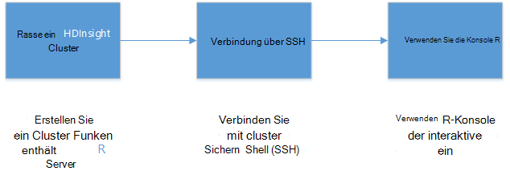
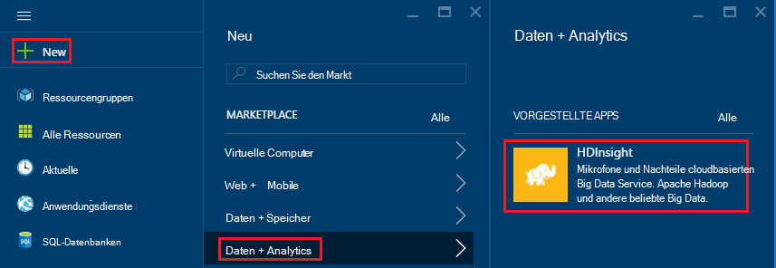
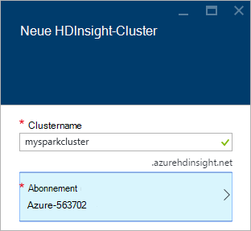
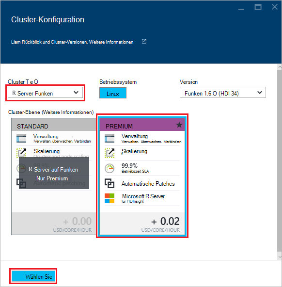
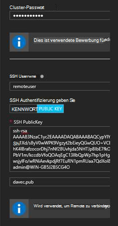
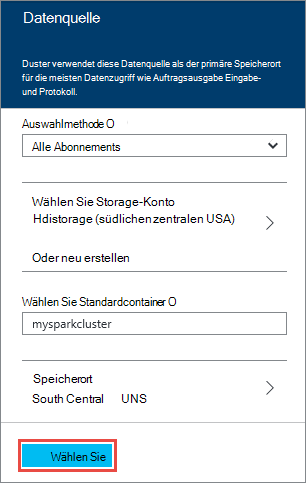
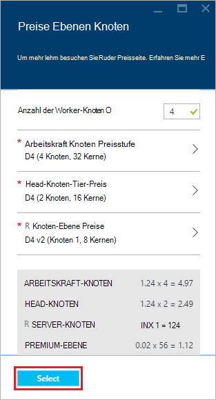
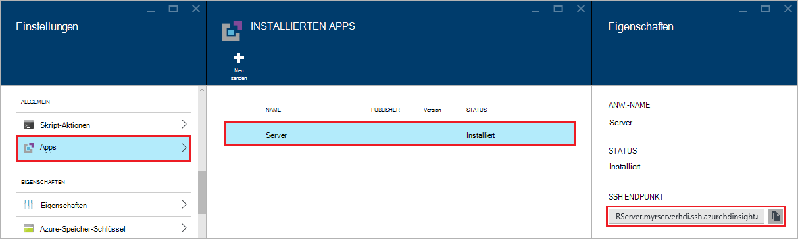
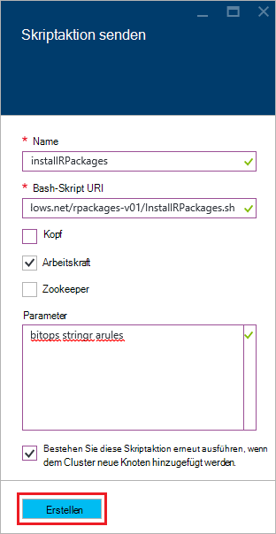

<properties
   pageTitle="Erste Schritte mit R Server HDInsight (Vorschau) | Azure"
   description="Erfahren Sie, wie Apache Spark HDInsight (Hadoop) Cluster erstellen R Server (Vorschau) und senden Sie ein R-Skript im Cluster."
   services="HDInsight"
   documentationCenter=""
   authors="jeffstokes72"
   manager="jhubbard"
   editor="cgronlun"
/>

<tags
   ms.service="HDInsight"
   ms.devlang="R"
   ms.topic="article"
   ms.tgt_pltfrm="na"
   ms.workload="data-services"
   ms.date="08/19/2016"
   ms.author="jeffstok"
/>

# Erste Schritte mit R Server auf HDInsight (Vorschau)

Die Premium-Stufe für HDInsight enthält R Server als Teil des Clusters HDInsight (Vorschau). Dadurch R Skripts MapReduce und Spark verteilte Berechnung ausgeführt. In diesem Dokument erfahren Sie, wie Sie einen neuen R-Server auf HDInsight erstellen, und führen Sie ein R-Skript, das veranschaulicht, wie mit Spark für verteilte R Berechnungen.

## Erforderliche Komponenten

* __Ein Azure-Abonnement__: Bevor Sie dieses Lernprogramm beginnen, müssen Sie ein Azure-Abonnement. Weitere Informationen finden Sie unter [Get Azure-Testversion](https://azure.microsoft.com/documentation/videos/get-azure-free-trial-for-testing-hadoop-in-hdinsight/) .

* __Eine Secure Shell (SSH)-Client__: ein SSH-Client für die Remoteverbindung zum HDInsight-Cluster und führen Befehle direkt auf dem Cluster verwendet. Linux, Unix und Mac OS-Systeme bieten einen SSH-Client über die `ssh` Befehl. Für Windows-Systeme sollten [kitten](http://www.chiark.greenend.org.uk/~sgtatham/putty/download.html).

    * __SSH-Schlüssel (optional)__: das SSH-Konto zum Verbinden mit einem Kennwort oder einen öffentlichen Schlüssel sichern. Ein Kennwort ist einfacher und ermöglicht es Ihnen, ohne zuvor ein öffentliches/privates Schlüsselpaar erstellen; eine Taste ist jedoch sicherer.
    
        Die Schritte in diesem Dokument wird davon ausgegangen, dass Sie ein Kennwort verwenden. Informationen zum Erstellen und Verwenden von SSH-Schlüssel mit HDInsight finden Sie in folgenden Dokumenten:
        
        * [Verwenden von SSH mit HDInsight von Linux, Unix oder OS X-clients](hdinsight-hadoop-linux-use-ssh-unix.md)
        
        * [Verwenden von SSH mit HDInsight von Windows-clients](hdinsight-hadoop-linux-use-ssh-windows.md)

### Steuerelement erforderlich

[AZURE.INCLUDE [access-control](../../includes/hdinsight-access-control-requirements.md)]

## Erstellen des Clusters

> [AZURE.NOTE] In diesem Dokument erstellt ein R-Server auf HDInsight verwenden grundlegende Konfigurationsinformationen. Cluster her (z. B. Konten zusätzlichen Speicher hinzufügen, mithilfe einer Azure Virtual Network oder eine Metastore für Struktur) finden Sie unter [Erstellen von Linux-basierten HDInsight-Cluster](hdinsight-hadoop-provision-linux-clusters.md).

1. Mit der [Azure-Portal](https://portal.azure.com)anmelden.

2. Wählen Sie __neu__, __Daten + Analytics__und __HDInsight__.

    

3. Geben Sie einen Namen für den Cluster im Feld __Clusternamen__ . Haben Sie mehrere Azure-Abonnements verwenden Sie __den Abonnementeintrag__ auswählen, die Sie verwenden möchten.

    

4. __Clustertyp__auswählen. -Blade __Clustertyp__ auswählen:

    * __Clustertyp__: R Server Funken
    
    * __Cluster-Tier__: Premium

    Lassen Sie die anderen Optionen die Standardwerte, und speichern Sie den Cluster mithilfe der Schaltfläche __auswählen__ .
    
    
    
    > [AZURE.NOTE] Sie können auch andere Cluster HDInsight (wie Hadoop oder HBase,) R Server hinzufügen, durch den Cluster auswählen und dann __Premium__.

5. Wählen Sie **Ressourcengruppe** eine Liste der verfügbaren Ressourcengruppen und dann auswählen, der der Cluster erstellt. Oder wählen Sie **Neu erstellen** und dann die neue Ressourcengruppe geben. Ein grünes Häkchen wird angezeigt, um anzugeben, dass der neue Gruppe verfügbar ist.

    > [AZURE.NOTE] Dieser Eintrag standardmäßig eine vorhandene Ressourcengruppen, wenn diese verfügbar sind.
    
    Schaltfläche __Wählen Sie__ die Ressourcengruppe speichern.

6. Wählen Sie **Berechtigungen**aus, und geben Sie eine **Cluster-Benutzernamen** und das **Passwort Cluster**.

    Geben Sie eine __SSH-Benutzername__.  SSH wird verwendet, um Remote über einen __Secure Shell (SSH)__ -Client herstellen. In diesem Dialogfeld oder Cluster (Registerkarte Konfiguration für den Cluster) erstellt wurde, können Sie entweder den SSH-Benutzer angeben. R Server konfiguriert __SSH Benutzername__ "Remoteuser" erwartet.  Wenn Sie einen anderen Benutzernamen verwenden, müssen Sie einen zusätzlichen Schritt auszuführen, nachdem der Cluster erstellt wird.
    
    

    __SSH-Authentifizierungstyp__: __Kennwort__ als Authentifizierungstyp auswählen, sofern mit einem öffentlichen Schlüssel gewünscht.  Sie benötigen ein öffentliches/privates Schlüsselpaar R Zugriff auf Server im Cluster über einen Remoteclient z.B. FORMAL, RStudio oder anderen Desktop IDE möchten.   

    Erstellen und öffentlichem und privatem Schlüssel auswählen "Öffentlicher Schlüssel" und gehen Sie wie folgt vor.  Diese Anleitung setzt voraus, dass Cygwin mit ssh-Keygen installiert haben.

    -    Generiert ein öffentliches/privates Schlüsselpaar aus der Befehlszeile auf Ihrem Laptop:
      
            SSH-Keygen - t Rsa -b 2048 – f < Private Schlüssel Dateiname >
      
    -    Eine private Schlüsseldatei und öffentliche Schlüsseldatei unter Name < Private Schlüssel Dateiname > pub dadurch z. B.  Davec und davec.pub.  Geben Sie die öffentliche Schlüsseldatei (* .pub) bei HDI Cluster Anmeldeinformationen:
      
          
      
    -    Ändern Sie Berechtigungen für private Schlüsseldatei auf Ihrem laptop
      
            Chmod 600 < Private Schlüssel Dateiname >
      
    -    Verwenden Sie private Schlüsseldatei mit SSH für Remotebenutzernamen, z.B.
      
            SSH-i < Private Schlüssel Dateiname >remoteuser@<hostname public ip>
      
      oder als Teil der Definition der Kontext Hadoop Spark Compute R Server auf dem Client (siehe Using Microsoft R Server als Hadoop Client im Abschnitt [Erstellen einer Compute Kontext für Spark](https://msdn.microsoft.com/microsoft-r/scaler-spark-getting-started#creating-a-compute-context-for-spark) online [Handbuch Erste Schritte mit RevoScaleR Hadoop Spark](https://msdn.microsoft.com/microsoft-r/scaler-spark-getting-started).)

7. Wählen Sie **Datenquelle** auswählen eine Datenquelle für den Cluster. Wählen Sie ein vorhandenes Speicherkonto __Speicherkonto__ auswählen und Sie das Konto auswählen oder erstellen Sie ein neues Konto über den Link __neu__ im Bereich __Speicher-Konto__ .

    Wenn Sie __neu__auswählen, geben Sie einen Namen für das neue Speicherkonto. Ein grünes Häkchen wird angezeigt, wenn der Name akzeptiert wird.

    Der Name des Clusters standardmäßig den __Standardcontainer__ . Lassen Sie dieses als Wert.
    
    Wählen Sie __Speicherort__ Bereich für das Speicherkonto in erstellen auswählen.
    
    > [AZURE.IMPORTANT] Den Standort für die Standarddatenquelle wird auch die Position des Clusters HDInsight festgelegt. Die Cluster und Standard-Datenquelle muss im selben Bereich befinden.

    Die Datenquellenkonfiguration Speichern mithilfe der Schaltfläche **auswählen** .
    
    

8. Wählen Sie **Knoten Preise Ebenen** Informationen zu Knoten anzeigen, die für diesen Cluster erstellt werden. Nur, wenn Sie einen größeren Cluster benötigen, lassen Sie die Anzahl der workerknoten der Standardwert `4`. Die geschätzte Kosten des Clusters wird in die Blade angezeigt.

    > [AZURE.NOTE] Bei Bedarf können erneut Cluster später über das Portal Größe (Cluster -> Einstellungen -> Skalierung Cluster) erhöhen oder verringern die Anzahl der workerknoten.  Diese hilfreich für den Cluster nicht herunterfahren Leerlauf oder Kapazität Bedürfnisse größere Aufgaben.

    Einige Faktoren zu beachten beim Cluster Datenknoten und edgeknoten:  
   
    - Die Leistung von verteilten R analysiert Spark wird proportional zur Anzahl der workerknoten groß werden.  
    - Die Leistung von R analysiert ist linear zur Größe der Daten analysiert. Zum Beispiel:  
        - Für kleine und bequeme Daten werden am besten auf einem lokalen Computer Kontext auf dem edgeknoten analysiert.  Finden Sie weitere Informationen unter dem lokalen und Spark Compute Kontext am besten Szenarien Kontextoptionen Compute R Server auf HDInsight. 
        - Wenn die Kantenknoten anmelden und R-Skript gibt dann alle ScaleR Rx-Funktionen werden <strong>lokal</strong> auf dem edgeknoten ausgeführt Größe müssen so Speicher und Anzahl der Kerne des Knotens Rand entsprechend angepasst werden. Dasselbe gilt, wenn Sie R Server auf HDI als remote Compute Kontext von einem Laptop aus verwenden.
    
    

    Schaltfläche **Wählen Sie** den Knoten Preise Konfiguration speichern.
    
9. **Neuen HDInsight Cluster** Blade **an Startmenü anheften** ausgewählt ist, und wählen Sie **Erstellen**. Cluster erstellt und eine Kachel für sie Startmenü Azure-Verwaltungsportal hinzufügen. Das Symbol bedeutet, dass der Cluster erstellt und ändert sich nach Abschluss der Erstellung das HDInsight-Symbol angezeigt.

  	| Beim Erstellen | Erstellung abgeschlossen |
  	| ------------------ | --------------------- |
  	|  |  |

    > [AZURE.NOTE] Es dauert Clusters, normalerweise ca. 15 Minuten erstellt werden. Verwenden der Kachel auf das Startmenü oder den Eintrag **Benachrichtigungen** auf der linken Seite des Erstellungsprozesses überprüfen.

## Kantenknoten R-Server verbinden

Verbinden Sie mit R Server Kantenknoten über SSH HDInsight-Cluster:

    ssh USERNAME@r-server.CLUSTERNAME-ssh.azurehdinsight.net
    
> [AZURE.NOTE] Auch die `R-Server.CLUSTERNAME-ssh.azurehdinsight.net` Adresse in Azure-Portal-Cluster und dann __Alle Einstellungen__, __Apps__und __RServer__auswählen. Dadurch wird die SSH-Endpunktinformationen für den edgeknoten angezeigt.
>
> 
    
Wenn Sie ein Kennwort zum schützen Ihr Benutzerkonto SSH verwendet, werden Sie aufgefordert, eingeben. Wenn Sie einen öffentlichen Schlüssel verwendet, müssen Sie möglicherweise verwenden die `-i` Parameter, um den passenden privaten Schlüssel. Z. B. `ssh -i ~/.ssh/id_rsa USERNAME@R-Server.CLUSTERNAME-ssh.azurehdinsight.net`.
    
Weitere Informationen über SSH mit Linux-basierten HDInsight finden Sie in folgenden Artikeln:

* [Verwenden Sie SSH mit Linux-basierten Hadoop auf HDInsight von Linux, Unix und Mac OS](hdinsight-hadoop-linux-use-ssh-unix.md)

* [Verwenden Sie SSH mit Linux-basierten Hadoop auf Windows HDInsight](hdinsight-hadoop-linux-use-ssh-windows.md)

Nachdem die Verbindung hergestellt ist, erreichen Sie eine Meldung ähnlich der folgenden.

    username@ed00-myrser:~$

## Verwenden Sie die Konsole R

1. Verwenden Sie über SSH-Sitzung den folgenden Befehl zum Starten der Konsole R.

        R
    
    Eine Ausgabe ähnlich der folgenden wird angezeigt.
    
        R version 3.2.2 (2015-08-14) -- "Fire Safety"
        Copyright (C) 2015 The R Foundation for Statistical Computing
        Platform: x86_64-pc-linux-gnu (64-bit)

        R is free software and comes with ABSOLUTELY NO WARRANTY.
        You are welcome to redistribute it under certain conditions.
        Type 'license()' or 'licence()' for distribution details.

        Natural language support but running in an English locale

        R is a collaborative project with many contributors.
        Type 'contributors()' for more information and
        'citation()' on how to cite R or R packages in publications.

        Type 'demo()' for some demos, 'help()' for on-line help, or
        'help.start()' for an HTML browser interface to help.
        Type 'q()' to quit R.

        Microsoft R Server version 8.0: an enhanced distribution of R
        Microsoft packages Copyright (C) 2016 Microsoft Corporation

        Type 'readme()' for release notes.

        >

2. Aus der `>` auffordern, R-Code eingeben. R-Server enthält Pakete, mit denen Sie problemlos Hadoop arbeiten und verteilte Berechnung ausgeführt. Z. B. den folgenden Befehl an den Stamm das Standarddateisystem für HDInsight-Cluster.

        rxHadoopListFiles("/")
    
    Sie können auch WASB Stil Adressierung verwenden.
    
        rxHadoopListFiles("wasbs:///")

## R-Server verwenden auf HDI aus einer Remoteinstanz von Microsoft R Server oder Microsoft R Client

Pro Abschnitt zur Verwendung des öffentlichen/privaten Schlüsselpaaren auf den Cluster zuzugreifen, kann Setup auf HDI Hadoop Spark Compute Kontext aus einer Remoteinstanz von Microsoft R Server oder Microsoft R Client auf einem Desktop oder Laptop (siehe Using Microsoft R Server als Hadoop Client im Abschnitt [Erstellen einer Compute Kontext für Spark](https://msdn.microsoft.com/microsoft-r/scaler-spark-getting-started#creating-a-compute-context-for-spark) online [Handbuch Erste Schritte mit RevoScaleR Hadoop Spark](https://msdn.microsoft.com/microsoft-r/scaler-spark-getting-started)).  Dazu müssen Sie an der Festlegung der RxSpark Folgendes berechnen auf Ihrem Laptop: HdfsShareDir, ShareDir, SshUsername, SshHostname, SshSwitches und SshProfileScript. Zum Beispiel:

    
    myNameNode <- "default"
    myPort <- 0 
 
    mySshHostname  <- 'rkrrehdi1-ssh.azurehdinsight.net'  # HDI secure shell hostname
    mySshUsername  <- 'remoteuser'# HDI SSH username
    mySshSwitches  <- '-i /cygdrive/c/Data/R/davec'   # HDI SSH private key
 
    myhdfsShareDir <- paste("/user/RevoShare", mySshUsername, sep="/")
    myShareDir <- paste("/var/RevoShare" , mySshUsername, sep="/")
 
    mySparkCluster <- RxSpark(
      hdfsShareDir = myhdfsShareDir,
      shareDir     = myShareDir,
      sshUsername  = mySshUsername,
      sshHostname  = mySshHostname,
      sshSwitches  = mySshSwitches,
      sshProfileScript = '/etc/profile',
      nameNode     = myNameNode,
      port         = myPort,
      consoleOutput= TRUE
    )

    
 
## Compute-Kontext verwenden

Compute-Kontext können Sie steuern, ob Berechnung lokal auf dem edgeknoten ausgeführt werden oder ob sie Knoten im Cluster HDInsight verteilt werden.
        
1. R-Konsole anhand der folgenden Beispieldaten in der Standardspeicher für HDInsight laden.

        # Set the HDFS (WASB) location of example data
        bigDataDirRoot <- "/example/data"
        # create a local folder for storaging data temporarily
        source <- "/tmp/AirOnTimeCSV2012"
        dir.create(source)
        # Download data to the tmp folder
        remoteDir <- "http://packages.revolutionanalytics.com/datasets/AirOnTimeCSV2012"
        download.file(file.path(remoteDir, "airOT201201.csv"), file.path(source, "airOT201201.csv"))
        download.file(file.path(remoteDir, "airOT201202.csv"), file.path(source, "airOT201202.csv"))
        download.file(file.path(remoteDir, "airOT201203.csv"), file.path(source, "airOT201203.csv"))
        download.file(file.path(remoteDir, "airOT201204.csv"), file.path(source, "airOT201204.csv"))
        download.file(file.path(remoteDir, "airOT201205.csv"), file.path(source, "airOT201205.csv"))
        download.file(file.path(remoteDir, "airOT201206.csv"), file.path(source, "airOT201206.csv"))
        download.file(file.path(remoteDir, "airOT201207.csv"), file.path(source, "airOT201207.csv"))
        download.file(file.path(remoteDir, "airOT201208.csv"), file.path(source, "airOT201208.csv"))
        download.file(file.path(remoteDir, "airOT201209.csv"), file.path(source, "airOT201209.csv"))
        download.file(file.path(remoteDir, "airOT201210.csv"), file.path(source, "airOT201210.csv"))
        download.file(file.path(remoteDir, "airOT201211.csv"), file.path(source, "airOT201211.csv"))
        download.file(file.path(remoteDir, "airOT201212.csv"), file.path(source, "airOT201212.csv"))
        # Set directory in bigDataDirRoot to load the data into
        inputDir <- file.path(bigDataDirRoot,"AirOnTimeCSV2012") 
        # Make the directory
        rxHadoopMakeDir(inputDir)
        # Copy the data from source to input
        rxHadoopCopyFromLocal(source, bigDataDirRoot)

2. Als Nächstes sehen wir einige Daten Informationen erstellen und definieren Sie zwei Datenquellen gemeinsam mit den Daten.

        # Define the HDFS (WASB) file system
        hdfsFS <- RxHdfsFileSystem()
        # Create info list for the airline data
        airlineColInfo <- list(
            DAY_OF_WEEK = list(type = "factor"),
            ORIGIN = list(type = "factor"),
            DEST = list(type = "factor"),
            DEP_TIME = list(type = "integer"),
            ARR_DEL15 = list(type = "logical"))

        # get all the column names
        varNames <- names(airlineColInfo)

        # Define the text data source in hdfs
        airOnTimeData <- RxTextData(inputDir, colInfo = airlineColInfo, varsToKeep = varNames, fileSystem = hdfsFS)
        # Define the text data source in local system
        airOnTimeDataLocal <- RxTextData(source, colInfo = airlineColInfo, varsToKeep = varNames)

        # formula to use
        formula = "ARR_DEL15 ~ ORIGIN + DAY_OF_WEEK + DEP_TIME + DEST"

3. Führen wir eine logistische Regression mit lokalen Daten berechnen Kontext.

        # Set a local compute context
        rxSetComputeContext("local")
        # Run a logistic regression
        system.time(
            modelLocal <- rxLogit(formula, data = airOnTimeDataLocal)
        )
        # Display a summary 
        summary(modelLocal)

    Mit Linien folgende sollte Ausgabe angezeigt werden.

        Data: airOnTimeDataLocal (RxTextData Data Source)
        File name: /tmp/AirOnTimeCSV2012
        Dependent variable(s): ARR_DEL15
        Total independent variables: 634 (Including number dropped: 3)
        Number of valid observations: 6005381
        Number of missing observations: 91381
        -2*LogLikelihood: 5143814.1504 (Residual deviance on 6004750 degrees of freedom)

        Coefficients:
                        Estimate Std. Error z value Pr(>|z|)
        (Intercept)   -3.370e+00  1.051e+00  -3.208  0.00134 **
        ORIGIN=JFK     4.549e-01  7.915e-01   0.575  0.56548
        ORIGIN=LAX     5.265e-01  7.915e-01   0.665  0.50590
        ......
        DEST=SHD       5.975e-01  9.371e-01   0.638  0.52377
        DEST=TTN       4.563e-01  9.520e-01   0.479  0.63172
        DEST=LAR      -1.270e+00  7.575e-01  -1.676  0.09364 .
        DEST=BPT         Dropped    Dropped Dropped  Dropped
        ---
        Signif. codes:  0 ‘***’ 0.001 ‘**’ 0.01 ‘*’ 0.05 ‘.’ 0.1 ‘ ’ 1

        Condition number of final variance-covariance matrix: 11904202
        Number of iterations: 7

4. Anschließend führen wir die gleiche logistische Regression mit Spark-Kontext. Spark-Kontext wird die Verarbeitung durch die Arbeitskraft Knoten im Cluster HDInsight verteilen.

        # Define the Spark compute context 
        mySparkCluster <- RxSpark()
        # Set the compute context 
        rxSetComputeContext(mySparkCluster)
        # Run a logistic regression 
        system.time(  
            modelSpark <- rxLogit(formula, data = airOnTimeData)
        )
        # Display a summary
        summary(modelSpark)

    > [AZURE.NOTE] MapReduce können Sie Clusterknoten Berechnung verteilt. Informationen auf Compute Kontext finden Sie unter [Kontextoptionen R Server auf HDInsight Premium zu berechnen](hdinsight-hadoop-r-server-compute-contexts.md).

## R-Code auf mehreren Knoten verteilen

Mit R-Server Sie einfach vorhandenen R Code nutzen und mit über mehrere Knoten im Cluster ausführen `rxExec`. Dies ist nützlich, wenn eine Parameter-Sweep oder Simulationen. Im folgenden ist ein Beispiel zur Verwendung `rxExec`.

    rxExec( function() {Sys.info()["nodename"]}, timesToRun = 4 )
    
Verwenden Sie weiterhin Funken oder MapReduce Kontext, dies den Knotennamen Wert zurück für die Arbeitskraft Knoten, die den Code (`Sys.info()["nodename"]`) ausgeführt wird, auf. Z. B. auf einem Cluster mit vier Knoten erhalten Sie eine Ausgabe ähnlich der folgenden.

    $rxElem1
        nodename
    "wn3-myrser"

    $rxElem2
        nodename
    "wn0-myrser"

    $rxElem3
        nodename
    "wn3-myrser"

    $rxElem4
        nodename
    "wn3-myrser"

## R Installationspakete

Wenn Sie zusätzliche R-Pakete auf dem edgeknoten installieren möchten, können Sie `install.packages()` direkt in die R-Konsole Kantenknoten über SSH Verbindung. Benötigen Sie R-Pakete auf die Arbeitskraft Knoten des Clusters installieren, müssen Sie eine Skriptaktion verwenden.

Skriptaktionen sind Bash-Skripten, die Konfiguration der HDInsight-Cluster ändern oder zusätzlichen Software installiert werden. In diesem Fall installieren Sie zusätzliche R Pakete. Gehen Sie folgendermaßen vor, um zusätzliche Pakete mit einer Aktion Skript zu installieren.

> [AZURE.IMPORTANT] Mit Skriptaktionen zusätzliche R Pakete installieren kann nur verwendet werden, nach der Erstellung des Clusters. Es sollte nicht während der Clustererstellung verwendet werden, da das Skript auf R Server vollständig installiert und konfiguriert.

1. Wählen Sie [Azure-Portal](https://portal.azure.com)Servers R HDInsight-Cluster.

2. Wählen Sie Blatt Cluster __Alle Einstellungen__und __Skript-Aktionen__. Wählen Sie Blade __Skriptaktionen__ __Neue senden__ eine neue Skriptaktion übermitteln.

    

3. Blatt __Skriptaktion senden__ Informationen.

  - __Name__: ein angezeigter Name zum Identifizieren dieser Skripts
  - __Bash-Skript URI__:`http://mrsactionscripts.blob.core.windows.net/rpackages-v01/InstallRPackages.sh`
  - __Kopf__: Dies sollte __deaktiviert__ sein.
  - __Arbeitskraft__: Dies sollte __aktiviert__ sein
  - __Zookeeper__: Dies sollte __deaktiviert__ sein.
  - __Parameter__: der R-Pakete installiert werden. Zum Beispiel`bitops stringr arules`
  - __Persist dieses Skript...__: Dies sollte __aktiviert__ sein  

    > [AZURE.NOTE] 1 Standardmäßig werden alle R-Pakete von einem Snapshot des Microsoft MRAN Repository mit R Server-Version installiert, die installiert wurde.  Wenn Sie neuere Versionen von Paketen besteht einige Inkompatibilität installieren möchten, jedoch wird dies durch die Angabe `useCRAN` wie das erste Element des Pakets Liste z.B.  `useCRAN bitops, stringr, arules`.  
    > 2. Einige R Pakete erfordert zusätzliche Linux-Systembibliotheken. Der Einfachheit halber haben wir die Abhängigkeit von Top 100 beliebteste R Pakete benötigt vorinstalliert. Allerdings benötigen R-Pakete installieren Bibliotheken über diese müssen dann das base Skript herunterladen und Schritte zum Installieren von Systembibliotheken hinzufügen. Sie geänderte Skript ein Blob für den öffentlichen Container in Azure-Speicher hochladen und verwenden Sie das geänderte Skript die Pakete installiert.
    > Weitere Informationen zum Entwickeln von Skriptaktionen anzeigen Sie [Skriptaktion Entwicklung](hdinsight-hadoop-script-actions-linux.md)  

    

4. Wählen Sie zum Ausführen des Skripts __Erstellen__ . Nach Abschluss des Skripts stehen die R-Pakete auf allen Arbeitskraft Knoten.
    
## Nächste Schritte

Nun wissen, wie einen neuen HDInsight-Cluster erstellen, der r-Server und die Grundlagen der Verwendung von R-Konsole aus einer SSH-Sitzung enthält, verwenden Sie folgende andere Wege mit R Server HDInsight.

- [HDInsight Premium RStudio Server hinzufügen](hdinsight-hadoop-r-server-install-r-studio.md)

- [Berechnen Sie Kontextoptionen R Server Premium HDInsight](hdinsight-hadoop-r-server-compute-contexts.md)

- [Azure Speicheroptionen für R Server HDInsight Premium](hdinsight-hadoop-r-server-storage.md)

### Azure Ressourcenmanager Vorlagen

Wenn Sie automatisieren die Erstellung von R Server in Azure Ressourcenmanager Vorlagen HDInsight interessiert sind, finden Sie unter der folgenden Beispielvorlagen.

* [Erstellen Sie ein R-Server auf HDInsight Cluster mit einem öffentlichen SSH-Schlüssel](http://go.microsoft.com/fwlink/p/?LinkID=780809)
* [Erstellen eines Servers R HDInsight Cluster mit einem SSH-Kennwort](http://go.microsoft.com/fwlink/p/?LinkID=780810)

Beide Vorlagen erstellen Sie eine neue HDInsight-Cluster und zugeordneten Speicherkonto und Azure-CLI, Azure PowerShell oder Azure-Portal verwendet werden.

Allgemeine Informationen über Azure Resource Manager Vorlagen finden Sie unter [Hadoop erstellen Linux-basierten Clustern in Azure Ressourcenmanager Vorlagen HDInsight](hdinsight-hadoop-create-linux-clusters-arm-templates.md).
