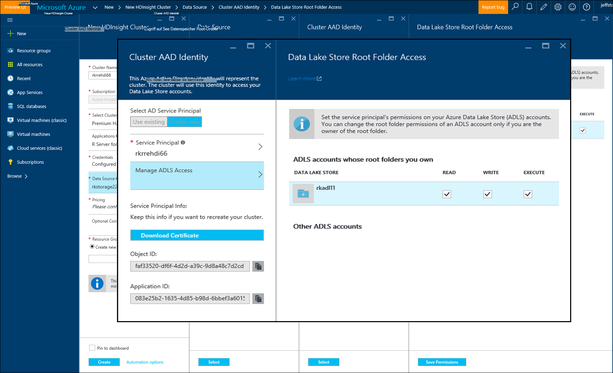

<properties
   pageTitle="Azure Speicheroptionen für R Server auf HDInsight (Vorschau) | Microsoft Azure"
   description="Informationen Sie über die verschiedenen Optionen für Benutzer mit R-Server auf HDInsight (Vorschau)"
   services="HDInsight"
   documentationCenter=""
   authors="jeffstokes72"
   manager="jhubbard"
   editor="cgronlun"
/>

<tags
   ms.service="HDInsight"
   ms.devlang="R"
   ms.topic="article"
   ms.tgt_pltfrm="na"
   ms.workload="data-services"
   ms.date="09/01/2016"
   ms.author="jeffstok"
/>

# <a name="azure-storage-options-for-r-server-on-hdinsight-preview"></a>Azure Speicheroptionen für R Server auf HDInsight (Vorschau)

Microsoft R Server auf HDInsight (Vorschau) hat Zugriff auf beide Azure Blob und [Azure See Datenspeicher](https://azure.microsoft.com/services/data-lake-store/)einen beibehaltenen Daten Code Objekte aus Analyse, usw..

Beim Erstellen eines Clusters Hadoop in HDInsight Geben Sie ein Konto Azure-Speicher. Von diesem Konto ein bestimmten BLOB-Speichercontainer enthält das Dateisystem für den Cluster (z. B. Hadoop Distributed File System erstellen). Aus Gründen der Leistung ist der HDInsight-Cluster in demselben Datenzentrum als primärem Speicher-Konto erstellt. Weitere Informationen finden Sie unter [verwenden Azure BLOB-Speicher mit HDInsight](hdinsight-hadoop-use-blob-storage.md "mit Azure BLOB-Speicher mit HDInsight").   


## <a name="use-multiple-azure-blob-storage-accounts"></a>Verwenden Sie mehrere Konten von Azure BLOB-Speicher

Bei Bedarf können Sie mehrere Azure-Speicherkonten oder Container mit HDI Cluster zugreifen. Dazu müssen Sie zusätzliche Speicherkonten in der Benutzeroberfläche angeben, wenn Sie Cluster erstellen und dann gehen sie r verwenden  

1.  Erstellen Sie einen HDInsight-Cluster mit einem speicherkontonamen Standardcontainer **container1**aufgerufen und **storage1** .
2. Geben Sie zusätzlicher Speicherkonto namens **storage2 an**.  
3. Kopieren Sie die Datei mycsv.csv im Verzeichnis Task und führen Sie Analyse für diese Datei aus.  

    ````
    hadoop fs –mkdir /share
    hadoop fs –copyFromLocal myscsv.scv /share  
    ````

3.  R Code legen Sie Namensknoten auf **Standard,** und die Verzeichnis- und verarbeiten.  

    ````
    myNameNode <- "default"
    myPort <- 0
    ````

  Speicherort der Daten:  

    BigDataDirRoot <-"/ freigeben"  

  Definieren Sie Spark Compute Kontext:

    MySparkCluster <-RxSpark(consoleOutput=TRUE)

  Kontext berechnen:

    rxSetComputeContext(mySparkCluster)

  Definieren des Dateisystems Hadoop verteilt Datei System bietet:

    HdfsFS <-RxHdfsFileSystem (HostName = MyNameNode Port = MyPort)

  Geben Sie die Eingabedatei bietet analysieren:

    Eingabedatei <-file.path(bigDataDirRoot,"mycsv.csv")

Alle Verzeichnis- und Verweise zeigen auf das Speicherkonto wasbs://container1@storage1.blob.core.windows.net. Dies ist das **Standardkonto Speicher** , der mit dem HDInsight verknüpft ist.

Angenommen, möchten eine Datei namens mySpecial.csv sich in der /private befindet Verzeichnis von **container2** in **storage2**.

Zeigen Sie in Ihrem Code R der Knoten Namensverweis Speicherkonto **storage2** .

    myNameNode <- "wasbs://container2@storage2.blob.core.windows.net"
    myPort <- 0

  Speicherort der Daten:

    bigDataDirRoot <- "/private"

  Definieren Sie Spark Compute Kontext:

    mySparkCluster <- RxSpark(consoleOutput=TRUE, nameNode=myNameNode, port=myPort)

  Kontext berechnen:

    rxSetComputeContext(mySparkCluster)

  Definieren Sie Dateisystem bietet:

    hdfsFS <- RxHdfsFileSystem(hostName=myNameNode, port=myPort)

  Geben Sie die Eingabedatei bietet analysieren:

    inputFile <-file.path(bigDataDirRoot,"mySpecial.csv")

Alle Verweise Verzeichnis- und zeigen Sie auf das Speicherkonto wasbs://container2@storage2.blob.core.windows.net. Dies ist der **Knoten** , den Sie angegeben haben.

Beachten Sie, dass Sie konfigurieren/User/RevoShare/<SSH username> Verzeichnis auf **storage2** wie folgt:

    hadoop fs -mkdir wasbs://container2@storage2.blob.core.windows.net/user
    hadoop fs -mkdir wasbs://container2@storage2.blob.core.windows.net/user/RevoShare
    hadoop fs -mkdir wasbs://container2@storage2.blob.core.windows.net/user/RevoShare/<RDP username>

## <a name="use-an-azure-data-lake-store"></a>Ein Azure Data Lake verwenden

Um mit Ihrem Konto HDInsight Lake Data Stores verwenden, müssen Sie Ihr Cluster jede Azure Data Lake Speicher zugreifen, die Sie verwenden möchten. Verwenden Sie den Speicher in R-Skript viel wie Sekundärspeicher-Konto (wie im vorherigen Verfahren beschrieben).

## <a name="add-cluster-access-to-your-azure-data-lake-stores"></a>Cluster-Zugriff auf Ihre Azure Data Lake Shops hinzufügen

Daten See Speicher zugreifen mithilfe einer Azure Active Directory (Azure AD) Service Principal, der HDInsight Cluster zugeordnet wurde.

### <a name="to-add-a-service-principal"></a>Hinzufügen einer Dienstprinzipalnamen
1. Die Registerkarte **Datenquelle** beim Erstellen des Clusters HDInsight wählen Sie **Cluster AAD Identität aus** .
2. Wählen Sie im Dialogfeld **Cluster AAD Identität** unter **Wählen Sie AD Service Principal** **neu erstellen**.

Benennen Sie die Dienstprinzipalnamen und ein Kennwort für sie erstellen öffnet eine neue Registerkarte wo Service Principal Ihre Daten See Shops zugeordnet werden können.

Beachten Sie, dass Sie auch Access Data Lake Speicher später hinzufügen können indem Daten See in Azure-Portal geöffnet und **Daten-Explorer** > **zugreifen**.  Es folgt ein Beispiel für ein Dialogfeld, das veranschaulicht einen Dienstprinzipal zu erstellen und laden Daten See "rkadl11" zugeordnet.




## <a name="use-the-data-lake-store-with-r-server"></a>Verwenden der Daten See R Server
Nach Zugriff auf Daten See Speicher gewährt haben, können Sie den Speicher R Server auf HDInsight genauso wie Sekundärspeicher Azure-Konto. Der einzige Unterschied ist, dass das Präfix **Wasb: / /** Änderungen **Adl: / /** wie folgt:

````
# Point to the ADL store (e.g. ADLtest)
myNameNode <- "adl://rkadl1.azuredatalakestore.net"
myPort <- 0

# Location of the data (assumes a /share directory on the ADL account)
bigDataDirRoot <- "/share"  

# Define Spark compute context
mySparkCluster <- RxSpark(consoleOutput=TRUE, nameNode=myNameNode, port=myPort)

# Set compute context
rxSetComputeContext(mySparkCluster)

# Define HDFS file system
hdfsFS <- RxHdfsFileSystem(hostName=myNameNode, port=myPort)

# Specify the input file in HDFS to analyze
inputFile <-file.path(bigDataDirRoot,"AirlineDemoSmall.csv")

# Create factors for days of the week
colInfo <- list(DayOfWeek = list(type = "factor",
               levels = c("Monday", "Tuesday", "Wednesday", "Thursday",
                          "Friday", "Saturday", "Sunday")))

# Define the data source
airDS <- RxTextData(file = inputFile, missingValueString = "M",
                    colInfo  = colInfo, fileSystem = hdfsFS)

# Run a linear regression
model <- rxLinMod(ArrDelay~CRSDepTime+DayOfWeek, data = airDS)
````

Es folgen die Befehle, mit denen Daten See Speicherkonto mit dem RevoShare-Verzeichnis konfigurieren und Beispiel-CSV-Datei aus dem vorherigen Beispiel hinzufügen:

````
hadoop fs -mkdir adl://rkadl1.azuredatalakestore.net/user
hadoop fs -mkdir adl://rkadl1.azuredatalakestore.net/user/RevoShare
hadoop fs -mkdir adl://rkadl1.azuredatalakestore.net/user/RevoShare/<user>

hadoop fs -mkdir adl://rkadl1.azuredatalakestore.net/share

hadoop fs -copyFromLocal /usr/lib64/R Server-7.4.1/library/RevoScaleR/SampleData/AirlineDemoSmall.csv adl://rkadl1.azuredatalakestore.net/share

hadoop fs –ls adl://rkadl1.azuredatalakestore.net/share
````

## <a name="use-azure-files-on-the-edge-node"></a>Dateien Sie Azure auf dem edgeknoten

Außerdem ist eine einfache Daten Speicheroption für die Verwendung in [Azure Dateien](../storage/storage-how-to-use-files-linux.md "Azure Dateien")Kantenknoten. Sie können eine Dateifreigabe Azure Storage Linux-Dateisystem bereitgestellt. Dies ist nützlich zum Speichern von Dateien, R-Skripts und Ergebnisobjekte später notwendig sein können, wenn es sinnvoll, auf die Kantenknoten als bietet native Dateisystem verwenden.

Ein großer Vorteil von Azure Dateien werden Dateifreigaben bereitgestellt und alle System mit einem unterstützten Betriebssystem wie Windows oder Linux verwendet werden können. Beispielsweise kann verwendet werden von anderen HDInsight-Cluster, die Ihnen oder einem Teammitglied, Azure-VM oder sogar von einem lokalen System.


## <a name="next-steps"></a>Nächste Schritte

Nun verwenden Sie die Grundlagen der R-Konsole aus einer SSH-Sitzung und einen neuen HDInsight-Cluster erstellen R Server verstehen, die folgenden Links andere Wege mit R Server HDInsight.

- [Übersicht über R Server auf HDInsight](hdinsight-hadoop-r-server-overview.md)
- [Erste Schritte mit R Server Hadoop](hdinsight-hadoop-r-server-get-started.md)
- [HDInsight Premium RStudio Server hinzufügen](hdinsight-hadoop-r-server-install-r-studio.md)
- [Kontextoptionen R Server HDInsight berechnen](hdinsight-hadoop-r-server-compute-contexts.md)
