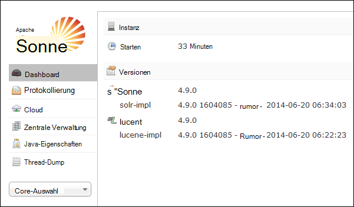

<properties
    pageTitle="Mit der Installation von Solr auf Linux-basierten HDInsight Skriptaktion | Microsoft Azure"
    description="Informationen Sie zum Solr für Linux-basierte HDInsight Hadoop Cluster mit Skriptaktionen installieren."
    services="hdinsight"
    documentationCenter=""
    authors="Blackmist"
    manager="jhubbard"
    editor="cgronlun"
    tags="azure-portal"/>

<tags
    ms.service="hdinsight"
    ms.workload="big-data"
    ms.tgt_pltfrm="na"
    ms.devlang="na"
    ms.topic="article"
    ms.date="10/03/2016"
    ms.author="larryfr"/>

# Installieren und Verwenden von Solr auf HDInsight Hadoop-Cluster

In diesem Thema lernen Sie das Solr mithilfe von Skriptaktion auf Azure HDInsight installieren. Solr ist eine leistungsfähige Such-Plattform und bietet auf Unternehmensebene Suchfunktionen für Hadoop verwalteten Daten. Solr auf HDInsight-Cluster installiert haben, erfahren Sie ebenfalls Daten mit Solr suchen.

> [AZURE.NOTE] Die Schritte in diesem Dokument erfordern einen Linux-basierte HDInsight-Cluster. Informationen auf einem Windows-basierten Cluster mit Solr finden Sie unter [Installieren und verwenden Solr auf HDinsight Hadoop-Cluster (Windows)](hdinsight-hadoop-solr-install.md)

In diesem Thema verwendete Skript erstellt einen Solr-Cluster in einer bestimmten Konfiguration. Ggf. die Clusterkonfiguration Solr mit anderen Sammlungen, Splitter, Schemas, Replikate müssen Sie das Skript und Solr Binärdateien entsprechend ändern.

## Was ist Solr?

[Apache Solr](http://lucene.apache.org/solr/features.html) ist eine Plattform für unternehmensweite suchen, die leistungsstarke Volltextsuche auf Daten ermöglicht. Wohingegen Hadoop speichern und Verwalten von Daten, bietet Apache Solr Suchfunktionen, Daten schnell abzurufen. Dieses Thema beschreibt einen HDInsight Cluster installieren Solr anpassen.

> [AZURE.WARNING] Komponenten mit HDInsight-Cluster vollständig unterstützt und Microsoft Support hilft isolieren und Lösen von Problemen im Zusammenhang mit diesen Komponenten.
>
> Benutzerdefinierte Komponenten wie Solr, erhalten angemessene Unterstützung helfen, das Problem zu beheben. Dadurch kann die Fehlerbehebung oder Aufforderung zu Kanälen für open-Source-Technologien, fundiertes Fachwissen für diese Technologie fand. Beispielsweise sind viele Community-Sites, wie verwendet werden können: [MSDN-Forum für HDInsight](https://social.msdn.microsoft.com/Forums/azure/en-US/home?forum=hdinsight), [http://stackoverflow.com](http://stackoverflow.com). Apache-Projekte verfügen Projektsites auf [http://apache.org](http://apache.org), zum Beispiel: [Hadoop](http://hadoop.apache.org/).

## Das Skript führt

Dieses Skript ändert die folgenden HDInsight-Cluster:

* Installiert in Solr`/usr/hdp/current/solr`
* Erstellt einen neuen Benutzer __Solrusr__, der Solr-Dienst ausgeführt wird
* Legt __Solruser__ als Besitzer`/usr/hdp/current/solr`
* Fügt eine [Upstart](http://upstart.ubuntu.com/) -Konfiguration, die Solr startet, wenn ein Clusterknoten neu gestartet. Solr wird auf den Clusterknoten automatisch nach der Installation gestartet werden.

## Installieren Sie Solr mit Skripts

Eine Beispielskript Solr auf einen HDInsight-Cluster installieren ist am folgenden Speicherort verfügbar.

    https://hdiconfigactions.blob.core.windows.net/linuxsolrconfigactionv01/solr-installer-v01.sh

Dieser Abschnitt beschreibt das Beispielskript verwenden, beim Erstellen eines neuen Clusters mithilfe des Azure-Portals. 

> [AZURE.NOTE] Azure PowerShell, Azure-CLI, HDInsight .NET SDK oder Azure Resource Manager Vorlagen können auch verwendet werden, Skriptaktionen anwenden. Sie können auch Skriptaktionen auf Cluster bereits anwenden. Weitere Informationen finden Sie unter [Cluster mit Skriptaktionen HDInsight anpassen](hdinsight-hadoop-customize-cluster-linux.md).

1. Bereitstellen eines Clusters mithilfe der Schritte in [HDInsight Bestimmung Linux-basierten Clustern](hdinsight-hadoop-create-linux-clusters-portal.md), aber werden nicht bereitgestellt.

2. **Optionale Konfiguration** Blade **Skriptaktionen**wählen und folgende Informationen:

    * __NAME__: Geben Sie einen Anzeigenamen für die Skriptaktion.
    * __Skript-URI__: https://hdiconfigactions.blob.core.windows.net/linuxsolrconfigactionv01/solr-installer-v01.sh
    * __Kopf__: Aktivieren Sie diese Option
    * __ARBEITSKRAFT__: Aktivieren Sie diese Option
    * __ZOOKEEPER__: Aktivieren Sie diese Option auf der Zookeeper-Knoten installieren
    * __Parameter__: lassen Sie dieses Feld leer

3. Am Ende der **Skriptaktionen**Schaltfläche **Wählen Sie** zum Speichern der Konfiguration. Schließlich Schaltfläche **Wählen Sie** unten die **Optionale Konfiguration** Blade optionale Konfigurationsinformationen speichern.

4. Bereitstellung des Clusters gemäß [HDInsight Bestimmung Linux-basierten Clustern](hdinsight-hadoop-create-linux-clusters-portal.md)weiter.

## Wie verwende ich Solr in HDInsight?

### Indizierung von Daten

Sie müssen mit Solr mit einigen Dateien indizieren beginnen. Solr können Sie Suchabfragen für die indizierten Daten ausführen. Gehen Sie zu Solr Beispieldaten hinzufügen und dann Abfragen:

1. Verbinden Sie mit HDInsight SSH:

        ssh USERNAME@CLUSTERNAME-ssh.azurehdinsight.net

    Weitere Informationen über SSH mit HDInsight finden Sie unter:

    * [Verwenden Sie SSH mit Linux-basierten Hadoop auf HDInsight von Linux, Unix und Mac OS](hdinsight-hadoop-linux-use-ssh-unix.md)

    * [Verwenden Sie SSH mit Linux-basierten Hadoop auf Windows HDInsight](hdinsight-hadoop-linux-use-ssh-windows.md)

    > [AZURE.IMPORTANT] Schritte verwenden später in diesem Dokument stellen einen SSL-Tunnel zum Herstellen der Solr Web-Benutzeroberfläche. Um die folgenden Schritte müssen Sie einen SSL-Tunnel einrichten und Konfigurieren des Browsers verwenden.
    >
    > Weitere Informationen finden Sie unter [Verwenden SSH Tunneling auf Ambari Webbenutzeroberfläche ResourceManager, JobHistory, NameNode, Oozie, und andere Webbenutzeroberfläche](hdinsight-linux-ambari-ssh-tunnel.md)

2. Verwenden Sie die folgenden Befehle zu Solr Index Beispieldaten:

        cd /usr/hdp/current/solr/example/exampledocs
        java -jar post.jar solr.xml monitor.xml

    Sie sehen auf der Konsole die folgende Ausgabe:

        POSTing file solr.xml
        POSTing file monitor.xml
        2 files indexed.
        COMMITting Solr index changes to http://localhost:8983/solr/update..
        Time spent: 0:00:01.624

    Das Dienstprogramm post.jar Indizes Solr mit zwei Beispieldokumente, **solr.xml** und **monitor.xml**. Diese werden in __collection1__ in Solr gespeichert.

3. Verwenden Sie folgende Abfrage die REST API von Solr:

        curl "http://localhost:8983/solr/collection1/select?q=*%3A*&wt=json&indent=true"

    Abfrage __collection1__ übereinstimmenden Dokumente ausgestellt __ \*:\* __ (als \*% 3A\* in der Abfragezeichenfolge) und die Antwort als JSON zurückgegeben werden soll. Die Antwort sollte etwa wie folgt aussehen:

            "response": {
                "numFound": 2,
                "start": 0,
                "maxScore": 1,
                "docs": [
                  {
                    "id": "SOLR1000",
                    "name": "Solr, the Enterprise Search Server",
                    "manu": "Apache Software Foundation",
                    "cat": [
                      "software",
                      "search"
                    ],
                    "features": [
                      "Advanced Full-Text Search Capabilities using Lucene",
                      "Optimized for High Volume Web Traffic",
                      "Standards Based Open Interfaces - XML and HTTP",
                      "Comprehensive HTML Administration Interfaces",
                      "Scalability - Efficient Replication to other Solr Search Servers",
                      "Flexible and Adaptable with XML configuration and Schema",
                      "Good unicode support: héllo (hello with an accent over the e)"
                    ],
                    "price": 0,
                    "price_c": "0,USD",
                    "popularity": 10,
                    "inStock": true,
                    "incubationdate_dt": "2006-01-17T00:00:00Z",
                    "_version_": 1486960636996878300
                  },
                  {
                    "id": "3007WFP",
                    "name": "Dell Widescreen UltraSharp 3007WFP",
                    "manu": "Dell, Inc.",
                    "manu_id_s": "dell",
                    "cat": [
                      "electronics and computer1"
                    ],
                    "features": [
                      "30\" TFT active matrix LCD, 2560 x 1600, .25mm dot pitch, 700:1 contrast"
                    ],
                    "includes": "USB cable",
                    "weight": 401.6,
                    "price": 2199,
                    "price_c": "2199,USD",
                    "popularity": 6,
                    "inStock": true,
                    "store": "43.17614,-90.57341",
                    "_version_": 1486960637584081000
                  }
                ]
              }

### Solr-Dashboard verwenden

Solr-Dashboard ist eine Web-Benutzeroberfläche, die mit Solr über Ihren Webbrowser ermöglicht. Solr-Dashboard werden nicht direkt auf das Internet vom HDInsight Cluster aber muss mit einem SSH-Tunnel zugegriffen werden. Finden Sie weitere Informationen über SSH-Tunnel [Verwendet SSH Tunneling auf Ambari Webbenutzeroberfläche ResourceManager, JobHistory, NameNode, Oozie, und andere Webbenutzeroberfläche](hdinsight-linux-ambari-ssh-tunnel.md)

Nachdem Sie einen SSH-Tunnel eingerichtet haben, gehen Sie folgendermaßen vor, Solr Dashboard verwenden:

1. Bestimmen Sie den Hostnamen für die primäre Hauptknoten:

    1. SSH Verbindung zum Cluster auf Port 22 verwenden. Beispielsweise `ssh USERNAME@CLUSTERNAME-ssh.azurehdinsight.net` wobei __Benutzername__ Ihr Benutzername SSH und __CLUSTERNAME__ ist der Name des Clusters.

        Weitere Informationen über SSH finden Sie in folgenden Dokumenten:

        * [SSH mit Linux-basierten HDInsight Linux, Unix und Mac OS X-Clients verwenden](hdinsight-hadoop-linux-use-ssh-unix.md)

        * [Verwenden von SSH mit Linux-basierte HDInsight von einem Windows-client](hdinsight-hadoop-linux-use-ssh-windows.md)
    
    3. Verwenden Sie folgenden Befehl zu der vollqualifizierte Hostname:

            hostname -f

        Ein erhalten ähnlich der folgenden:

            hn0-myhdi-nfebtpfdv1nubcidphpap2eq2b.ex.internal.cloudapp.net
    
        Dies ist der Hostname, der in den folgenden Schritten verwendet werden soll.
    
1. In Ihrem Browser eine Verbindung mit __Solr/Http://HOSTNAME:8983 / #/__, wobei __HOSTNAME__ der Name in den vorherigen Schritten ermittelt. 

    Die Anforderung sollte über SSH-Tunnel zu dem Head-Knoten für den Cluster HDInsight weitergeleitet werden. Sie sollte eine Seite ähnlich der folgenden angezeigt:

    

2. Verwenden Sie im linken Bereich **Core Auswahl** Dropdown- **collection1**auswählen. Mehrere Einträge sollten sie unter __collection1__angezeigt.

3. Wählen Sie die Einträge unter __collection1__ __Abfrage__. Verwenden Sie die folgenden Werte zum Auffüllen der Suchseite:

    * Geben Sie im Textfeld **Q** ** \*:**\*. Alle Dokumente, die indiziert sind wird in Solr zurückgegeben. Wenn Sie nach einer bestimmten Zeichenfolge in den Dokumenten suchen möchten, können Sie die Zeichenfolge eingeben.

    * Wählen Sie das Ausgabeformat im Textfeld **wt** . Standardeinstellung ist **Json**.

    Wählen Sie abschließend die Schaltfläche **Abfrage ausführen** am unteren Rand der Pate suchen.

    

    Die Ausgabe gibt zwei Dokumente, die für die Indizierung von Solr verwendet. Die Ausgabe ähnelt der folgenden:

            "response": {
                "numFound": 2,
                "start": 0,
                "maxScore": 1,
                "docs": [
                  {
                    "id": "SOLR1000",
                    "name": "Solr, the Enterprise Search Server",
                    "manu": "Apache Software Foundation",
                    "cat": [
                      "software",
                      "search"
                    ],
                    "features": [
                      "Advanced Full-Text Search Capabilities using Lucene",
                      "Optimized for High Volume Web Traffic",
                      "Standards Based Open Interfaces - XML and HTTP",
                      "Comprehensive HTML Administration Interfaces",
                      "Scalability - Efficient Replication to other Solr Search Servers",
                      "Flexible and Adaptable with XML configuration and Schema",
                      "Good unicode support: héllo (hello with an accent over the e)"
                    ],
                    "price": 0,
                    "price_c": "0,USD",
                    "popularity": 10,
                    "inStock": true,
                    "incubationdate_dt": "2006-01-17T00:00:00Z",
                    "_version_": 1486960636996878300
                  },
                  {
                    "id": "3007WFP",
                    "name": "Dell Widescreen UltraSharp 3007WFP",
                    "manu": "Dell, Inc.",
                    "manu_id_s": "dell",
                    "cat": [
                      "electronics and computer1"
                    ],
                    "features": [
                      "30\" TFT active matrix LCD, 2560 x 1600, .25mm dot pitch, 700:1 contrast"
                    ],
                    "includes": "USB cable",
                    "weight": 401.6,
                    "price": 2199,
                    "price_c": "2199,USD",
                    "popularity": 6,
                    "inStock": true,
                    "store": "43.17614,-90.57341",
                    "_version_": 1486960637584081000
                  }
                ]
              }

### Starten und Beenden von Solr

Möchten Sie manuell beenden oder starten Solar, verwenden Sie die folgenden Befehle:

    sudo stop solr

    sudo start solr

## Indizierte Sicherungsdaten

Empfiehlt sich jedoch sollten Sie die indizierten Daten Solr Clusterknoten auf Azure BLOB-Speicher sichern. Führen Sie dazu die folgenden Schritte aus:

1. Eine Verbindung mit SSH, dann verwenden Sie den folgenden Befehl zu der Hostname der Head-Knoten:

        hostname -f
        
2. Anhand der folgenden Snapshot indizierten Daten erstellen. Ersetzen Sie __HOSTNAMEN__ mit dem Namen des vorherigen Befehls zurückgegeben:

        curl http://HOSTNAME:8983/solr/replication?command=backup

    Eine Antwort wie folgt sollte angezeigt werden:

        <?xml version="1.0" encoding="UTF-8"?>
        <response>
          <lst name="responseHeader">
            <int name="status">0</int>
            <int name="QTime">9</int>
          </lst>
          <str name="status">OK</str>
        </response>

2. Anschließend wechseln Sie zu __/usr/hdp/current/solr/example/solr__. Ein Unterverzeichnis für jede Auflistung werden. __Datenverzeichnis der Snapshot für diese Auflistung ist__ jede Auflistung Verzeichnis befindet.

    Wenn Sie die Schritte oben verwendet die Beispieldokumente indizieren, das __/usr/hdp/current/solr/example/solr/collection1/data__ Verzeichnis sollte jetzt beispielsweise ein Verzeichnis namens __Snapshot. ###__ die # es sind das Datum und die Zeit des Snapshots.

3. Erstellen Sie ein komprimiertes Archiv Snapshotordner ähnelt dem folgenden Befehl:

        tar -zcf snapshot.20150806185338855.tgz snapshot.20150806185338855

    Das Erstellen ein neues Archivs namens __snapshot.20150806185338855.tgz__, die den Inhalt des Verzeichnisses __snapshot.20150806185338855__ enthält.

3. Sie können das Archiv in den primären Speicher der Cluster mit dem folgenden Befehl Speichern:

    Hadoop fs - CopyFromLocal snapshot.20150806185338855.tgz/Beispiel Daten

    > [AZURE.NOTE] Eine dedizierte Verzeichnis für Solr Momentaufnahmen erstellen möchten. Z. B. `hadoop fs -mkdir /solrbackup`.

Weitere Informationen zum Arbeiten mit Solr Sicherung und Wiederherstellung finden Sie unter [Erstellen und Wiederherstellen des SolrCores](https://cwiki.apache.org/confluence/display/solr/Making+and+Restoring+Backups+of+SolrCores).

## Siehe auch

- [Installieren und verwenden Farbton auf HDInsight Cluster](hdinsight-hadoop-hue-linux.md). Farbton ist eine Web-Benutzeroberfläche, das Erstellen, ausführen und speichern Schwein und Struktur Aufträge sowie Durchsuchen der Standardspeicher für Ihre HDInsight cluster erleichtert.

- [R auf HDInsight-Cluster installieren][hdinsight-install-r]. Verwenden Sie Cluster Anpassung R auf HDInsight Hadoop-Cluster installieren. R ist ein Open-Source-Sprache und Umgebung für statistische Datenverarbeitung. Es enthält Hunderte von integrierten statistischen Funktionen und eigene Programmiersprachen, die Aspekte der funktionalen und objektorientierte Programmierung kombiniert. Darüber hinaus umfangreiche Grafiken bereit.

- [Giraph für HDInsight-Cluster installieren](hdinsight-hadoop-giraph-install-linux.md). Verwenden Sie Cluster Anpassung Giraph auf HDInsight Hadoop-Cluster installieren. Giraph können Sie Graphen mit Hadoop Verarbeitung durchführen und mit Azure HDInsight verwendet werden kann.

- [Farbton für HDInsight-Cluster installieren](hdinsight-hadoop-hue-linux.md). Verwenden Sie Cluster Anpassung Farbton auf HDInsight Hadoop-Cluster installieren. Farbton ist eine Reihe von Web Applications, die Interaktion mit einem Hadoop-Cluster verwendet.

[hdinsight-install-r]: hdinsight-hadoop-r-scripts-linux.md
[hdinsight-cluster-customize]: hdinsight-hadoop-customize-cluster-linux.md
