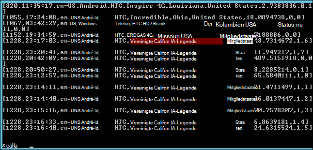

<properties
    pageTitle="Verwenden von Skriptaktion Spark Hadoop Cluster installieren | Microsoft Azure"
    description="Erfahren Sie, wie einen HDInsight Cluster mit Spark Skript Aktion angepasst."
    services="hdinsight"
    documentationCenter=""
    authors="nitinme"
    manager="jhubbard"
    editor="cgronlun"/>

<tags
    ms.service="hdinsight"
    ms.workload="big-data"
    ms.tgt_pltfrm="na"
    ms.devlang="na"
    ms.topic="article"
    ms.date="02/05/2016"
    ms.author="nitinme"/>

# Installieren Sie und verwenden Sie Spark Skriptaktion mit HDInsight Hadoop-Cluster

> [AZURE.IMPORTANT] Dieser Artikel ist jetzt veraltet. HDInsight bietet jetzt Spark als ein erstklassiges Cluster für Windows-basierten Clustern, d. h. Sie jetzt direkt Spark-Cluster erstellen können ohne einen Hadoop Cluster mit Skriptaktion ändern. Clustertyp Spark verwenden, erhalten Sie einen HDInsight Version 3.2 Cluster mit Spark Version 1.3.1.  Um verschiedene Versionen von Spark installieren, können Sie Skriptaktion. HDInsight bietet ein Beispielskript Skriptaktion.

Erfahren Sie Spark auf Windows installieren basierenden Skriptaktion mit HDInsight und Spark Abfragen auf HDInsight Clustern.

**Verwandte Artikel**

- [In HDInsight Cluster Hadoop erstellen](hdinsight-provision-clusters.md): Allgemeine Informationen zum HDInsight-Cluster erstellen.

- [Erste Schritte mit Apache Spark auf HDInsight](hdinsight-apache-spark-jupyter-spark-sql.md): einen HDInsight Spark-Cluster erstellen.

- [HDInsight Cluster mit Skriptaktion anpassen][hdinsight-cluster-customize]: Allgemeine Informationen zum Anpassen von HDInsight Cluster mit Skriptaktion.

- [Skripts für HDInsight Skriptaktion entwickeln](hdinsight-hadoop-script-actions.md).

## Was ist Spark?

<a href="http://spark.apache.org/docs/latest/index.html" target="_blank">Apache Spark</a> ist ein Open Source-parallele Verarbeitung Rahmen, die Verarbeitung im Speicher zur Leistungssteigerung big Data analytische Applikationen unterstützt. Spark Berechnung speicherresidenten Funktionen machen es eine gute Wahl für iterative Algorithmen Computer lernen und Graph berechnet.

Spark kann auch verwendet werden, zu konventionellen Festplatten-basierte Daten verarbeiten. Spark verbessert das herkömmliche MapReduce-Framework vermeiden Schreibvorgänge auf der Festplatte in der Phase. Auch deshalb Spark Hadoop verteilt Datei System bietet und Azure BLOB-Speicher mit vorhandenen Daten Spark problemlos verarbeitet werden können.

Dieses Thema beschreibt einen HDInsight Cluster installieren Spark anpassen.

## Installieren Sie mithilfe der Azure-Portal Spark

Eine Beispielskript Spark auf einen HDInsight-Cluster installieren ist ein Blob schreibgeschützt Azure-Speicher zur [https://hdiconfigactions.blob.core.windows.net/sparkconfigactionv03/spark-installer-v03.ps1](https://hdiconfigactions.blob.core.windows.net/sparkconfigactionv03/spark-installer-v03.ps1)ab. Dieses Skript kann Spark 1.2.0 oder Funken 1.0.2 je erstellte HDInsight-Cluster installieren.

- Wenn Sie das Skript, beim Erstellen eines Clusters **HDInsight 3.2 verwenden** , installiert **Spark 1.2.0**.
- Wenn Sie das Skript, beim Erstellen eines Clusters **HDInsight 3.1 verwenden** , installiert **Spark 1.0.2**.

Sie können dieses Skript ändern oder erstellen ein eigenes Skript zum anderen Spark-Versionen installieren.

> [AZURE.NOTE] Das Beispielskript funktioniert nur mit HDInsight 3.1 und 3.2. Weitere Informationen über HDInsight Cluster Versionen finden Sie unter [HDInsight Cluster Versionen](hdinsight-component-versioning.md).

1. Erstellen eines Clusters mithilfe der Option **Benutzerdefinierte** wie [Hadoop erstellen Cluster in HDInsight](hdinsight-provision-clusters.md#portal)beschrieben. Wählen Sie den Cluster abhängig von den folgenden:

    - Wenn Sie **Spark 1.2.0**installieren möchten, erstellen Sie einen HDInsight 3.2 Cluster.
    - Wenn Sie **Spark 1.0.2**installieren möchten, erstellen Sie einen HDInsight 3.1 Cluster.

2. Der **Skript-Aktionen** des Assistenten klicken Sie auf **Skriptaktion hinzufügen** , um Angaben über die Skriptaktion wie folgt:

    ![Skriptaktion für einen Cluster anpassen verwenden] (./media/hdinsight-hadoop-spark-install/HDI.CustomProvision.Page6.png "Skriptaktion für einen Cluster anpassen verwenden")

    <table border='1'>
        <tr><th>Eigenschaft</th><th>Wert</th></tr>
        <tr><td>Name</td>
            <td>Geben Sie einen Namen für die Skriptaktion. Z. B. <b>Spark installieren</b>.</td></tr>
        <tr><td>Skript URI</td>
            <td>Geben Sie den URI Uniform Resource Identifier () in das Skript aufgerufen wird, um den Cluster anpassen. Beispielsweise <i>https://hdiconfigactions.blob.core.windows.net/sparkconfigactionv03/spark-installer-v03.ps1</i></td></tr>
        <tr><td>Knotentyp</td>
            <td>Geben Sie Knoten, auf denen das Skript Anpassung ausgeführt wird. Sie können <b>alle Knoten</b>, <b>Head-Knoten</b>oder <b>Worker-Knoten</b>.
        <tr><td>Parameter</td>
            <td>Geben Sie die Parameter ggf. vom Skript an. Das Skript Spark installieren erfordert keine Parameter, damit Sie dieses Feld leer lassen können.</td></tr>
    </table>

    Sie können mehrere Skriptaktion mehrere Komponenten im Cluster installieren. Nachdem die Skripts hinzugefügt haben, klicken Sie auf das Häkchen, um den Cluster erstellen.

Das Skript können Sie Spark auf HDInsight mithilfe von Azure PowerShell oder HDInsight .NET SDK installieren. Diese Verfahren werden später in diesem Thema Anweisungen.

## Spark in HDInsight verwenden
Spark stellt APIs in Scala, Python und Java. Die interaktive Shell Spark können Sie Spark Abfragen. Dieser Abschnitt beschreibt die verschiedenen Ansätze Spark arbeiten mit:

- [Mithilfe der Shell Spark interaktiv Abfragen](#sparkshell)
- [Mithilfe der Shell Spark Spark SQL-Abfragen](#sparksql)
- [Ein eigenständiges Scala Programm](#standalone)

###Mithilfe der Shell Spark interaktiv Abfragen
Die folgenden Schritte Spark Abfragen aus einer interaktiven Spark-Shell. In diesem Abschnitt führen wir eine Abfrage Spark auf eine Beispieldatendatei (/ example/data/gutenberg/davinci.txt) auf HDInsight Cluster standardmäßig verfügbar ist.

1. Azure-Portal aktivieren Sie den Remotedesktop für den Cluster erstellten Spark installiert und dann Remote zum Cluster. Eine Anleitung finden Sie [mit HDInsight-Cluster über RDP](hdinsight-administer-use-management-portal.md#rdp).

2. Öffnen Sie in der Sitzung Remote Desktop Protocol (RDP) auf dem Desktop Hadoop Befehlszeile (aus einer desktop-Verknüpfung) und navigieren Sie zum Speicherort, in dem Funken installiert ist. beispielsweise **C:\apps\dist\spark-1.2.0**.

3. Führen Sie den folgenden Befehl Spark-Shell starten:

         .\bin\spark-shell --master yarn

    Nachdem der Befehl abgeschlossen ist, erhalten Sie eine Scala Fragen:

         scala>

5. Die Meldung Scala Geben Sie Spark Abfrage unten ein. Diese Abfrage zählt das Vorkommen des Worts in der davinci.txt-Datei, die an/Beispiel Daten/Gutenberg auf den Cluster Azure Blob-Speicher verfügbar ist.

        val file = sc.textFile("/example/data/gutenberg/davinci.txt")
        val counts = file.flatMap(line => line.split(" ")).map(word => (word, 1)).reduceByKey(_ + _)
        counts.toArray().foreach(println)

6. Die Ausgabe sollte folgendermaßen aussehen:

    

7. Geben Sie: Q Scala Fragen zu beenden.

        :q

###Mithilfe der Shell Spark Spark SQL-Abfragen

Spark SQL können Sie mit Spark relationalen Abfragen in strukturierte Abfragesprache (SQL), HiveQL oder Scala ausgedrückt. In diesem Abschnitt betrachten wir mit Spark Struktur auf eine Struktur Beispieltabelle abgefragt. Struktur Tabelle in diesem Abschnitt ( **Hivesampletable**) ist standardmäßig verfügbar, wenn Sie einen Cluster erstellen.

>[AZURE.NOTE] Im folgenden Beispiel wurde gegen **1.2.0 wecken**, das installiert wird, läuft die Skriptaktion während HDInsight 3.2 erstellen.

1. Azure-Portal aktivieren Sie den Remotedesktop für den Cluster erstellten Spark installiert und dann Remote zum Cluster. Eine Anleitung finden Sie [mit HDInsight-Cluster über RDP](hdinsight-administer-use-management-portal.md#rdp).

2. RDP-Sitzung auf dem Desktop öffnen Sie Hadoop Befehlszeile (in einer desktop-Verknüpfung) und navigieren Sie zum Speicherort, in dem Funken installiert ist; beispielsweise **C:\apps\dist\spark-1.2.0**.

3. Führen Sie den folgenden Befehl Spark-Shell starten:

         .\bin\spark-shell --master yarn

    Nachdem der Befehl abgeschlossen ist, erhalten Sie eine Scala Fragen:

         scala>

4. Festlegen Sie auf der Scala den Kontext Struktur. Dies ist erforderlich, Struktur Abfragen arbeiten mit Spark.

        val hiveContext = new org.apache.spark.sql.hive.HiveContext(sc)

    Hinweis Diese **sc** Spark Standardkontext, die beim Starten der Shell Spark festgelegt ist.

5. Abfrage mit dem Kontext Struktur Struktur und Ausgabe in der Konsole. Die Abfrage ruft Daten auf Geräten eine bestimmte Produktion und schränkt die Anzahl der abgerufenen 20 Datensätze.

        hiveContext.sql("""SELECT * FROM hivesampletable WHERE devicemake LIKE "HTC%" LIMIT 20""").collect().foreach(println)

6. Sie sollte eine Ausgabe ähnlich der folgenden angezeigt:

    

7. Geben Sie: Q Scala Fragen zu beenden.

        :q

### Ein eigenständiges Scala Programm

In diesem Abschnitt schreiben wir eine Scala Anwendung, die zählt die Anzahl der Zeilen, die mit den Buchstaben 'a' und 'b' in einer Beispieldatei (/ example/data/gutenberg/davinci.txt) auf HDInsight Cluster standardmäßig verfügbar ist. Zum Schreiben und eine eigenständige Scala mit einem Cluster Spark Installation angepasst, führen Sie die folgenden Schritte aus:

- Schreiben Sie ein Programm Scala
- Das Scala Programm zu JAR-Datei
- Die Stapelverarbeitung im Cluster

#### Schreiben Sie ein Programm Scala
In diesem Abschnitt schreiben Sie ein Scala Programm, das zählt die Anzahl der Zeilen mit 'a' und 'b' in der Beispieldatendatei.

1. Öffnen Sie einen Texteditor, und fügen Sie folgenden Code:

        /* SimpleApp.scala */
        import org.apache.spark.SparkContext
        import org.apache.spark.SparkContext._
        import org.apache.spark.SparkConf

        object SimpleApp {
          def main(args: Array[String]) {
            val logFile = "/example/data/gutenberg/davinci.txt"         //Location of the sample data file on Azure Blob storage
            val conf = new SparkConf().setAppName("SimpleApplication")
            val sc = new SparkContext(conf)
            val logData = sc.textFile(logFile, 2).cache()
            val numAs = logData.filter(line => line.contains("a")).count()
            val numBs = logData.filter(line => line.contains("b")).count()
            println("Lines with a: %s, Lines with b: %s".format(numAs, numBs))
          }
        }

2. Speichern Sie die Datei mit dem Namen **SimpleApp.scala**.

#### Das Scala Programm
In diesem Abschnitt verwenden Sie <a href="http://www.scala-sbt.org/0.13/docs/index.html" target="_blank">Einfache Buildtool</a> (oder Sbt) die Scala-Anwendung erstellen. SBT erfordert Java 1.6 oder höher, so sicherstellen, dass Sie die richtige Version von Java installiert, bevor Sie mit diesem Abschnitt fortfahren.

1. Installieren Sie Sbt von http://www.scala-sbt.org/0.13/tutorial/Installing-sbt-on-Windows.html.
2. Erstellen Sie einen Ordner namens **SimpleScalaApp**, und erstellen Sie in diesem Ordner eine Datei namens **simple.sbt**. Dies ist eine Konfigurationsdatei, die Informationen über die Scala Version Bibliothek Abhängigkeiten usw. enthält. Fügen Sie Folgendes in die Datei simple.sbt und speichern:

        name := "SimpleApp"

        version := "1.0"

        scalaVersion := "2.10.4"

        libraryDependencies += "org.apache.spark" %% "spark-core" % "1.2.0"

    >[AZURE.NOTE] Stellen Sie sicher, dass leeren Zeilen in der Datei beibehalten.

3. Im Ordner **SimpleScalaApp** erstellen Sie eine Struktur- **\src\main\scala** , und fügen Sie zuvor im Ordner \src\main\scala erstellt Scala-Programm (**SimpleApp.scala**).
4. Öffnen Sie ein Eingabeaufforderungsfenster, wechseln Sie zum Verzeichnis SimpleScalaApp und geben Sie den folgenden Befehl:

        sbt package

    Sobald die Anwendung kompiliert wird, sehen Sie eine **simpleapp_2.10-1.0.jar** -Datei im Stammordner SimpleScalaApp im Verzeichnis **\target\scala-2.10** erstellt.

#### Die Stapelverarbeitung im Cluster
In diesem Abschnitt Sie im Cluster, die Spark remote installiert und Zielordner SimpleScalaApp Projekt kopieren. Befehl dann die **Spark übermitteln** den Auftrag auf dem Cluster senden.

1. Remote-Cluster, die Spark installiert wurde. Vom Computer wo Sie geschrieben und SimpleApp.scala Programm kopieren Sie den Ordner **SimpleScalaApp\target** , und fügen Sie ihn auf dem Cluster.
2. RDP-Sitzung auf dem Desktop öffnen Sie Hadoop-Befehlszeile, und navigieren Sie zum Speicherort, in **den Zielordner** eingefügt.
3. Geben Sie den folgenden Befehl zur Ausführung des SimpleApp.scala-Programms:

        C:\apps\dist\spark-1.2.0\bin\spark-submit --class "SimpleApp" --master local target/scala-2.10/simpleapp_2.10-1.0.jar

4. Wenn das Programm beendet ist, wird die Ausgabe in der Konsole angezeigt.

        Lines with a: 21374, Lines with b: 11430

## Installieren Sie mithilfe von Azure PowerShell Funken

In diesem Abschnitt verwenden wir das Cmdlet **<a href = "http://msdn.microsoft.com/library/dn858088.aspx" target="_blank">Hinzufügen AzureHDInsightScriptAction</a>** Skripts aufrufen Skriptaktion anpassen ein Clusters mit. Stellen Sie bevor Sie fortfahren sicher installiert und Azure PowerShell konfiguriert. Weitere Informationen auf Arbeitsstation ausführen Azure PowerShell-Cmdlets für HDInsight [Installieren und Konfigurieren von Azure PowerShell](../powershell-install-configure.md).

Führen Sie die folgenden Schritte aus:

1. Ein Azure PowerShell öffnen und die folgenden Variablen:

        # Provide values for these variables
        $subscriptionName = "<SubscriptionName>"        # Name of the Azure subscription
        $clusterName = "<HDInsightClusterName>"         # HDInsight cluster name
        $storageAccountName = "<StorageAccountName>"    # Azure Storage account that hosts the default container
        $storageAccountKey = "<StorageAccountKey>"      # Key for the Storage account
        $containerName = $clusterName
        $location = "<MicrosoftDataCenter>"             # Location of the HDInsight cluster. It must be in the same data center as the Storage account.
        $clusterNodes = <ClusterSizeInNumbers>          # Number of nodes in the HDInsight cluster
        $version = "<HDInsightClusterVersion>"          # For example, "3.2"

2. Geben Sie die Konfiguration wie Knoten im Cluster sowie der Standardspeicher verwendet werden.

        # Specify the configuration options
        Select-AzureSubscription $subscriptionName
        $config = New-AzureHDInsightClusterConfig -ClusterSizeInNodes $clusterNodes
        $config.DefaultStorageAccount.StorageAccountName="$storageAccountName.blob.core.windows.net"
        $config.DefaultStorageAccount.StorageAccountKey=$storageAccountKey
        $config.DefaultStorageAccount.StorageContainerName=$containerName

3. Verwenden Sie das Cmdlet **Hinzufügen AzureHDInsightScriptAction** eine Skriptaktion Clusterkonfiguration hinzufügen. Später wird Cluster erstellt wird, die Skriptaktion ausgeführt.

        # Add a script action to the cluster configuration
        $config = Add-AzureHDInsightScriptAction -Config $config -Name "Install Spark" -ClusterRoleCollection HeadNode -Uri https://hdiconfigactions.blob.core.windows.net/sparkconfigactionv03/spark-installer-v03.ps1

    **Add-AzureHDInsightScriptAction** -Cmdlet verwendet die folgenden Parameter:

    <table style="border-color: #c6c6c6; border-width: 2px; border-style: solid; border-collapse: collapse;">
    <tr>
    <th style="border-color: #c6c6c6; border-width: 2px; border-style: solid; border-collapse: collapse; width:90px; padding-left:5px; padding-right:5px;">Parameter</th>
    <th style="border-color: #c6c6c6; border-width: 2px; border-style: solid; border-collapse: collapse; width:550px; padding-left:5px; padding-right:5px;">Definition</th></tr>
    <tr>
    <td style="border-color: #c6c6c6; border-width: 2px; border-style: solid; border-collapse: collapse; padding-left:5px;">Konfiguration</td>
    <td style="border-color: #c6c6c6; border-width: 2px; border-style: solid; border-collapse: collapse; padding-left:5px; padding-right:5px;">Das Konfigurationsobjekt, das Script Informationen hinzugefügt wird.</td></tr>
    <tr>
    <td style="border-color: #c6c6c6; border-width: 2px; border-style: solid; border-collapse: collapse; padding-left:5px;">Name</td>
    <td style="border-color: #c6c6c6; border-width: 2px; border-style: solid; border-collapse: collapse; padding-left:5px;">Name der Skriptaktion.</td></tr>
    <tr>
    <td style="border-color: #c6c6c6; border-width: 2px; border-style: solid; border-collapse: collapse; padding-left:5px;">ClusterRoleCollection</td>
    <td style="border-color: #c6c6c6; border-width: 2px; border-style: solid; border-collapse: collapse; padding-left:5px;">Gibt die Knoten auf denen Skript Anpassung ausgeführt wird. Gültige Werte sind Hauptknoten (um auf dem Head-Knoten installieren) oder DataNode (um auf die Datenknoten installieren). Sie können eine oder beide Werte.</td></tr>
    <tr>
    <td style="border-color: #c6c6c6; border-width: 2px; border-style: solid; border-collapse: collapse; padding-left:5px;">URI</td>
    <td style="border-color: #c6c6c6; border-width: 2px; border-style: solid; border-collapse: collapse; padding-left:5px;">Gibt den URI für das Skript ausgeführt wird.</td></tr>
    <tr>
    <td style="border-color: #c6c6c6; border-width: 2px; border-style: solid; border-collapse: collapse; padding-left:5px;">Parameter</td>
    <td style="border-color: #c6c6c6; border-width: 2px; border-style: solid; border-collapse: collapse; padding-left:5px;">Das Skript erforderlichen Parameter. In diesem Thema verwendete Skript keine Parameter erfordern und daher lassen dieses Parameters im Ausschnitt oben.
    </td></tr>
    </table>

4. Schließlich erstellen Sie benutzerdefinierten Cluster mit Spark installiert.  

        # Start creating a cluster with Spark installed
        New-AzureHDInsightCluster -Config $config -Name $clusterName -Location $location -Version $version

Wenn Sie aufgefordert werden, geben Sie die Anmeldeinformationen für den Cluster. Es dauert einige Minuten, bevor der Cluster erstellt wird.

## Installieren Sie mithilfe von PowerShell Funken

Siehe [Anpassen HDInsight Cluster mit Skriptaktion](hdinsight-hadoop-customize-cluster.md#call_scripts_using_powershell).

## Installieren Sie Spark mit .NET SDK

Siehe [Anpassen HDInsight Cluster mit Skriptaktion](hdinsight-hadoop-customize-cluster.md#call_scripts_using_azure_powershell).

## Siehe auch

- [Hadoop erstellen Cluster in HDInsight](hdinsight-provision-clusters.md): HDInsight-Cluster erstellen.
- [Erste Schritte mit Apache Spark auf HDInsight](hdinsight-apache-spark-jupyter-spark-sql.md): Erste Schritte mit Spark auf HDInsight.
- [HDInsight Cluster mit Skriptaktion anpassen][hdinsight-cluster-customize]: HDInsight-Cluster mit Skriptaktion anpassen.
- [Skripts für HDInsight Skriptaktion entwickeln](hdinsight-hadoop-script-actions.md): Skriptaktion Skripts zu entwickeln.
- [R auf HDInsight-Cluster installieren] [ hdinsight-install-r] beschreibt, wie Sie Cluster Anpassung zu R HDInsight Hadoop-Cluster verwenden. R ist ein Open-Source-Sprache und Umgebung für statistische Datenverarbeitung. Es enthält Hunderte von integrierten statistischen Funktionen und eigene Programmiersprachen, die Aspekte der funktionalen und objektorientierte Programmierung kombiniert. Darüber hinaus umfangreiche Grafiken bereit.
- [Giraph für HDInsight-Cluster installieren](hdinsight-hadoop-giraph-install.md). Verwenden Sie Cluster Anpassung Giraph auf HDInsight Hadoop-Cluster installieren. Giraph können Sie Graphen mit Hadoop Verarbeitung durchführen und mit Azure HDInsight verwendet werden kann.
- [Solr auf HDInsight-Cluster installieren](hdinsight-hadoop-solr-install.md). Verwenden Sie Cluster Anpassung Solr auf HDInsight Hadoop-Cluster installieren. Solr können Sie leistungsstarke Suchvorgänge auf Daten.

[hdinsight-provision]: hdinsight-provision-clusters.md
[hdinsight-install-r]: hdinsight-hadoop-r-scripts.md
[hdinsight-cluster-customize]: hdinsight-hadoop-customize-cluster.md
[powershell-install-configure]: powershell-install-configure.md
