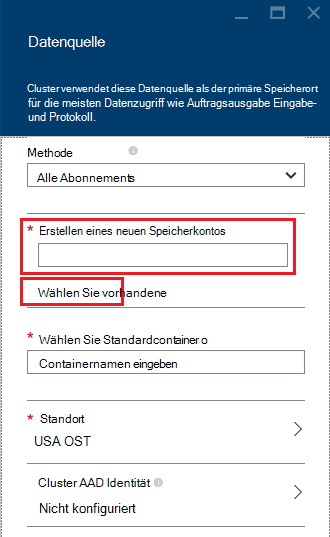

<properties
    pageTitle="Abfragen von Daten aus bietet kompatible BLOB-Speicher | Microsoft Azure"
    description="HDInsight verwendet Azure BLOB-Speicher als große Datenspeicher bietet. Informationen Sie zum Abfragen von Daten aus dem BLOB-Speicher und Ergebnisse der Analyse."
    keywords="BLOB-Speicher bietet strukturierten, unstrukturierten Daten"
    services="hdinsight,storage"
    documentationCenter=""
    tags="azure-portal"
    authors="mumian"
    manager="jhubbard"
    editor="cgronlun"/>

<tags
    ms.service="hdinsight"
    ms.workload="big-data"
    ms.tgt_pltfrm="na"
    ms.devlang="na"
    ms.topic="get-started-article"
    ms.date="09/06/2016"
    ms.author="jgao"/>

# Hadoop in HDInsight verwenden Sie bietet kompatible Azure BLOB-Speicher

Informationen Sie zum HDInsight kostengünstige Azure BLOB-Speicher mit, Azure Speicherkonto und BLOB-Speichercontainer erstellen und anschließend Adressdaten in.

Azure BLOB-Speicher ist eine stabile, allgemeine, die nahtlos mit HDInsight. Über eine Hadoop verteilten System (bietet) Schnittstelle kann strukturierte oder unstrukturierte Daten im BLOB-Speicher aller Komponenten im HDInsight betreiben.

Speichern von Daten im BLOB-Speicher können Sie problemlos HDInsight-Cluster löschen, die für die Berechnung verwendet werden, ohne Datenverlust.

> [AZURE.IMPORTANT] HDInsight unterstützt nur Block-Blobs. Nicht-Supportseite oder Blobs anfügen.

Informationen zum Erstellen eines HDInsight-Clusters finden Sie unter [Erste Schritte mit HDInsight] [ hdinsight-get-started] oder [HDInsight erstellen Cluster][hdinsight-creation].

## HDInsight-Speicherarchitektur
Das folgende Diagramm bietet eine abstrakte Ansicht der Speicherarchitektur HDInsight:

![Hadoop Cluster-API bietet Zugang zu strukturierte und unstrukturierte Daten im BLOB-Speicher speichern verwenden.] (./media/hdinsight-hadoop-use-blob-storage/HDI.WASB.Arch.png "HDInsight-Speicherarchitektur")

HDInsight bietet Zugriff auf das verteilte Dateisystem, das lokal auf den Compute-Knoten zugeordnet ist. Dieses Dateisystem kann mit den voll gekennzeichneten URI zugegriffen werden:

    hdfs://<namenodehost>/<path>

Darüber hinaus ermöglicht HDInsight die Daten, die in Azure BLOB-Speicher gespeichert. Die Syntax lautet:

    wasb[s]://<containername>@<accountname>.blob.core.windows.net/<path>

> [AZURE.NOTE] Der HDInsight-Version als 3.0 `asv://` verwendete anstelle von `wasb://`. `asv://`sollte nicht verwendet werden mit HDInsight 3.0 oder höher, da dadurch Fehler.

Hadoop unterstützt ein Konzept des Standard-Dateisystem. Das Standarddateisystem impliziert ein Standardschema und Autorität. Auch kann verwendet werden, um relative Pfade aufgelöst. Während des Erstellungsprozesses HDInsight Azure Storage-Konto und ein bestimmtes Azure BLOB-Speicher ist Container über dieses Konto als Standard-Dateisystem definiert.

Neben diesem Speicherkonto können Sie zusätzlichen Speicherkonten aus der gleichen Azure-Abonnement oder andere Azure-Abonnements hinzufügen, während der Erstellung oder nach dem Erstellen ein Clusters. Informationen zum Hinzufügen von zusätzlichen Speicher-Konten finden Sie unter [Erstellen HDInsight-Cluster][hdinsight-creation].

- **Container Storage-Konten, die mit einem Cluster verbunden sind:** Da der Kontoname und Schlüssel während der Erstellung des Clusters zugeordnet sind, haben Sie vollen Zugriff auf die Blobs in diesen Containern.

- **Öffentlichen Container oder öffentliche Blobs Storage-Konten, die nicht mit einem Cluster verbunden sind:** Sie haben Lesezugriff auf die Blobs in Containern.

    > [AZURE.NOTE]
        > Öffentlichen Container können alle Blobs aufzulisten, die im Container verfügbar sind und Container Metadaten. Öffentliche Blobs können die Blobs nur zugreifen, wenn die genaue URL kennen. Weitere Informationen finden Sie unter <a href="http://msdn.microsoft.com/library/windowsazure/dd179354.aspx">Einschränken des Zugriffs auf Container und Blobs</a>.

- **Private Container Storage-Konten, die nicht mit einem Cluster verbunden sind:** Sie können die Blobs in Containern zugreifen, wenn das Speicherkonto definieren, wenn Sie WebHCat Aufträge senden. Dies wird später in diesem Artikel erläutert.

Erstellung und ihre Schlüssel definiert Speicherkonten werden im %HADOOP_HOME%/conf/core-site.xml auf den Clusterknoten gespeichert. Das Standardverhalten von HDInsight ist definierten in der Datei Core site.xml Speicherkonten verwenden. Es wird nicht empfohlen, die Core-site.xml Datei Cluster Head node(master) versehen oder jederzeit migriert werden und jede Änderung dieser Dateien verloren.

Mehrere WebHCat-Einzelvorgänge Struktur, MapReduce Hadoop streaming und Schwein, führen eine Speicherkonten und Metadaten mit ihnen. (Dies funktioniert derzeit, für Schweine mit Speicher, jedoch nicht für Metadaten.) Im Abschnitt [Zugriff Blobs Azure PowerShell mit](#powershell) diesem Artikel ist ein Beispiel für diese Funktion. Weitere Informationen finden Sie unter [HDInsight-Cluster mit alternativen Speicherkonten und Metastores verwenden](http://social.technet.microsoft.com/wiki/contents/articles/23256.using-an-hdinsight-cluster-with-alternate-storage-accounts-and-metastores.aspx).

BLOB-Speicher kann für strukturierte und unstrukturierte Daten verwendet werden. Speichercontainer für BLOB-Daten als Schlüssel-Wert-Paare speichern und es gibt keine Verzeichnishierarchie. Jedoch der Schrägstrich (/) in den Schlüsselnamen dienen zu erscheinen in einer Verzeichnisstruktur gespeichert ist. Beispielsweise kann ein Blob-Schlüssel *input/log1.txt*sein. Keine tatsächlichen *Eingabe* Verzeichnis vorhanden, aber aufgrund der Schrägstrich in den Schlüsselnamen wird die Darstellung des Dateipfades.

###Vorteile von BLOB-Speicher
Die implizite Leistungseinbußen kein Positionierung von Computeclustern und Speicherressourcen verringert übrigens Compute-Clustern nahe der Speicherressourcen Konto in Azure Bereich Hochgeschwindigkeitsnetzes macht es sehr effizient für den Compute-Knoten Zugriff auf die Daten in Azure BLOB-Speicher erstellt werden.

Es gibt speichern Daten in Azure BLOB-Speicher statt bietet mehrere Vorteile:

* **Daten wiederverwenden und Freigeben von:** Compute-Cluster befindet die Daten bietet. Die Daten können nur die Programme, die auf den Compute-Cluster über bietet APIs. Die Daten in Azure BLOB-Speicher ist möglich durch bietet APIs oder [BLOB-Speicher REST APIs][blob-storage-restAPI]. So kann eine größere Anzahl von Small Business (einschließlich anderer HDInsight Cluster) und die Daten verwendet werden.
* **Archivierung:** Speichern von Daten in Azure BLOB-Speicher ermöglicht HDInsight Cluster zur Berechnung ohne Datenverlust sicher gelöscht werden.
* **Daten Kosten:** Speichern von Daten in DFS langfristig ist teurer als Daten in Azure BLOB-Speicher gespeichert, da ein Compute-Cluster höher als die Kosten für einen Container Azure BLOB-Speicher kostet. Außerdem, da die Daten nicht für jede Generation Compute Cluster neu geladen werden, speichern Sie auch Kosten Laden von Daten.
* **Elastische skalieren:** Zwar bietet eine skalierte Dateisystem bereitstellt, die Skalierung die Anzahl der Knoten bestimmt, die für den Cluster erstellen. Ändern der Skalierung werden ein komplizierterer Vorgang als eine elastische Skalierung Funktionen automatisch in Azure BLOB-Speicher abzurufen.
* **Georeplikation:** Der Container Azure BLOB-Speicher kann geografisch repliziert. Das geografische Recovery und Datenredundanz Ihnen gibt, ein Failover an geografisch repliziert wirkt sich erheblich auf die Leistung und es entstehen zusätzliche Kosten. Unsere Empfehlung ist Geo-Replikation mit Bedacht wählen und nur, wenn der Wert der Daten die zusätzlichen Kosten.

Bestimmte Aufträge MapReduce und Pakete können Zwischenergebnisse, die Sie wirklich in Azure BLOB-Speicher speichern möchten. In diesem Fall können Sie zum Speichern der Daten in der lokalen bietet festlegen. HDInsight verwendet DFS für mehrere dieser Zwischenergebnisse in Hive-Aufträge und anderen Prozessen.

> [AZURE.NOTE] Die meisten bietet Befehle (z. B. <b>ls</b>, <b>CopyFromLocal</b> und <b>Mkdir</b>) funktionieren weiterhin wie erwartet. Nur die Befehle für die systemeigene bietet Implementierung (die als DFS bezeichnet wird), wie <b>Fschk</b> und <b>Dfsadmin</b>zeigen anders in Azure BLOB-Speicher.

## BLOB-Container erstellen

Verwendung von Blobs erstellen ein [Speicherkonto Azure][azure-storage-create]. Im Rahmen dieser Geben Sie eine Azure-Region, die Objekte erstellen Sie mit diesem Konto gespeichert werden. Der Cluster und das Speicherkonto müssen im selben Bereich befinden. Die Struktur Metastore SQL Server-Datenbank und Oozie Metastore SQL Server-Datenbank müssen auch im selben Bereich befinden.

Wo befindet, gehört jedes Blob erstellten Container Azure Storage-Konto. Dieser Container möglicherweise ein vorhandenes Blob außerhalb HDInsight erstellt wurde oder wird ein Container für HDInsight-Cluster erstellt wird.

BLOB-Standardcontainer speichert Clusterinformationen Protokolle wie Historie. Freigeben Sie nicht Standardcontainer Blob mit mehreren HDInsight. Dies kann Auftragsverlauf beschädigt und Cluster verantwortlich. Es wird empfohlen, verwenden Sie einen anderen Container für jeden Cluster und freigegebene Daten auf ein verknüpftes Speicherkonto Bereitstellung aller relevanten Cluster als Standardkonto Speicher angegeben. Weitere Informationen zum Konfigurieren verknüpfter Speicherkonten finden Sie unter [Erstellen HDInsight-Cluster][hdinsight-creation]. Jedoch können Sie eine Standard-Behälter nach dem Löschen des ursprünglichen HDInsight Clusters wiederverwenden. HBase Cluster behalten können Sie tatsächlich das Schema HBase und Daten durch Erstellen eines neuen HBase-Clusters mit BLOB-Speicher Standardcontainer, der durch ein HBase-Cluster verwendet wird, das gelöscht wurde.

### Mithilfe des Azure-Portals

Beim Erstellen eines HDInsight-Clusters aus dem Portal können Sie ein Storage-Konto verwenden oder ein neues Speicherkonto erstellen:

###Mithilfe von Azure CLI

[AZURE.INCLUDE [use-latest-version](../../includes/hdinsight-use-latest-cli.md)]

Wenn Sie [installiert und konfiguriert der Azure-CLI](../xplat-cli-install.md), kann Folgendes Speicherkonto und Container verwendet.

    azure storage account create <storageaccountname> --type LRS

> [AZURE.NOTE] Die `--type` Parameter gibt an, wie das Speicherkonto repliziert werden. Weitere Informationen finden Sie in [Azure Storage Replication](../storage/storage-redundancy.md). Verwenden Sie keine ZRS wie ZRS Seitenblob, Datei, Tabelle oder Warteschlange unterstützt.

Sie werden aufgefordert, die an das Speicherkonto zugeordnet ist die geografische Region. Das Speicherkonto sollte in derselben Region erstellen auf HDInsight Cluster erstellen möchten.

Nachdem das Speicherkonto erstellt wurde, verwenden Sie folgenden Befehl Konto Speicherschlüssel abrufen:

    azure storage account keys list <storageaccountname>

Um einen Container zu erstellen, verwenden Sie den folgenden Befehl ein:

    azure storage container create <containername> --account-name <storageaccountname> --account-key <storageaccountkey>

### Mithilfe von Azure PowerShell

Wenn Sie [Installation und Konfiguration von Azure PowerShell][powershell-install], können Sie Folgendes Azure PowerShell Prompt ein Speicherkonto und Container erstellen:

[AZURE.INCLUDE [upgrade-powershell](../../includes/hdinsight-use-latest-powershell.md)]

    $SubscriptionID = "<Your Azure Subscription ID>"
    $ResourceGroupName = "<New Azure Resource Group Name>"
    $Location = "EAST US 2"
    
    $StorageAccountName = "<New Azure Storage Account Name>"
    $containerName = "<New Azure Blob Container Name>"
    
    Add-AzureRmAccount
    Select-AzureRmSubscription -SubscriptionId $SubscriptionID
    
    # Create resource group
    New-AzureRmResourceGroup -name $ResourceGroupName -Location $Location
    
    # Create default storage account
    New-AzureRmStorageAccount -ResourceGroupName $ResourceGroupName -Name $StorageAccountName -Location $Location -Type Standard_LRS 
    
    # Create default blob containers
    $storageAccountKey = (Get-AzureRmStorageAccountKey -ResourceGroupName $resourceGroupName -StorageAccountName $StorageAccountName)[0].Value
    $destContext = New-AzureStorageContext -StorageAccountName $storageAccountName -StorageAccountKey $storageAccountKey  
    New-AzureStorageContainer -Name $containerName -Context $destContext

## Dateien im BLOB-Speicher

Das URI-Schema für den Zugriff auf Dateien im BLOB-Speicher HDInsight ist:

    wasb[s]://<BlobStorageContainerName>@<StorageAccountName>.blob.core.windows.net/<path>

Das URI-Schema unverschlüsselte Zugriff (mit dem *Wasb:* Präfix) und SSL verschlüsselt (mit *Wasbs*). Wir empfehlen *Wasbs* möglichst auch beim Zugriff auf Daten, die innerhalb der gleichen Region in Azure.

Die &lt;BlobStorageContainerName&gt; gibt den Namen des Containers in Azure BLOB-Speicher.
Die &lt;StorageAccountName&gt; der Azure-Speicher Kontoname bezeichnet. Ein vollqualifizierter Domänenname (FQDN) ist erforderlich.

Wenn weder &lt;BlobStorageContainerName&gt; und &lt;StorageAccountName&gt; angegeben wurde, das Standard-Dateisystem verwendet. Die Dateien im Standarddateisystem können Sie einen relativen oder einen absoluten Pfad. Beispielsweise kann die *Hadoop Mapreduce examples.jar* -Datei, die mit HDInsight-Cluster verwiesen werden mithilfe einer der folgenden:

    wasbs://mycontainer@myaccount.blob.core.windows.net/example/jars/hadoop-mapreduce-examples.jar
    wasbs:///example/jars/hadoop-mapreduce-examples.jar
    /example/jars/hadoop-mapreduce-examples.jar

> [AZURE.NOTE] Der Dateiname ist <i>Hadoop examples.jar</i> in HDInsight Versionen 2.1 und 1,6 Clustern.

Die &lt;Pfad&gt; ist der Pfadname der Datei oder des Verzeichnisses bietet. Da in Azure BLOB-Speicher einfach Schlüsselwert Shops sind ist keine echte hierarchisches Dateisystem. Ein Schrägstrich (/) in einem BLOB-Schlüssel wird als Verzeichnistrennzeichen interpretiert. Beispielsweise heißt der Blob für *Hadoop Mapreduce examples.jar* :

    example/jars/hadoop-mapreduce-examples.jar

> [AZURE.NOTE] Beim Arbeiten mit Blobs außerhalb HDInsight die meisten Dienstprogramme nicht erkennt das Format WASB und stattdessen wie erwartet eine grundlegende Pfadformat `example/jars/hadoop-mapreduce-examples.jar`.

## Access-Blobs mit Azure-CLI

Verwenden Sie folgenden Befehl Listen Sie die Blob-Befehle:

    azure storage blob

**Beispiel für Azure CLI zum Hochladen einer Datei**

    azure storage blob upload <sourcefilename> <containername> <blobname> --account-name <storageaccountname> --account-key <storageaccountkey>

**Beispiel für Azure CLI zum Herunterladen einer Datei**

    azure storage blob download <containername> <blobname> <destinationfilename> --account-name <storageaccountname> --account-key <storageaccountkey>

**Beispiel für Azure CLI zum Löschen einer Datei**

    azure storage blob delete <containername> <blobname> --account-name <storageaccountname> --account-key <storageaccountkey>

**Beispiel für Azure CLI zu Dateien**

    azure storage blob list <containername> <blobname|prefix> --account-name <storageaccountname> --account-key <storageaccountkey>

## Access-Blobs mit Azure PowerShell

> [AZURE.NOTE] Die Befehle in diesem Abschnitt bieten ein einfaches Beispiel mit PowerShell in Blobs gespeicherten Daten zugreifen. Sehen Sie beispielsweise einen Funktionsumfang, die für die Arbeit mit HDInsight angepasst [HDInsight Tools](https://github.com/Blackmist/hdinsight-tools).

Verwenden Sie folgenden Befehl Listen Sie die Blob-Cmdlets für:

    Get-Command *blob*

![Liste der BLOB-bezogenen PowerShell-Cmdlets.][img-hdi-powershell-blobcommands]

###Dateien hochladen

[Daten zu HDInsight]finden Sie unter[hdinsight-upload-data].

###Dateien herunterladen

Das folgende Script downloads ein im aktuellen Ordner. Wechseln Sie vor dem Ausführen des Skripts zu einem Ordner, in dem Sie Schreibzugriff haben.

    $resourceGroupName = "<AzureResourceGroupName>"
    $storageAccountName = "<AzureStorageAccountName>"   # The storage account used for the default file system specified at creation.
    $containerName = "<BlobStorageContainerName>"  # The default file system container has the same name as the cluster.
    $blob = "example/data/sample.log" # The name of the blob to be downloaded.
    
    # Use Add-AzureAccount if you haven't connected to your Azure subscription
    Login-AzureRmAccount 
    Select-AzureRmSubscription -SubscriptionID "<Your Azure Subscription ID>"
    
    Write-Host "Create a context object ... " -ForegroundColor Green
    $storageAccountKey = (Get-AzureRmStorageAccountKey -ResourceGroupName $resourceGroupName -Name $storageAccountName)[0].Value
    $storageContext = New-AzureStorageContext -StorageAccountName $storageAccountName -StorageAccountKey $storageAccountKey  
    
    Write-Host "Download the blob ..." -ForegroundColor Green
    Get-AzureStorageBlobContent -Container $ContainerName -Blob $blob -Context $storageContext -Force
    
    Write-Host "List the downloaded file ..." -ForegroundColor Green
    cat "./$blob"

Bereitstellung Gruppe Ressourcenname und den Clusternamen, können Sie den folgenden Code:

    $resourceGroupName = "<AzureResourceGroupName>"
    $clusterName = "<HDInsightClusterName>"
    $blob = "example/data/sample.log" # The name of the blob to be downloaded.
    
    $cluster = Get-AzureRmHDInsightCluster -ResourceGroupName $resourceGroupName -ClusterName $clusterName
    $defaultStorageAccount = $cluster.DefaultStorageAccount -replace '.blob.core.windows.net'
    $defaultStorageAccountKey = (Get-AzureRmStorageAccountKey -ResourceGroupName $resourceGroupName -Name $defaultStorageAccount)[0].Value
    $defaultStorageContainer = $cluster.DefaultStorageContainer
    $storageContext = New-AzureStorageContext -StorageAccountName $defaultStorageAccount -StorageAccountKey $defaultStorageAccountKey 
    
    Write-Host "Download the blob ..." -ForegroundColor Green
    Get-AzureStorageBlobContent -Container $defaultStorageContainer -Blob $blob -Context $storageContext -Force

###Dateien löschen

    Remove-AzureStorageBlob -Container $containerName -Context $storageContext -blob $blob

###Dateien auflisten

    Get-AzureStorageBlob -Container $containerName -Context $storageContext -prefix "example/data/"

###Abfragen Sie Struktur mithilfe eines Speicherkontos nicht definierte

Dieses Beispiel zeigt, wie einen Ordner Speicherkonto, das bei der Erstellung definiert ist.
$clusterName = "<HDInsightClusterName>"

    $undefinedStorageAccount = "<UnboundedStorageAccountUnderTheSameSubscription>"
    $undefinedContainer = "<UnboundedBlobContainerAssociatedWithTheStorageAccount>"

    $undefinedStorageKey = Get-AzureStorageKey $undefinedStorageAccount | %{ $_.Primary }

    Use-AzureRmHDInsightCluster $clusterName

    $defines = @{}
    $defines.Add("fs.azure.account.key.$undefinedStorageAccount.blob.core.windows.net", $undefinedStorageKey)

    Invoke-AzureRmHDInsightHiveJob -Defines $defines -Query "dfs -ls wasbs://$undefinedContainer@$undefinedStorageAccount.blob.core.windows.net/;"

## Nächste Schritte

In diesem Artikel haben Sie gelernt, bietet kompatible Azure BLOB-Speicher mit HDInsight und Sie erfahren, dass Azure BLOB-Speicher ein wesentlicher Bestandteil des HDInsight ist. Dies ermöglicht skalierbare, langfristige Archivierung Daten Übernahme Lösungen Azure BLOB-Speicher und HDInsight Aufheben der Sperre innerhalb der strukturierten und unstrukturierten Daten.

Weitere Informationen finden Sie unter:

* [Erste Schritte mit Azure HDInsight][hdinsight-get-started]
* [Upload von Daten auf HDInsight][hdinsight-upload-data]
* [Struktur mit HDInsight verwenden][hdinsight-use-hive]
* [Verwenden Sie Schwein mit HDInsight][hdinsight-use-pig]
* [Mithilfe von Azure Storage Shared Access Signaturen Zugriff auf Daten mit HDInsight][hdinsight-use-sas]

[hdinsight-use-sas]: hdinsight-storage-sharedaccesssignature-permissions.md
[powershell-install]: ../powershell-install-configure.md
[hdinsight-creation]: hdinsight-provision-clusters.md
[hdinsight-get-started]: hdinsight-hadoop-tutorial-get-started-windows.md
[hdinsight-upload-data]: hdinsight-upload-data.md
[hdinsight-use-hive]: hdinsight-use-hive.md
[hdinsight-use-pig]: hdinsight-use-pig.md

[blob-storage-restAPI]: http://msdn.microsoft.com/library/windowsazure/dd135733.aspx
[azure-storage-create]: ../storage/storage-create-storage-account.md

[img-hdi-powershell-blobcommands]: ./media/hdinsight-hadoop-use-blob-storage/HDI.PowerShell.BlobCommands.png
[img-hdi-quick-create]: ./media/hdinsight-hadoop-use-blob-storage/HDI.QuickCreateCluster.png
[img-hdi-custom-create-storage-account]: ./media/hdinsight-hadoop-use-blob-storage/HDI.CustomCreateStorageAccount.png  
