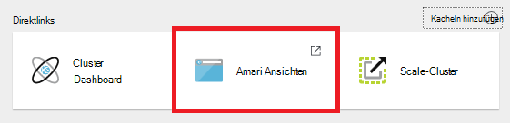
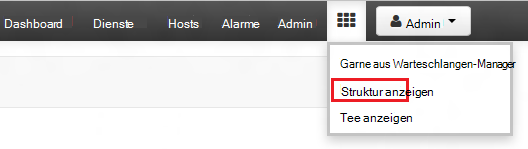
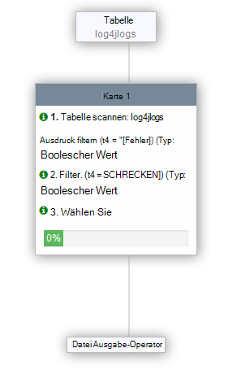

<properties
   pageTitle="Mithilfe von Ambari Ansichten arbeiten mit Struktur auf HDInsight (Hadoop) | Microsoft Azure"
   description="Informationen Sie zum Anzeigen Struktur Webbrowser Struktur Abfragen senden. Struktur anzeigen ist Teil der Ambari Web-Benutzeroberfläche mit HDInsight Linux-basierten Cluster bereitgestellt."
   services="hdinsight"
   documentationCenter=""
   authors="Blackmist"
   manager="jhubbard"
   editor="cgronlun"
    tags="azure-portal"/>

<tags
   ms.service="hdinsight"
   ms.devlang="na"
   ms.topic="article"
   ms.tgt_pltfrm="na"
   ms.workload="big-data"
   ms.date="10/28/2016"
   ms.author="larryfr"/>

#Verwenden Sie die Ansicht Struktur Hadoop in HDInsight

[AZURE.INCLUDE [hive-selector](../../includes/hdinsight-selector-use-hive.md)]

Ambari ist eine Verwaltung und Überwachung nutzen mit Linux-basierten HDInsight. Ambari gebotenen Funktionen gehört eine Webbenutzeroberfläche Hive-Abfragen verwendet werden kann. Dies ist die __Struktur anzeigen__, Teil Ambari Ansichten mit der HDInsight.

> [AZURE.NOTE] Ambari verfügt über viele Funktionen, die in diesem Dokument beschrieben wird nicht. Weitere Informationen finden Sie unter [Verwalten HDInsight Cluster mit Ambari Web-Benutzeroberfläche](hdinsight-hadoop-manage-ambari.md).

##Erforderliche Komponenten

- Ein Linux-basiertes HDInsight-Cluster. Informationen zum Erstellen eines neuen Clusters finden Sie unter [Erste Schritte mit Linux-basierten HDInsight](hdinsight-hadoop-linux-tutorial-get-started.md).

##Öffnen Sie die Struktur anzeigen

Sie können Ambari auf Azure-Portal. Wählen Sie HDInsight-Cluster und dann __Ambari Ansichten__ von __Artikel__ .

Sie können auch direkt zu Ambari navigieren, indem Sie zu https://CLUSTERNAME.azurehdinsight.net in einem Webbrowser ( __CLUSTERNAME__ ist, in dem der Name Ihres Clusters HDInsight) und wählen Sie die Gruppe von Quadraten aus (neben den Link __Admin__ und auf den linken Rand der Seite) im Seitenmenü verfügbaren Ansichten. Wählen Sie die __Struktur anzeigen__.

.

> [AZURE.NOTE] Beim Ambari werden Sie aufgefordert, die Website authentifizieren. Geben Sie den Admin (Standard `admin`,) Kontoname und Kennwort, die Sie beim Erstellen des Clusters verwendet.

Sie sollte eine Seite ähnlich der folgenden angezeigt:

##Anzeigen von Tabellen

Wählen Sie unter __Datenbank-Explorer__ der Seite __den Standardeintrag in der Registerkarte __Datenbanken__ __ . Dies zeigt eine Liste der Tabellen in der Standarddatenbank. Für einen neuen HDInsight Cluster sollte nur eine Tabelle vorhanden. __Hivesampletable__.

Die Schritte in diesem Dokument neue Tabellen hinzugefügt, können das Aktualisierungssymbol in der oberen rechten Ecke des Datenbank-Explorer Sie die Liste der verfügbaren Tabellen aktualisieren.

##Abfrage-editor

Gehen Sie aus der Struktur zu Daten mit dem Hive-Abfrage ausgeführt.

1. Das Arbeitsblatt im __Abfrage-Editor__ -Abschnitt der Seite fügen Sie HiveQL Folgendes ein:

        DROP TABLE log4jLogs;
        CREATE EXTERNAL TABLE log4jLogs(t1 string, t2 string, t3 string, t4 string, t5 string, t6 string, t7 string)
        ROW FORMAT DELIMITED FIELDS TERMINATED BY ' '
        STORED AS TEXTFILE LOCATION 'wasbs:///example/data/';
        SELECT t4 AS sev, COUNT(*) AS cnt FROM log4jLogs WHERE t4 = '[ERROR]' GROUP BY t4;

    Diese Aussagen werden die folgenden Aktionen durchführen:

    - **DROP TABLE** - Löschen der Tabelle und der Datendatei, falls die Tabelle bereits vorhanden ist.
    - **Externe Tabelle erstellen** - erstellt eine neue "externe" Tabelle Struktur. Externe Tabellen speichern nur die Tabellendefinition in Struktur. die Daten verbleiben am ursprünglichen Speicherort.
    - **FORMAT Zeile** - weist Struktur wie die Daten formatiert werden. In diesem Fall werden die Felder in jedem Protokoll durch ein Leerzeichen getrennt.
    - **Gespeichert als Textdatei Speicherort** - weist Struktur, in der Daten, gespeichert (Beispiel-Daten-Verzeichnis) und davon wird als Text gespeichert.
    - **Auswählen** - wählt alle Zeilen Spalte t4 Wert [Fehler] enthält.

    >[AZURE.NOTE] Externe Tabellen verwendet werden, wenn die zugrunde liegenden Daten von einer externen Quelle wie ein automatisches Uploadprozess oder anderen MapReduce Vorgang erwartet jedoch empfiehlt Hive-Abfragen mit den neuesten Daten. Löschen einer externen Tabelle ist *nicht* löschen die Daten nur die Tabellendefinition.

2. Mithilfe der Schaltfläche __Ausführen__ im unteren Bereich des Abfrage-Editors, um die Abfrage zu starten. Wendet Orange und Text in __beendet__geändert. __Abfrageergebnisse Prozess__ Abschnitt sollte unter den Abfrage-Editor angezeigt und zeigt Informationen über den Auftrag.

    > [AZURE.IMPORTANT] Einige Browser möglicherweise nicht korrekt Informationen protokollieren oder Ergebnisse aktualisiert. Wenn Sie Stapelverarbeitung ohne Aktualisieren des Protokolls Ergebnisse immer ausführen angezeigt wird, verwenden Sie Mozilla FireFox oder Google Chrome.

3. Nach Abschluss die Abfrage wird der __Prozess Abfrageergebnisse__ Abschnitt die Ergebnisse des Vorgangs angezeigt. __Beendet die__ Schaltfläche ändert sich auch, eine grüne Schaltfläche __Ausführen__ . Die Registerkarte __Ergebnisse__ sollten folgende Informationen enthalten:

        sev       cnt
        [ERROR]   3

    Die Registerkarte __Protokolle__ kann verwendet werden, an die Protokollinformationen, die durch das Projekt erstellt. Hiermit können Sie zur Problembehandlung, wenn Probleme mit einer Abfrage.

    > [AZURE.TIP] Beachten Sie die __Ergebnisse speichern__ Dropdown-Dialogfeld im linken oberen Teil __Abfrageergebnisse Prozess__ ; Hiermit können Sie die Ergebnisse herunterladen oder HDInsight Speicher als CSV-Datei speichern.

3. Wählen Sie die ersten vier Zeilen dieser Abfrage, und wählen Sie dann __Ausführen__. Beachten Sie, dass keine Ergebnisse vorliegen, wenn der Auftrag abgeschlossen ist. Dies ist Teil der Abfrage ausgewählten Schaltfläche __Ausführen__ Verwendung nur ausgewählten Anweisungen ausgeführt. In diesem Fall enthalten nicht die Auswahl die letzte Anweisung, die Zeilen aus der Tabelle abgerufen. Wenn Sie nur diese Zeile auswählen und __Ausführen__, sollte die erwarteten Ergebnisse angezeigt werden.

3. Mit der Schaltfläche __Neues Arbeitsblatt__ am Ende der __Abfrage-Editor__ ein neues Arbeitsblatt erstellt. Geben Sie in das neue Arbeitsblatt HiveQL Folgendes ein:

        CREATE TABLE IF NOT EXISTS errorLogs (t1 string, t2 string, t3 string, t4 string, t5 string, t6 string, t7 string) STORED AS ORC;
        INSERT OVERWRITE TABLE errorLogs SELECT t1, t2, t3, t4, t5, t6, t7 FROM log4jLogs WHERE t4 = '[ERROR]';

    Diese Aussagen werden die folgenden Aktionen durchführen:

    - **Erstellen der Tabelle IF NOT EXISTS** - erstellt eine Tabelle, wenn es nicht bereits vorhanden ist. Da **externe** Schlüsselwort nicht verwendet wird, ist eine interne Tabelle Struktur Data Warehouse gespeichert und wird vollständig von Struktur verwaltet. Im Gegensatz zu externen Tabellen löscht Ablegen einer internen Tabelle zugrunde liegenden Daten.
    - **Gespeichert als ORK** - speichert die Daten optimiert Zeile Einspaltig (ORK)-Format. Dies ist ein hochgradig optimierte und effiziente Format zum Speichern von Daten der Struktur.
    - ÜBERSCHREIBEN von **Einfügen... Wählen Sie** - wählt Zeilen aus der **log4jLogs** -Tabelle, die enthalten [Fehler] und fügt die Daten in der Tabelle **ErrorLogs** .

    Mithilfe der Schaltfläche __Ausführen__ dieser Abfrage. Die Registerkarte __Ergebnisse__ enthält Informationen von dieser Abfrage keine Zeilen zurückgegeben werden, da der Status sollte als __erfolgreich__angezeigt.

###Hive-Einstellungen

Wählen Sie __das Symbol rechts neben dem Editor__ .

Einstellung können verschiedene Struktur, wie das Ausführungsmodul für Tez (standardmäßig) die Systemstruktur ändern ändern, MapReduce verwendet werden.

###Erläutern Sie Visual

__Erläutern Sie Visual__ -Symbol rechts neben dem Editor auswählen

Wird __Visual erklären__ der Abfrage die Verständnis des Ablaufs komplexe Abfragen kann. Verwenden die Schaltfläche __Erklärung__ im Abfrage-Editor können Sie Text entspricht dieser Ansicht anzeigen.

###Tez

Wählen Sie das __Tez__ -Symbol rechts neben dem Editor.

Dies zeigt die gesteuerte azyklische Graph (so) für diese Abfrage von Tez verwendet, wenn verfügbar. Wenn Sie so für Abfragen anzeigen möchten hast Du in der Vergangenheit oder Debug Prozess Tez verwenden [Tez Ansicht](hdinsight-debug-ambari-tez-view.md) stattdessen.

###Benachrichtigung

Wählen Sie das Symbol __Benachrichtigung__ rechts des Editors.

Anträge werden Nachrichten, die beim Ausführen von Abfragen erstellt werden. Beispielsweise erhalten Sie eine Benachrichtigung, wenn eine Abfrage gesendet wird oder ein Fehler auftritt.

##Gespeicherte Abfragen

1. Der Abfrage-Editor erstellen Sie ein neues Arbeitsblatt und geben Sie die folgende Abfrage:

        SELECT * from errorLogs;

    Führen Sie die Abfrage um sicherzustellen, dass es funktioniert. Die Ergebnisse werden wie folgt:

        errorlogs.t1    errorlogs.t2    errorlogs.t3    errorlogs.t4    errorlogs.t5    errorlogs.t6    errorlogs.t7
        2012-02-03  18:35:34    SampleClass0    [ERROR]     incorrect   id  
        2012-02-03  18:55:54    SampleClass1    [ERROR]     incorrect   id  
        2012-02-03  19:25:27    SampleClass4    [ERROR]     incorrect   id

2. Verwenden Sie die Schaltfläche __Speichern__ unten im Editor. Diese Abfrage __Errorlogs__ und auf __OK klicken__. Beachten Sie, dass der Name des Arbeitsblatts, __Errorlogs__.

3. Wählen Sie die Registerkarte __Gespeicherte Abfragen__ am oberen Rand der Seite Struktur. Beachten Sie, dass __Errorlogs__ jetzt als gespeicherte Abfrage aufgeführt ist. Es bleibt in der Liste, bis Sie es entfernen. Auswahl eines Namens wird die Abfrage im Abfrage-Editor geöffnet.

##Abfrageverlauf

Die Schaltfläche __Verlauf__ am oberen Rand der Struktur anzeigen können Sie Abfragen anzeigen, die Sie zuvor ausgeführt wurde. Verwenden sie jetzt und wählen Sie einige Abfragen, die Sie zuvor ausgeführt wurde. Wenn Sie eine Abfrage auswählen, öffnet sich der Abfrage-Editor.

##Benutzerdefinierte Funktion (UDF)

Struktur kann auch durch **benutzerdefinierte Funktion (UDF)**erweitert werden. Eine UDF-Datei können Sie Funktionen oder Logik einfach modelliert ist nicht in HiveQL implementieren.

Während einer UDF-Datei als Teil der HiveQL Aussagen in Ihrer Abfrage hinzufügen können, können UDF-Registerkarte am oberen Rand der Struktur anzeigen und Speichern einer UDF mit dem __Abfrage-Editor__verwendet werden kann.

Nachdem Sie eine UDF auf Struktur hinzugefügt haben, wird eine Schaltfläche __Udfs einfügen__ am Ende der __Abfrage-Editor__angezeigt. Hiermit zeigt eine Dropdownliste UDFs in der Struktur definiert. Auswählen eines UDF fügt HiveQL Aussagen zur Abfrage der UDF-Datei aktivieren.

Angenommen, Sie eine UDF mit den folgenden Eigenschaften definiert:

* Ressourcenname: Myudfs
* Ressourcenpfad: wasbs:///myudfs.jar
* UDF-Name: Myawesomeudf
* UDF-Klassenname: com.myudfs.Awesome

Mithilfe der Schaltfläche __Einfügen Udfs__ zeigt einen Eintrag namens __Myudfs__mit einem anderen Dropdown für jede UDF für die Ressource definiert. In diesem Fall __Myawesomeudf__. Diese Auswahl wird am Anfang der Abfrage Folgendes hinzufügen:

    add jar wasbs:///myudfs.jar;

    create temporary function myawesomeudf as 'com.myudfs.Awesome';

Sie können dann UDF in Ihrer Abfrage. Z. B. `SELECT myawesomeudf(name) FROM people;`.

Weitere Informationen zu Struktur auf HDInsight mit UDFs finden Sie unter:

* [Python mit Struktur und HDInsight Schwein](hdinsight-python.md)

* [Hinzufügen einer benutzerdefinierten Struktur UDF zum HDInsight](http://blogs.msdn.com/b/bigdatasupport/archive/2014/01/14/how-to-add-custom-hive-udfs-to-hdinsight.aspx)

##Nächste Schritte

Allgemeine Informationen zur Struktur in HDInsight:

* [Hadoop auf HDInsight Struktur verwenden](hdinsight-use-hive.md)

Weitere Informationen können Sie mit Hadoop auf HDInsight arbeiten:

* [Hadoop auf HDInsight Schwein verwenden](hdinsight-use-pig.md)

* [Verwenden Sie MapReduce Hadoop auf HDInsight](hdinsight-use-mapreduce.md)
