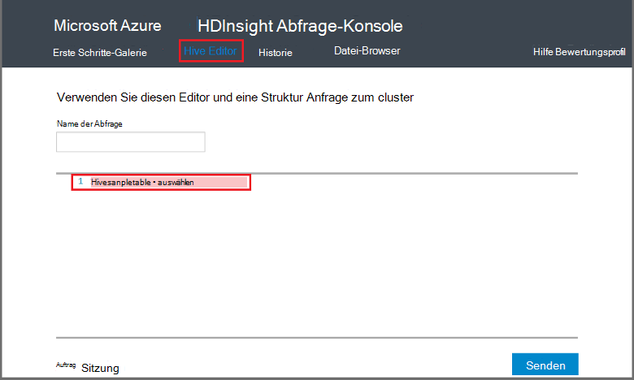

<properties
   pageTitle="Verwenden Hadoop Struktur auf der Abfragekonsole HDInsight | Microsoft Azure"
   description="Erfahren Sie, wie mithilfe der webbasierten Konsole Abfrage Struktur in einem Cluster HDInsight Hadoop aus Ihrem Browser Abfragen."
   services="hdinsight"
   documentationCenter=""
   authors="Blackmist"
   manager="jhubbard"
   editor="cgronlun"
    tags="azure-portal"/>

<tags
   ms.service="hdinsight"
   ms.devlang="na"
   ms.topic="article"
   ms.tgt_pltfrm="na"
   ms.workload="big-data"
   ms.date="09/20/2016"
   ms.author="larryfr"/>

# Abfragen Sie Struktur mithilfe der Query-Konsole

[AZURE.INCLUDE [hive-selector](../../includes/hdinsight-selector-use-hive.md)]

In diesem Artikel erfahren Sie, wie Sie HDInsight Abfragekonsole Struktur in einem Cluster HDInsight Hadoop aus Ihrem Browser Abfragen.

> [AZURE.IMPORTANT] HDInsight Abfrage-Konsole ist nur auf Windows-basierte HDInsight-Cluster. Bei Verwendung von Linux-basierten HDInsight-Cluster finden Sie unter [Struktur führen Sie Abfragen mit Struktur anzeigen](hdinsight-hadoop-use-hive-ambari-view.md).

##Erforderliche Komponenten

Die Schritte in diesem Artikel wird Folgendes erforderlich.

* Eine Windows-basierte HDInsight Hadoop-cluster

* Modernen Webbrowser

##Abfragen Sie Struktur mithilfe der Query-Konsole

1. Öffnen Sie einen Webbrowser, und navigieren Sie zu __https://CLUSTERNAME.azurehdinsight.net__, ist der Name Ihres Clusters HDInsight durch __CLUSTERNAME__ . Wenn Sie aufgefordert werden, geben Sie den Benutzernamen und das Kennwort, das Sie beim Erstellen des Clusters verwendet.

2. Wählen Sie Links oben auf der Seite **Hive-Editor**. Dies zeigt ein Formular mit HiveQL-Anweisungen eingeben, die im HDInsight-Cluster ausgeführt werden soll.

    

    Ersetzen Sie den Text `Select * from hivesampletable` mit den folgenden HiveQL:

        set hive.execution.engine=tez;
        DROP TABLE log4jLogs;
        CREATE EXTERNAL TABLE log4jLogs (t1 string, t2 string, t3 string, t4 string, t5 string, t6 string, t7 string)
        ROW FORMAT DELIMITED FIELDS TERMINATED BY ' '
        STORED AS TEXTFILE LOCATION 'wasbs:///example/data/';
        SELECT t4 AS sev, COUNT(*) AS count FROM log4jLogs WHERE t4 = '[ERROR]' AND INPUT__FILE__NAME LIKE '%.log' GROUP BY t4;

    Diese Aussagen werden die folgenden Aktionen durchführen:

    * **DROP TABLE**: die Tabelle und die Datei löscht, wenn die Tabelle bereits vorhanden ist.
    * **Externe Tabelle erstellen**: erstellt eine neue 'externe' Tabelle Struktur. Externe Tabellen speichern nur die Tabellendefinition in Struktur. die Daten verbleiben am ursprünglichen Speicherort.

    > [AZURE.NOTE] Externe Tabellen sollte verwendet werden, wenn Sie erwarten, dass die zugrunde liegenden Daten von einer externen Quelle (z. B. eine automatisierte Upload von Daten) oder eine andere Operation MapReduce aktualisiert werden, aber immer soll Hive-Abfragen mit den neuesten Daten.
    >
    > Löschen einer externen Tabelle ist **nicht** löschen die Daten nur die Tabellendefinition.

    * **ZEILENFORMAT**: weist Struktur wie die Daten formatiert. In diesem Fall werden die Felder in jedem Protokoll durch ein Leerzeichen getrennt.
    * **Gespeichert als Textdatei Speicherort**: weist Struktur die Daten ist (Verzeichnis Beispiel-Daten) gespeichert und wird als Text gespeichert
    * **Auswählen**: Wählen Sie alle Zeilen, Spalte **t4** Wert **[Fehler]**enthalten. Dies sollte der Wert **3** zurück, da drei Zeilen, die diesen Wert enthalten.
    * **INPUT__FILE__NAME wie '%.log'** - sagt Struktur, die wir nur Daten aus Dateien zurückgibt. Log. Dies beschränkt die Suche auf sample.log-Datei enthält die Daten und verhindert, dass Sie zurückgeben von Daten aus anderen Dateien, die nicht das Schema definiert.

2. Klicken Sie auf **Senden**. **Job-Sitzung** am unteren Rand der Seite sollte Details für den Auftrag angezeigt.

3. Wenn das Feld **Status** in **abgeschlossen**geändert wird, wählen Sie für das Projekt **Anzeigen** . Auf der Detailseite enthält die **Auftragsausgabe** `[ERROR]   3`. Können Sie die Schaltfläche **Download** unter diesem Feld eine Datei, die die Ausgabe des Projekts enthält.

##Zusammenfassung

Wie Sie sehen, bietet Konsole Abfrage leicht Hive-Abfragen in einem Cluster HDInsight und Überwachen des Status Abrufen der Ausgabe.

Um Informationen zur Verwendung von Hive Abfragekonsole Struktur Auftrag ausführen, wählen Sie am oberen Rand der Konsole Abfrage **Einstieg** und verwenden Sie die enthaltenen Beispiele. Jedes Beispiel führt durch die Struktur analysieren Daten erläutert im Beispiel verwendeten HiveQL-Anweisungen verwenden.

##Nächste Schritte

Weitere Informationen zu Struktur in HDInsight:

* [Hadoop auf HDInsight Struktur verwenden](hdinsight-use-hive.md)

Informationen zum Arbeiten Sie mit Hadoop auf HDInsight:

* [Hadoop auf HDInsight Schwein verwenden](hdinsight-use-pig.md)

* [Verwenden Sie MapReduce Hadoop auf HDInsight](hdinsight-use-mapreduce.md)

Bei Verwendung von Tez mit Struktur finden Sie in den folgenden Dokumenten Debuginformationen:

* [Mithilfe der Tez-Benutzeroberfläche auf Windows-basierten HDInsight](hdinsight-debug-tez-ui.md)

* [Ambari Tez Ansicht auf Linux-basierten HDInsight](hdinsight-debug-ambari-tez-view.md)

[1]: ../HDInsight/hdinsight-hadoop-visual-studio-tools-get-started.md

[hdinsight-sdk-documentation]: http://msdnstage.redmond.corp.microsoft.com/library/dn479185.aspx

[azure-purchase-options]: http://azure.microsoft.com/pricing/purchase-options/
[azure-member-offers]: http://azure.microsoft.com/pricing/member-offers/
[azure-free-trial]: http://azure.microsoft.com/pricing/free-trial/

[apache-tez]: http://tez.apache.org
[apache-hive]: http://hive.apache.org/
[apache-log4j]: http://en.wikipedia.org/wiki/Log4j
[hive-on-tez-wiki]: https://cwiki.apache.org/confluence/display/Hive/Hive+on+Tez
[import-to-excel]: http://azure.microsoft.com/documentation/articles/hdinsight-connect-excel-power-query/

[hdinsight-use-oozie]: hdinsight-use-oozie.md
[hdinsight-analyze-flight-data]: hdinsight-analyze-flight-delay-data.md

[hdinsight-storage]: hdinsight-hadoop-use-blob-storage.md

[hdinsight-provision]: hdinsight-provision-clusters.md
[hdinsight-submit-jobs]: hdinsight-submit-hadoop-jobs-programmatically.md
[hdinsight-upload-data]: hdinsight-upload-data.md
[hdinsight-get-started]: hdinsight-hadoop-linux-tutorial-get-started.md

[Powershell-install-configure]: powershell-install-configure.md
[powershell-here-strings]: http://technet.microsoft.com/library/ee692792.aspx

[img-hdi-hive-powershell-output]: ./media/hdinsight-use-hive/HDI.Hive.PowerShell.Output.png
