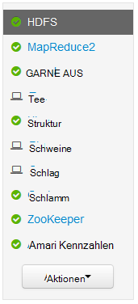
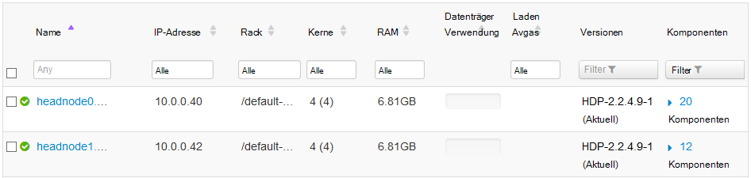
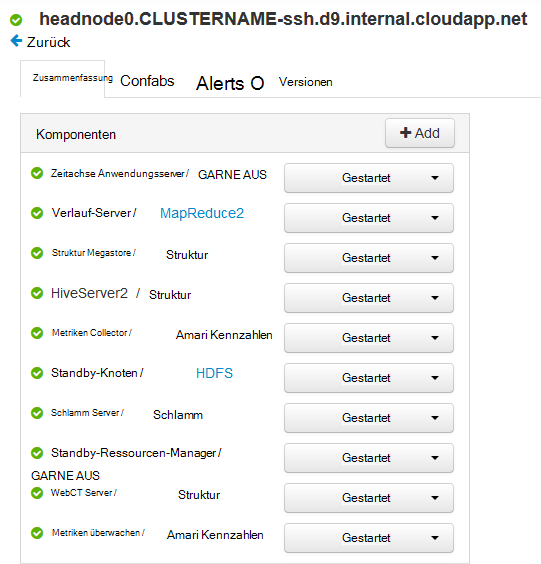
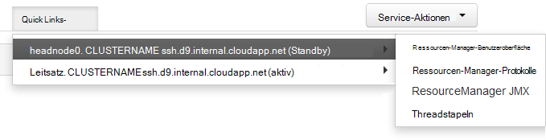
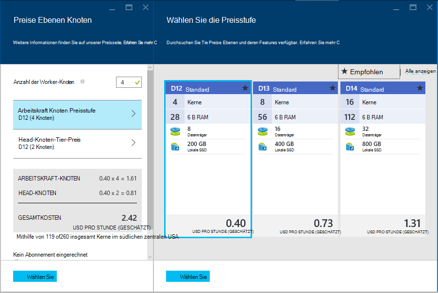

<properties
    pageTitle="Funktionen für hohe Verfügbarkeit von Linux-basierten HDInsight (Hadoop) | Microsoft Azure"
    description="Erfahren Sie, wie Linux-basierten HDInsight Cluster mehr Zuverlässigkeit und Verfügbarkeit mit zusätzlicher Head-Knoten. Sie lernen das Hadoop-Dienste wie Ambari und Struktur wie Auswirkungen einzeln auf jedes Headknoten über SSH eine Verbindung."
    services="hdinsight"
    editor="cgronlun"
    manager="jhubbard"
    authors="Blackmist"
    documentationCenter=""
    tags="azure-portal"/>

<tags
    ms.service="hdinsight"
    ms.workload="big-data"
    ms.tgt_pltfrm="na"
    ms.devlang="multiple"
    ms.topic="article"
    ms.date="09/13/2016"
    ms.author="larryfr"/>

#Verfügbarkeit und Zuverlässigkeit der Hadoop Cluster HDInsight

Hadoop erreicht hohe Verfügbarkeit und Zuverlässigkeit durch redundante Kopien von Diensten und Daten auf die Knoten in einem Cluster verteilt. Standarddistributionen Hadoop müssen jedoch in der Regel nur einen einzigen Head-Knoten. Jeder Ausfall der einzelnen Head-Knoten kann den Cluster nicht mehr funktioniert.

Um dieses potenzielle Problem bieten HDInsight Linux-basierten Clustern auf Azure zwei Hauptknoten erhöhen die Verfügbarkeit und Zuverlässigkeit der Hadoop-Dienste sowie der laufenden Aufträge.

> [AZURE.NOTE] Die Schritte in diesem Dokument sind spezifisch für Linux-basierte HDInsight-Cluster. Bei Verwendung einen Windows-basierten Cluster finden Sie unter [Verfügbarkeit und Zuverlässigkeit von Windows-basierten Hadoop Cluster HDInsight](hdinsight-high-availability.md) Windows-spezifische Informationen.

##Grundlegendes zu Knoten

Knoten in einem Cluster HDInsight werden mithilfe von Azure-Computer implementiert. Wenn ein Knoten ausfällt, wird offline geschaltet, und ein neuer Knoten erstellt, um den ausgefallenen Knoten zu ersetzen. Während der Knoten offline ist, verwendet einen anderen Knoten desselben Typs erst der neue Knoten online geschaltet wird.

> [AZURE.NOTE] Der Knoten Daten analysieren, wenn es fehlschlägt, ist der Fortschritt bei der Arbeit verloren. Der Auftrag des fehlerhaften Knotens arbeitete wird zu einem anderen Knoten erneut.

Den folgenden Abschnitten werden die einzelnen Knotentypen mit HDInsight verwendet. Für einen Cluster werden nicht alle Knoten verwendet. Beispielsweise wird ein Cluster Hadoop Nimbus Knoten keinen. Weitere Knoten HDInsight Cluster Arten Abschnitt der Cluster Typen [Hadoop erstellen Linux-basierten Clustern in HDInsight](hdinsight-hadoop-provision-linux-clusters.md#cluster-types).

###Head-Knoten

Einige Implementierungen Hadoop haben einen einzigen Head-Knoten, das Dienste und Komponenten, die den Fehler der Arbeitskraft Knoten problemlos verwalten. Jedoch würde Ausfälle von master Services auf dem Head-Knoten des Clusters zu arbeiten.

HDInsight Cluster bieten eine sekundäre Headknoten master Dienste und Komponenten auf dem sekundären Knoten bei einem Ausfall des primären ausgeführt.

> [AZURE.IMPORTANT] Beide Hauptknoten sind gleichzeitig aktiv und im Cluster ausgeführt. Angegebene Zeit (und standby auf andere Headknoten) sind nur einige Dienste bietet oder GARN, aktiv auf einem Head-Knoten. Andere Dienste wie HiveServer2 oder MetaStore Struktur sind gleichzeitig aktiv beider Hauptknoten.

Head-Knoten (und andere Knoten im HDInsight,) haben einen numerischen Wert als Bestandteil des Hostnamens des Knotens. Beispielsweise `hn0-CLUSTERNAME` oder `hn4-CLUSTERNAME`. 

> [AZURE.IMPORTANT] Verbinden Sie den numerischen Wert nicht mit, ob ein Knoten Primär oder sekundär ist; der numerische Wert ist nur vorhanden, einen eindeutigen Namen für jeden Knoten bereit.

###Nimbus Knoten

Storm-Cluster ermöglichen Nimbus Knoten ähnlichen Funktionalität Hadoop JobTracker verteilen und verarbeiten workerknoten überwacht. HDInsight bereit Clustertyp Sturm 2 Nimbus Knoten.

###Zookeeper-Knoten

[ZooKeeper](http://zookeeper.apache.org/ ) -Knoten (ZKs) werden zum Marktführer Wahl master Hauptknoten Dienste und um sicherzustellen, dass Dienste, Datenknoten (Mitarbeiter) und Gateways der Head-Knoten wissen master Dienst aktiv ist. HDInsight bietet standardmäßig 3 ZooKeeper Knoten.

###Arbeitskraft-Knoten

Arbeitskraft Knoten ausführen die aktuellen Analyse wird ein Auftrag an den Cluster gesendet. Beim Ausfall eines Knotens Arbeitskraft wird die Aufgabe, die durchgeführt wurde an eine andere Arbeitskraft Knoten gesendet. Standardmäßig werden HDInsight 4 Arbeitskraft Knoten erstellen. Allerdings können Sie diese Nummer, um Ihre Bedürfnisse bei der Clustererstellung und nach Erstellung des Clusters ändern.

###Kantenknoten

Eines nicht aktiv Datenanalyse innerhalb des Clusters an, aber wird stattdessen beim Arbeiten mit Hadoop von Entwicklern oder datenwissenschaftler verwendet. Edgeknoten befindet sich im gleichen virtuellen Azure-Netzwerk wie die anderen Knoten im Cluster und alle anderen Knoten direkt zugreifen kann. Da es nicht Daten für den Cluster Analyse beteiligt ist, kann ohne Ressourcen von kritischen Hadoop Services oder Analysis-Aufträge verwendet werden.

Derzeit ist HDInsight R Server der einzige Cluster, die einen Kantenknoten standardmäßig bereitstellt. R Server auf HDInsight der Kantenknoten verwendet Testcode R lokal auf dem Knoten, bevor sie an den Cluster für die verteilte Verarbeitung.

[HDInsight Linux-basierten Cluster mit auf einen Kantenknoten erstellen](https://azure.microsoft.com/documentation/templates/hdinsight-linux-with-hue-on-edge-node/) ist eine Beispielvorlage, mit der ein Cluster Hadoop Erstellen eines.

## Zugriff auf den Knoten

Zugriff auf den Cluster über das Internet erfolgt über öffentliche Gateway und ist auf dem Head-Knoten mit und (falls ein R-Server auf HDInsight Cluster) edgeknoten. Zugriff auf Dienste auf dem Head-Knoten erfolgt mit mehreren Head-Knoten als öffentliche Gateway Anfragen auf dem Head-Knoten weiterleitet, die den angeforderten Dienst hostet. Beispielsweise wenn Ambari derzeit auf dem sekundären Hauptknoten gehostet wird, wird das Gateway Anfragen Ambari zu diesem Knoten route.

Beim Zugriff auf den Cluster über SSH wird über Port 22 (Standard für SSH) Primärknoten Head anschließen; Verbindung über Port 23 verbindet mit dem sekundären Head-Knoten. Beispielsweise `ssh username@mycluster-ssh.azurehdinsight.net` primäre Head-Knoten im Cluster mit dem Namen __MeinCluster__verbindet.

> [AZURE.NOTE] Dies gilt auch für Protokolle nach SSH, wie die SSH Datei Transfer Protocol (SFTP).

HDInsight-Cluster mit R Server zur Kantenknoten auch direkt möglich über SSH über Port 22. Beispielsweise `ssh username@RServer.mycluster.ssh.azurehdinsight.net` für einen Server R HDInsight Cluster mit dem Namen __MeinCluster__Rand Knoten verbindet. 

### Internen vollqualifizierten Domänennamen (FQDN)

Knoten in einem Cluster HDInsight haben eine interne IP-Adresse und FQDN nur aus dem Cluster (z. B. einer SSH-Sitzung auf dem Head-Knoten oder ein Auftrag auf dem Cluster.) zugegriffen werden kann Beim Zugreifen auf Dienste auf dem Cluster mit den internen vollqualifizierten Domänennamen oder IP-Adresse verwenden Sie Ambari, das IP oder FQDN beim Zugriff auf den Dienst verwenden.

Oozie-Dienst kann z. B. nur ausgeführt, ein Head-Knoten und mit der `oozie` Befehl aus einer SSH-Sitzung erfordert die URL für den Dienst. Dies kann aus Ambari abgerufen werden, mithilfe des folgenden Befehls:

    curl -u admin:PASSWORD "https://CLUSTERNAME.azurehdinsight.net/api/v1/clusters/CLUSTERNAME/configurations?type=oozie-site&tag=TOPOLOGY_RESOLVED" | grep oozie.base.url

Dies gibt den Wert zurück wie die folgende enthält die interne URL mit dem `oozie` Befehl:

    "oozie.base.url": "http://hn0-CLUSTERNAME-randomcharacters.cx.internal.cloudapp.net:11000/oozie"

### Zugreifen auf andere Knoten

Sie können Knoten, die nicht direkt über das Internet mit den folgenden Methoden.

* __SSH__: nach Verbindung über SSH Headknoten dann können SSH aus dem Head-Knoten zum anderen Knoten im Cluster herstellen.
* __SSH-Tunnel__: benötigen Sie Zugriff auf einen Webdienst auf einen Knoten, der nicht mit dem Internet verbunden ist, müssen Sie [einen SSH-Tunnel verwenden](hdinsight-linux-ambari-ssh-tunnel.md).
* __Azure Virtual Network__: Wenn HDInsight Cluster virtuellen Azure-Netzwerk gehört, kann alle Ressourcen im gleichen virtuellen Netzwerk direkt alle Knoten im Cluster zugreifen.

## Service-Status überprüfen

Überprüfen des Status von Diensten, die auf dem Head-Knoten kann die Webbenutzeroberfläche Ambari oder Ambari-REST-API verwendet werden.

###Ambari Web-Benutzeroberfläche

Ambari Web-Benutzeroberfläche ist auf https://CLUSTERNAME.azurehdinsight.net. Der Name des Clusters ersetzen Sie **CLUSTERNAME** . Bei Aufforderung geben Sie die Benutzeranmeldeinformationen HTTP für den Cluster. Der standardmäßige HTTP-Benutzername ist **Admin** und das Kennwort ist beim Erstellen des Clusters eingegebene Kennwort.

Beim Eintreffen auf Ambari installierte Dienste auf der linken Seite finden.

Es gibt eine Reihe von Symbolen, die neben Service Status an angezeigt. Alle Warnungen im Zusammenhang mit einem Dienst können über den Link **Warnung** am oberen Rand der Seite angezeigt werden. Wählen Sie jeden Dienst, um weitere Informationen anzuzeigen.

Die Service-Seite bietet Informationen über den Status und die Konfiguration der einzelnen Dienste bietet nicht Informationen auf der Head-Knoten der Dienst ausgeführt wird. Verwenden Sie zum Anzeigen dieser Informationen den **Hosts** Link am oberen Rand der Seite. Hosts im Cluster einschließlich des Head-Knoten wird angezeigt.

Verknüpfung eines Head-Knoten zeigt die Dienste und Komponenten auf diesem Knoten.

###Ambari-REST-API

Ambari REST API steht über das Internet und öffentliche Gateway behandelt Routinganforderungen auf dem Head-Knoten, der derzeit die REST-API befindet.

Folgendes können Sie einen Dienst über die REST API Ambari überprüfen:

    curl -u admin:PASSWORD https://CLUSTERNAME.azurehdinsight.net/api/v1/clusters/CLUSTERNAME/services/SERVICENAME?fields=ServiceInfo/state

* HTTP-Benutzer (Administrator) Kennwort ersetzen Sie **Kennwort**

* Der Name des Clusters ersetzen Sie **CLUSTERNAME**

* Der Name des Dienstes, den Status überprüfen ersetzen Sie **SERVICENAME**

Überprüfen Sie den Status des Dienstes **bietet** in einem Cluster mit dem Namen **MeinCluster**mit einem Kennwort **Kennwort**würden Sie beispielsweise Folgendes verwenden:

    curl -u admin:password https://mycluster.azurehdinsight.net/api/v1/clusters/mycluster/services/HDFS?fields=ServiceInfo/state

Die Antwort ist ähnlich der folgenden:

    {
      "href" : "http://hn0-CLUSTERNAME.randomcharacters.cx.internal.cloudapp.net:8080/api/v1/clusters/mycluster/services/HDFS?fields=ServiceInfo/state",
      "ServiceInfo" : {
        "cluster_name" : "mycluster",
        "service_name" : "HDFS",
        "state" : "STARTED"
      }
    }

Die URL besagt, dass der Dienst auf Head-Knoten mit dem Namen __hn0 CLUSTERNAME__läuft.

Der Status gibt uns der Dienst derzeit ausgeführt wird oder **gestartet**.

Wenn im Cluster installierten Dienste nicht bekannt ist, können Sie die folgenden, zum Abrufen einer Liste:

    curl -u admin:PASSWORD https://CLUSTERNAME.azurehdinsight.net/api/v1/clusters/CLUSTERNAME/services

####Komponenten

Services können Komponenten enthalten, denen den Status der einzeln überprüfen möchten. Beispielsweise enthält bietet die NameNode. Zum Anzeigen von Informationen für eine Komponente wäre der Befehl:

    curl -u admin:PASSWORD https://CLUSTERNAME.azurehdinsight.net/api/v1/clusters/CLUSTERNAME/services/SERVICE/components/component

Wenn Sie nicht wissen, welche Komponenten von einem Dienst bereitgestellt werden, können Sie die folgenden, zum Abrufen einer Liste:

    curl -u admin:PASSWORD https://CLUSTERNAME.azurehdinsight.net/api/v1/clusters/CLUSTERNAME/services/SERVICE/components/component
    
## Zugreifen auf Dateien auf dem Head-Knoten

###SSH

Verbindung zum Head-Knoten über SSH Protokolldateien **Systemprotokolle**finden Sie unter. **/Var/log/hadoop-yarn/yarn** beispielsweise Protokolle für aus.

Jedes Headknoten haben eindeutige Einträge, so sollten Sie die Protokolle auf.

###SFTP

Sie können auch auf dem Head-Knoten über SSH FTP oder Secure Datei Transfer Protocol (SFTP) schließen und die Protokolldateien direkt downloaden.

Ähnlich wie SSH-Client beim Verbinden mit dem Cluster SSH Benutzerkontonamen und SSH-Adresse des Clusters angeben muss. Z. B. `sftp username@mycluster-ssh.azurehdinsight.net`. Sie auch Geben Sie das Kennwort für das Konto Aufforderung oder Bereitstellen einer öffentlichen Schlüssel unter Verwendung der `-i` Parameter.

Sobald verbunden, Sie erhalten eine `sftp>` aufgefordert. Aus dieser können Verzeichnisse ändern, hochladen und herunterladen. Beispielsweise die folgenden Befehle wechseln Sie zum Verzeichnis **/var/log/hadoop/hdfs** und alle Dateien im Verzeichnis herunterladen.

    cd /var/log/hadoop/hdfs
    get *

Geben Sie eine Liste der verfügbaren Befehle, `help` an der `sftp>` aufgefordert.

> [AZURE.NOTE] Es gibt auch grafische Schnittstellen, mit denen Sie das Dateisystem bei Verbindung mit SFTP visualisieren. Beispielsweise können mit [MobaXTerm](http://mobaxterm.mobatek.net/) eine Schnittstelle ähnlich wie Windows Explorer Dateisystem zu durchsuchen.

###Ambari

> [AZURE.NOTE] Zugriff auf Dateien über Ambari erfordert einen Tunnel SSH Websites für die einzelnen Dienste im Internet nicht öffentlich verfügbar gemacht werden. Informationen über SSH-Tunnel finden Sie unter [Verwenden SSH Tunneling auf Ambari Webbenutzeroberfläche ResourceManager, JobHistory, NameNode, Oozie, und andere Webbenutzeroberfläche](hdinsight-linux-ambari-ssh-tunnel.md).

Webbenutzeroberfläche Ambari wählen Sie den Dienst Protokolle für (z. B. GARN) anzeigen möchten, und verwenden Sie **Quicklinks** auf der Head-Knoten zum Anzeigen der Protokolle für.

## Konfigurieren die Knotengröße ##

Die Anzahl der während der Erstellung des Clusters kann nur ein Knoten ausgewählt. Eine Liste der Größen VM finden Sie für HDInsight, einschließlich Core, Speicher und lokalen Speicher für jeden [HDInsight Preisseite](https://azure.microsoft.com/pricing/details/hdinsight/).

Beim Erstellen eines neuen Clusters können Sie die Größe der Knoten angeben. Die folgenden Informationen an die Größe der [Azure-Portal]mit[preview-portal], [Azure PowerShell][azure-powershell], und [Azure CLI][azure-cli]:

* **Azure-Portal**: beim Erstellen eines neuen Clusters erhalten Sie die Option Größe (Tarif) des Kopfes Arbeitskraft und (wenn vom Clustertyp) ZooKeeper-Knoten für den Cluster:

    

* **Azure-CLI**: bei Verwendung der `azure hdinsight cluster create` Befehl legen die Größe der Kopf, Arbeitskraft und ZooKeeper-Knoten mit den `--headNodeSize`, `--workerNodeSize`, und `--zookeeperNodeSize` Parameter.

* **Azure PowerShell**: bei Verwendung der `New-AzureRmHDInsightCluster` -Cmdlets lassen sich die Größe der Kopf, Arbeitskraft und ZooKeeper-Knoten mit der `-HeadNodeVMSize`, `-WorkerNodeSize`, und `-ZookeeperNodeSize` Parameter.

##Nächste Schritte

In diesem Dokument haben Sie erfahren, wie Azure HDInsight hohen Verfügbarkeit für Hadoop bereitstellt. Anhand der folgenden Informationen in diesem Dokument genannten Punkte.

- [Ambari weiteren Verweis](https://github.com/apache/ambari/blob/trunk/ambari-server/docs/api/v1/index.md)

- [Installieren und Konfigurieren der Azure-CLI](../xplat-cli-install.md)

- [Installieren und Konfigurieren von Azure PowerShell](../powershell-install-configure.md)

- [Verwalten von HDInsight mit Ambari](hdinsight-hadoop-manage-ambari.md)

- [Bereitstellung von Linux-basierten HDInsight-Cluster](hdinsight-hadoop-provision-linux-clusters.md)

[preview-portal]: https://portal.azure.com/
[azure-powershell]: ../powershell-install-configure.md
[azure-cli]: ../xplat-cli-install.md
