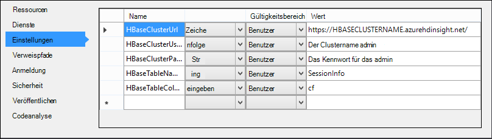
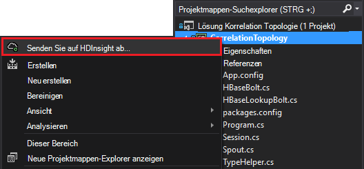

<properties
 pageTitle="Zuordnen von Ereignissen über Zeit Sturm mit HBase auf HDInsight"
 description="Erfahren Sie, wie Ereignisse zu korrelieren, die zu unterschiedlichen Zeiten HDInsight über Sturm und HBase eintreffen."
 services="hdinsight"
 documentationCenter=""
 authors="Blackmist"
 manager="jhubbard"
 editor="cgronlun"
 tags="azure-portal"/>

<tags
 ms.service="hdinsight"
 ms.devlang="dotnet"
 ms.topic="article"
 ms.tgt_pltfrm="na"
 ms.workload="big-data"
 ms.date="10/27/2016"
 ms.author="larryfr"/>

# Zuordnen von Ereignissen über Zeit Sturm mit HBase auf HDInsight

Mithilfe eines permanenten Datenspeichers mit Apache können Daten korrelieren, die zu unterschiedlichen Zeitpunkten eintreffen. Anmeldung und Abmeldung Ereignisse für eine benutzersitzung berechnen, wie lange dauerte die Sitzung z. B. verknüpfen.

In diesem Dokument erfahren Sie, wie eine einfache C# Storm-Topologie erstellen, die Anmelde-und Abmeldevorgänge für Sitzungen verfolgt und berechnet die Dauer der Sitzung. Die Topologie verwendet HBase als permanente Datenspeicher. HBase können Sie Batchabfragen auf Verlaufsdaten zu zusätzliche Hinweise, wie wie viele Sitzungen gestartet oder in einem bestimmten Zeitraum abgeschlossen wurden.

## Erforderliche Komponenten

- Visual Studio und HDInsight Tools für Visual Studio: Installationsinformationen finden Sie unter [Erste Schritte mit HDInsight Tools for Visual Studio](../HDInsight/hdinsight-hadoop-visual-studio-tools-get-started.md) .

- Apache Storm auf HDInsight cluster (Windows-). Storm-Topologie, die eingehende Daten verarbeitet und speichert ihn in HBase ausgeführt wird.

    > [AZURE.IMPORTANT] Im Gegensatz zu SCP.NET Topologien für Linux-basierte Sturm Cluster nach 28/10/2016 erstellt funktioniert HBase SDK für .NET Paket 2016 10/28/nicht unter Linux richtig.

- Apache HBase HDInsight Cluster (Linux oder Windows). Dies ist der Datenspeicher für dieses Beispiel.

## Architektur

Korrelation von Ereignissen erfordert einen allgemeinen Bezeichner für die Ereignisquelle. Zum Beispiel eine Benutzer-ID, ID für eine Sitzung oder andere Daten eindeutig a) und b) im Sturm alle Daten. Dieses Beispiel verwendet einen GUID-Wert zur Darstellung einer Sitzung-ID

Dieses Beispiel besteht aus zwei HDInsight-Cluster:

-   HBase: persistente Datenspeicher Verlaufsdaten

-   Storm: mit der eingehende Daten einlesen

Daten von Storm-Topologie zufällig generiert und besteht aus folgenden Elementen:

-   Sitzung-ID: eine GUID, die eindeutig für jede Sitzung

-   Ereignis: ein Start- oder END-Ereignis. Beispielsweise tritt starten immer vor Ende

-   : Die Zeit des Ereignisses.

Diese Daten verarbeitet und in HBase gespeichert.

### Storm-Topologie

Zu Beginn eine Sitzung **ein Startereignis** erhalten die Topologie und HBase angemeldet. Beim Empfang **ein** Topologie ruft **Das Startereignis** und berechnet die Zeit zwischen zwei Ereignissen. **Diese Dauer** wird dann in HBase **END** Event Informationen gespeichert.

> [AZURE.IMPORTANT] Während diese Topologie das grundlegende Muster zeigt müssen eine Gestaltung für die folgenden Szenarien:
>
> - Ereignisse Ankunft defekt
> - Ereignisse duplizieren
> - Gelöschte Ereignisse

Der Beispieltopologie besteht aus folgenden Komponenten:

-   Session.cs: Erstellen einer zufälligen Sitzungsbezeichner Start Zeit und wie lange die Sitzung dauert simuliert einer

-   Spout.cs: 100 Sitzungen erstellt ein Startereignis Gibt zufällige Timeout für jede Sitzung wartet, gibt ein. Dann beendet recycelt wird, um neue zu generieren.

-   HBaseLookupBolt.cs: die Sessionid Sitzung Informationen von HBase verwendet. Bei der Verarbeitung ein findet entsprechende Startereignis und berechnet die Dauer der Sitzung.

-   HBaseBolt.cs: Speichert Informationen in HBase.

-   TypeHelper.cs: Unterstützt Konvertierung beim Lesen / Schreiben in HBase.

### HBase-schema

In HBase werden die Daten in einer Tabelle mit dem Schema/Folgendes gespeichert:

-   Zeilenschlüssel: Session-ID als Schlüssel für Zeilen in dieser Tabelle verwendet wird

-   Spalte Familie: der Name "Cf" ist. In dieser Artikelreihe gespeichert werden:

    -   Ereignis: Anfang oder Ende

    -   Zeit: die Zeit in Millisekunden, die das Ereignis aufgetreten ist

    -   Dauer: die Länge zwischen Start- und Enddatum

-   Versionen: 'Cf' Familie soll jede Zeile 5 Versionen beibehalten

    > [AZURE.NOTE] Ein Protokoll der vorherigen Werte für eine bestimmte Zeilenschlüssel gespeichert sind. HBase gibt standardmäßig nur den Wert für die neueste Version einer Zeile. In diesem Fall wird die gleiche Zeile alle Ereignisse (Anfang, Ende.) verwendet jede Version einer Zeile durch den Timestampwert identifiziert wird. Dadurch wird eine Verlaufsansicht von Ereignissen für eine bestimmte ID angemeldet

## Laden Sie das Projekt

Das Beispielprojekt kann von [https://github.com/Azure-Samples/hdinsight-storm-dotnet-event-correlation](https://github.com/Azure-Samples/hdinsight-storm-dotnet-event-correlation)heruntergeladen werden.

Dieser Download enthält die folgenden C#-Projekten:

-   CorrelationTopology: C# Storm-Topologie, die Start-und Ende für Sitzungen zufällig ausgibt. Jede Sitzung dauert zwischen 1 und 5 Minuten.

-   SessionInfo: C# Konsolenanwendungsprojekt, die HBase-Tabelle erstellt und bietet Beispielabfragen gespeicherten Sitzungsdaten Informationen zurückgeben.

## Erstellen Sie die Tabelle

1. Öffnen Sie das Projekt **SessionInfo** in Visual Studio.

2. Im **Projektmappen-Explorer**mit der rechten Maustaste des Projekts **SessionInfo** , und wählen Sie **Eigenschaften**.

    

3. **Einstellungen Sie**, und legen Sie die folgenden Werte:

    -   HBaseClusterURL: die URL zum Cluster HBase. Beispielsweise https://myhbasecluster.azurehdinsight.net

    -   HBaseClusterUserName: die Admin-HTTP-Benutzerkonto für den cluster

    -   HBaseClusterPassword: das Kennwort für das Benutzerkonto Administrator-HTTP

    -   HBaseTableName: der Name der Tabelle mit diesem Beispiel

    -   HBaseTableColumnFamily: Der Familie Spaltenname

    

5. Führen Sie die Projektmappe. Bei der entsprechenden Aufforderung wählen Sie die Taste "c" zum Erstellen einer Tabelle im Cluster HBase aus

## Erstellen und Bereitstellen der Storm-Topologie

1.  Öffnen Sie die Projektmappe **CorrelationTopology** in Visual Studio.

2.  Wählen Sie im **Projektmappen-Explorer**die **CorrelationTopology** , und wählen Sie Eigenschaften.

3.  Im Eigenschaftenfenster **Bearbeiten** und die folgenden Informationen. Die ersten 5 sollte dieselben Werte **SessionInfo** Projekt verwendet:

    -   HBaseClusterURL: die URL zum Cluster HBase. Beispielsweise https://myhbasecluster.azurehdinsight.net

    -   HBaseClusterUserName: die Admin-HTTP-Benutzerkonto für den cluster

    -   HBaseClusterPassword: das Kennwort für das Benutzerkonto Administrator-HTTP

    -   HBaseTableName: der Name der Tabelle, die mit diesem Beispiel verwenden. Dies sollte denselben Tabellennamen wie im SessionInfo-Projekt

    -   HBaseTableColumnFamily: Der Familie Spaltenname. Dies sollte Familie Spaltenname wie im SessionInfo-Projekt

    > [AZURE.IMPORTANT] Die HBaseTableColumnNames kann nicht geändert werden, wie die Standardeinstellungen von **SessionInfo** zum Abrufen von Daten verwendeten Namen.

4.  Speichern Sie Eigenschaften und erstellen Sie das Projekt.

5.  Im **Projektmappen-Explorer**rechts auf das Projekt, und wählen Sie **Senden an auf HDInsight**. Wenn Sie aufgefordert werden, geben Sie die Anmeldeinformationen für Ihr Azure-Abonnement.

    

6.  Wählen Sie im Dialogfeld **Senden Topologie** Storm-Cluster, der diese Topologie ausgeführt wird.

    > [AZURE.NOTE] Beim ersten eine Topologie senden dauert es einige Sekunden zum Abrufen des Namens der HDInsight Cluster.

7.  Sobald die Topologie hochgeladen und an den Cluster gesendet wurde, wird **Storm-Topologie-Ansicht** öffnen und ausgeführte Topologie anzeigen. Wählen Sie **CorrelationTopology** und verwenden Sie die Schaltfläche "Aktualisieren" oben rechts auf der Seite die Topologieinformationen aktualisieren.

    

    Beginn die Topologie Daten wird der Wert in der Spalte **Hervorgebrachte** erhöht.

    > [AZURE.NOTE] Wenn die **Topologieansicht Sturm** nicht automatisch geöffnet wird, gehen Sie folgendermaßen öffnen:
    >
    > 1. Im **Projektmappen-Explorer**erweitern Sie **Azure**, und dann **HDInsight**.
    >
    > 2. Klicken Sie mit der rechten Maustaste den Storm-Cluster, den die Topologie ausgeführt wird, und wählen Sie dann **Ansicht Sturm Topologien**

## Abfrage der Daten

Nach Daten ausgegeben wurden, gehen Sie folgendermaßen vor, um die Daten abzufragen.

1. **SessionInfo** Projekt zurückkehren. Wenn nicht ausgeführt wird, starten Sie eine neue Instanz.

2. Bei Aufforderung wählen Sie **s** Startereignis suchen. Werden Sie aufgefordert einen Start- und einen Zeitraum - definieren eingeben werden nur Ereignisse zwischen diesen beiden Zeiten zurückgegeben.

    Verwenden Sie Folgendes Format, wenn die Anfangs- und Endzeiten eingeben: hh: mm und "bin" oder "pm". Beispielsweise 20 Uhr.

    Da die Topologie gerade gestartet wurde, verwenden eine Startzeit aus, bevor sie bereitgestellt wurde und nun eine Endzeit. Dies sollte START Ereignisse erfassen, die beim Start generiert wurden. Wenn die Abfrage ausgeführt wird, erhalten Sie eine Liste der Einträge wie die folgenden:

        Session e6992b3e-79be-4991-afcf-5cb47dd1c81c started at 6/5/2015 6:10:15 PM. Timestamp = 1433527820737

Suchen nach Ereignissen, Ende funktioniert wie Starten-Ereignisse. END-Ereignisse werden jedoch zufällig zwischen 1 und 5 Minuten nach dem START-Ereignis generiert. So müssen Sie einige Zeiträume versuchen zu Ende Ereignisse. END-Ereignisse enthält außerdem die Dauer der Sitzung - der Unterschied zwischen dem Ereignis Startzeit und Endzeit Ereignis. Hier ist ein Beispiel für END-Ereignisse:

    Session fc9fa8e6-6892-4073-93b3-a587040d892e lasted 2 minutes, and ended at 6/5/2015 6:12:15 PM

> [AZURE.NOTE] Eingegebene Zeitwerte in Ortszeit sind, werden die von der Abfrage zurückgegebenen UTC.

##Beenden der Topologie

Wenn Sie die Topologie beenden möchten, das **CorrelationTopology** -Projekt in Visual Studio zurück. **Storm-Topologie-Ansicht**wählen Sie die Topologie, und verwenden Sie die **Abbrechen** -Schaltfläche am oberen Rand der Topologie-Ansicht.

##Cluster löschen

[AZURE.INCLUDE [delete-cluster-warning](../../includes/hdinsight-delete-cluster-warning.md)]

##Nächste Schritte

Weitere Beispiele für Sturm anzeigen Sie [Topologien für auf HDInsight](hdinsight-storm-example-topology.md)
 
