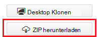
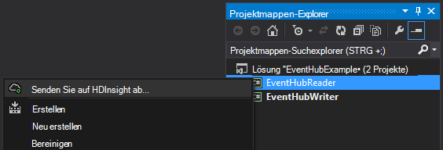
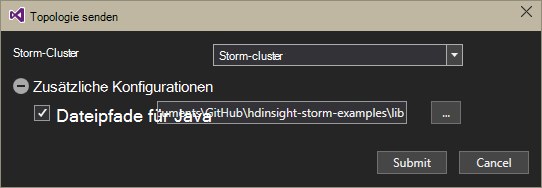
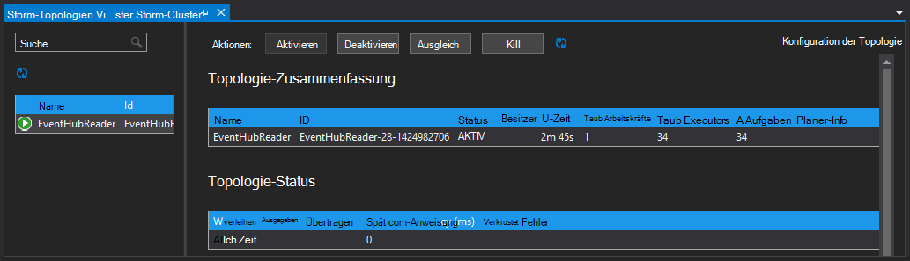

<properties
   pageTitle="Verarbeitet Ereignisse Ereignis Hubs auf HDInsight | Microsoft Azure"
   description="Informationen Sie zum Ereignis Hubs Prozessdaten mit C# Storm-Topologie in Visual Studio mit HDInsight-Tools für Visual Studio erstellt."
   services="hdinsight,notification hubs"
   documentationCenter=""
   authors="Blackmist"
   manager="jhubbard"
   editor="cgronlun"/>

<tags
   ms.service="hdinsight"
   ms.devlang="dotnet"
   ms.topic="article"
   ms.tgt_pltfrm="na"
   ms.workload="big-data"
   ms.date="10/27/2016"
   ms.author="larryfr"/>

# Verarbeitung von Ereignissen von Azure Ereignis Hubs mit auf HDInsight (C#)

Azure Event Hubs können Sie große Datenmengen aus Websites, apps und Geräte verarbeiten. Ereignis-Hubs Schnauze werden benutzerfreundliche Apache Storm HDInsight zum Analysieren der Daten in Echtzeit. Sie können auch Daten zu Ereignis Hubs Bolzen Ereignis Hubs mit Sturm schreiben.

In diesem Lernprogramm erfahren Sie, wie Sie HDInsight-Tools für Visual Studio installierten Visual Studio-Vorlagen zu Azure Ereignis Hubs arbeiten zwei Topologien.

* **EventHubWriter**: nach dem Zufallsprinzip generiert Daten und schreibt es in Ereignis-Hubs

* **EventHubReader**: liest Daten aus Ereignis Hubs und protokolliert die Daten in den Protokollen Sturm

> [AZURE.NOTE] Die Schritte in diesem Dokument in einer windowsumgebung-Entwicklung mit Visual Studio zu verlassen, kann das kompilierte Projekt zu Linux oder Windows-basierten HDInsight Cluster gesendet werden. Linux-basierten Clustern erstellt nur nach 28/10/2016 Unterstützung SCP.NET Topologien.
>
> Um eine C#-Topologie mit Linux-basierten Cluster verwenden, müssen Sie Microsoft.SCP.Net.SDK NuGet-Paket vom Projekt verwendete Version 0.10.0.6 oder höher aktualisieren. Die Version des Pakets muss auch Hauptversion Sturm auf HDInsight installiert. Auf HDInsight Version 3.3 und 3.4 z. B. sturmversion 0.10.x, während HDInsight 3.5 Sturm verwendet 1.0.x.
> 
> C#-Topologien auf Linux-basierten Clustern müssen verwenden .NET 4.5 und Mono auf HDInsight Cluster ausgeführt. Meiste funktioniert jedoch das Dokument [Mono-Kompatibilität](http://www.mono-project.com/docs/about-mono/compatibility/) für Inkompatibilitäten überprüfen soll.
>
> Eine Java-Version von diesem Projekt auch auf Linux oder Windows-basierten Cluster funktionieren, finden Sie unter [Ereignisse von Azure Ereignis Hubs mit auf HDInsight (Java) verarbeiten](hdinsight-storm-develop-java-event-hub-topology.md).

## Erforderliche Komponenten

* Ein [Apache Storm HDInsight Cluster](hdinsight-apache-storm-tutorial-get-started.md)

* Ein [Azure Event Hub](../event-hubs/event-hubs-csharp-ephcs-getstarted.md)

* [Azure .NET SDK](http://azure.microsoft.com/downloads/)

* Die [HDInsight-Tools für Visual Studio](hdinsight-hadoop-visual-studio-tools-get-started.md)

## Projektabschluss

Sie können eine vollständige Version des Projekts erstellt in diesem Lernprogramm von GitHub: [Eventhub-Storm-Hybrid](https://github.com/Azure-Samples/hdinsight-dotnet-java-storm-eventhub). Allerdings müssen Sie noch Konfigurationen bereitstellen, indem Sie die Schritte in diesem Lernprogramm.

## Ereignis-Hubs Schnauze und Schraube

Das Ereignis Auslauf und Bolzen werden Java-Komponenten, die Sie mit Event-Hubs von Apache Storm problemlos ermöglichen. Diese Komponenten in Java geschrieben sind, können HDInsight Tools für Visual Studio Hybridtopologien erstellt, das Mischen von C# und Java-Komponenten.

Auslauf und Bolzen werden als einzelne Java Archive (JAR) Datei namens **eventhubs-storm-spout-#.#-jar-with-dependencies.jar**, verteilt, ## ist die Version der Datei.

### Die JAR-Datei herunterladen

Die neueste Version der Jar-Datei ist im Projekt [HDInsight Sturm Beispiele](https://github.com/hdinsight/hdinsight-storm-examples) **Lib-eventhub** -Ordner enthalten. Um die Datei herunterzuladen, verwenden Sie eine der folgenden Methoden.

> [AZURE.NOTE] Auslauf und Bolzen haben im Apache Storm-Projekt gesendet wurde. Weitere Informationen finden Sie unter [STURM 583: erste Einchecken Sturm Ereignis Hubs](https://github.com/apache/storm/pull/336/files) in GitHub.

* **Eine ZIP-Datei herunterladen**: Site [HDInsight Sturm Beispiele](https://github.com/hdinsight/hdinsight-storm-examples) wählen Sie **Download ZIP** im rechten Bereich eine ZIP-Datei mit dem Projekt.

    

    Nach dem Herunterladen der Datei extrahieren Sie das Archiv und die Datei wird im Verzeichnis **Lib** .

* **Klon des Projekts**: [Git](http://git-scm.com/) installiert haben, verwenden Sie folgenden Befehl zum Klonen von lokal im Repository, und suchen Sie die Datei im Verzeichnis **Lib** .

        git clone https://github.com/hdinsight/hdinsight-storm-examples

## Konfigurieren von Event Hubs

Ereignis-Hubs ist die Datenquelle für dieses Beispiel. Verwenden Sie die Informationen im Abschnitt __Erstellen einer Ereignis-Hub__ des Dokuments [mit Ereignis beginnen](../event-hubs/event-hubs-csharp-ephcs-getstarted.md) .

3. Nach dem Erstellen der Ereignis-Hub zeigen Sie EventHub Blade in Azure-Portal an, und wählen Sie __Shared Access Richtlinien__. Verwenden Sie den Eintrag __+ Hinzufügen__ , fügen Sie die folgenden Richtlinien:

  	| Name | Berechtigungen |
  	| ----- | ----- |
  	| Writer | Senden |
  	| Reader | Überwachen |

    

5. Wählen Sie __Reader__ und __Writer__ . Kopieren Sie und speichern Sie den __PRIMARY KEY__ -Wert für beide Richtlinien wie diese später verwendet werden.

## Konfigurieren der EventHubWriter

1. Wenn Sie nicht die neueste Version der HDInsight-Tools für Visual Studio installiert haben, finden Sie unter [Erste Schritte mit HDInsight-Tools für Visual Studio](hdinsight-hadoop-visual-studio-tools-get-started.md).

2. [Eventhub-Storm-Hybrid-](https://github.com/Azure-Samples/hdinsight-dotnet-java-storm-eventhub)Lösung herunterladen. Öffnen Sie die Projektmappe und dauern Sie eine Weile, sich den Code für das __EventHubWriter__ -Projekt.

4. Öffnen Sie im Projekt __EventHubWriter__ die Datei __App.config__ . Verwenden Sie die Informationen zuvor konfigurierten Ereignis-Hub füllen den Wert für die folgenden Schlüssel:

  	| Schlüssel | Wert |
  	| ----- | ----- |
  	| EventHubPolicyName | Autor (falls Sie einen anderen Namen verwendet die Richtlinie mit der _Berechtigung,_ stattdessen verwenden.) |
  	| EventHubPolicyKey | Der Schlüssel für die Writer-Richtlinie |
  	| EventHubNamespace | Der Namespace, der Event-Hub enthält |
  	| EventHubName | Ihr Event Hub-name |
  	| EventHubPartitionCount | Die Anzahl der Partitionen in Ihrem Haupt-Ereignis |

4. Speichern Sie und schließen Sie die Datei **App.config** .

## Konfigurieren der EventHubReader

1. Öffnen Sie des __EventHubReader__ -Projekts und einige erstrebenswert im Code suchen.

2. Öffnen Sie die __App.config__ für __EventHubWriter__. Verwenden Sie die Informationen zuvor konfigurierten Ereignis-Hub füllen den Wert für die folgenden Schlüssel:

  	| Schlüssel | Wert |
  	| ----- | ----- |
  	| EventHubPolicyName | Leser (Wenn Sie einen anderen Namen verwendet die Richtlinie mit der Berechtigung _hören_ stattdessen verwenden.) |
  	| EventHubPolicyKey | Der Schlüssel für die Reader-Richtlinie |
  	| EventHubNamespace | Der Namespace, der Event-Hub enthält |
  	| EventHubName | Ihr Event Hub-name |
  	| EventHubPartitionCount | Die Anzahl der Partitionen in Ihrem Haupt-Ereignis |

3. Speichern Sie und schließen Sie die Datei **App.config** .

## Die Topologien bereitstellen

1. **Projektmappen-Explorer**das Projekt **EventHubReader** Maustaste, und wählen **Absenden an auf HDInsight**.

    

2. Wählen Sie auf dem Bildschirm **Topologie übermitteln** **Storm-Cluster**. **Zusätzliche Konfigurationen**erweitern, wählen Sie **Java Dateipfade**, wählen Sie **** und das Verzeichnis, das die **eventhubs-storm-spout-0.9-jar-with-dependencies.jar** enthält, die Sie zuvor heruntergeladen haben. Klicken Sie abschließend auf **Senden**.

    

3. Bei der Übermittlung der Topologie wird **Sturm Topologien Viewer** angezeigt. Wählen Sie die **EventHubReader** -Topologie im linken Statistiken für die Topologie. Derzeit sollte nichts geschehen, da noch keine Ereignisse in Ereignis-Hubs geschrieben wurden.

    

4. **Projektmappen-Explorer**das Projekt **EventHubWriter** Maustaste, und wählen **Absenden an auf HDInsight**.

2. Wählen Sie auf dem Bildschirm **Topologie übermitteln** **Storm-Cluster**. **Zusätzliche Konfigurationen**erweitern, wählen Sie **Java Dateipfade**, wählen Sie **** und das Verzeichnis, das die **eventhubs-storm-spout-0.9-jar-with-dependencies.jar** enthält, die Sie zuvor heruntergeladen haben. Klicken Sie abschließend auf **Senden**.

5. Wenn die Topologie übermittelt wurde, aktualisiert die Topologie im **Sturm Topologien Viewer** stellen Sie sicher, dass beide Topologien im Cluster ausgeführt werden.

6. Wählen Sie im **Sturm Topologien Viewer** **EventHubReader** -Topologie.

4. Doppelklicken Sie in der Diagrammansicht __LogBolt__ . Dadurch wird die __Komponente__ Zusammenfassungsseite für die Schraube geöffnet.

3. Wählen Sie im Abschnitt __Executors__ Links in der Spalte __Ports__ . Dadurch werden Informationen von der Komponente angezeigt. Die protokollierte Informationen ist ähnlich der folgenden:

        2016-10-20 13:26:44.186 m.s.s.b.ScpNetBolt [INFO] Processing tuple: source: com.microsoft.eventhubs.spout.EventHubSpout:7, stream: default, id: {5769732396213255808=520853934697489134}, [{"deviceId":3,"deviceValue":1379915540}]
        2016-10-20 13:26:44.234 m.s.s.b.ScpNetBolt [INFO] Processing tuple: source: com.microsoft.eventhubs.spout.EventHubSpout:7, stream: default, id: {7154038361491319965=4543766486572976404}, [{"deviceId":3,"deviceValue":459399321}]
        2016-10-20 13:26:44.335 m.s.s.b.ScpNetBolt [INFO] Processing tuple: source: com.microsoft.eventhubs.spout.EventHubSpout:6, stream: default, id: {513308780877039680=-7571211415704099042}, [{"deviceId":5,"deviceValue":845561159}]
        2016-10-20 13:26:44.445 m.s.s.b.ScpNetBolt [INFO] Processing tuple: source: com.microsoft.eventhubs.spout.EventHubSpout:7, stream: default, id: {-2409895457033895206=5479027861202203517}, [{"deviceId":8,"deviceValue":2105860655}]

## Beenden Sie die Topologien

Stoppen Sie die Topologien jeder Topologie im **Sturm Topologie Viewer**, klicken Sie auf **Abbrechen**.

## Cluster löschen

[AZURE.INCLUDE [delete-cluster-warning](../../includes/hdinsight-delete-cluster-warning.md)]

## Notizen

### Prüfpunkte

Die EventHubSpout in regelmäßigen Abständen Prüfpunkte der Zustand der Zookeeper-Knoten, der den aktuellen Offset für Nachrichten speichert aus der Warteschlange gelesen. Dadurch wird die Komponente empfangen Nachrichten gespeicherten Offset in den folgenden Szenarien:

* Die Instanz der Komponente ausfällt und neu gestartet.

* Sie vergrößert oder verkleinert den Cluster durch Hinzufügen oder Entfernen von Knoten.

* Die Topologie ist und **mit dem gleichen Namen**neu gestartet.

Sie können auch exportieren und Importieren von beibehaltenen Prüfpunkte zu WASB (den Azure-Speicher im Cluster HDInsight verwendet.) Die Skripts dazu befinden sich auf HDInsight Cluster am **c:\apps\dist\storm-0.9.3.2.2.1.0-2340\zkdatatool-1.0\bin**.

>[AZURE.NOTE] Die Versionsnummer im Pfad kann unterschiedlich sein, Version Sturm im Cluster installiert in der Zukunft ändern kann.

Die Skripts in diesem Verzeichnis sind:

* **stormmeta_import.cmd**: Zookeeper alle Sturm Metadaten aus Cluster Standardcontainer Speicher importieren.

* **stormmeta_export.cmd**: alle Sturm Metadaten aus Zookeeper in Standardcontainer Storage Cluster exportieren.

* **stormmeta_delete.cmd**: alle Sturm Metadaten aus Zookeeper löschen.

Exportieren ein Imports können Sie Prüfpunktdaten beibehalten, wenn Sie müssen Cluster löschen Verarbeitung vom aktuellen Offset im Hub fortsetzen, wenn Sie einen neuen Cluster wieder online schalten möchten.

> [AZURE.NOTE] Da der Standardcontainer Speicher beibehalten wird, verwenden der neue Cluster **müssen** dieselbe Speicherkonto und Container vorherigen Cluster.

## Nächste Schritte

In diesem Dokument haben Sie gelernt, wie Java Ereignis Hubs Auslauf und Bolzen aus einer C#-Topologie arbeiten mit Daten in Azure Event Hub. Erfahren Sie mehr über das Erstellen von C#-Topologien finden Sie hier.

* [Entwickeln von C# Topologien für Apache Storm auf HDInsight mit Visual Studio](hdinsight-storm-develop-csharp-visual-studio-topology.md)

* [SCP-Programmführer](hdinsight-storm-scp-programming-guide.md)

* [Topologien für auf HDInsight](hdinsight-storm-example-topology.md)
 
