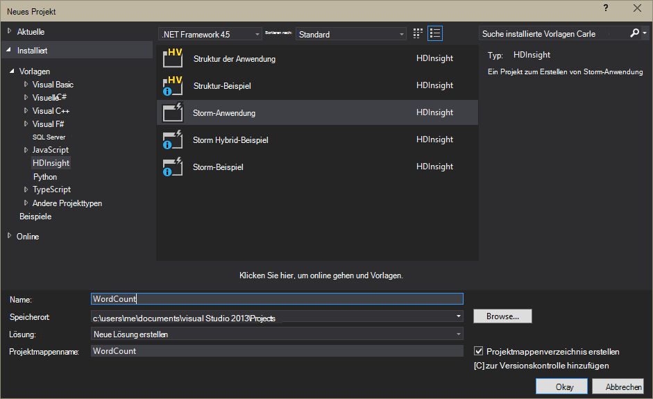

<properties
    pageTitle="Einführung in Apache Storm auf HDInsight | Microsoft Azure"
    description="Einführung in Apache Storm und Sturm auf HDInsight Verwendung Echtzeitdaten Analytics Lösungen in der Cloud zu erfahren."
    services="hdinsight"
    documentationCenter=""
    authors="Blackmist"
    manager="jhubbard"
    editor="cgronlun"
    tags="azure-portal"/>

<tags
   ms.service="hdinsight"
   ms.devlang="na"
   ms.topic="get-started-article"
   ms.tgt_pltfrm="na"
   ms.workload="big-data"
   ms.date="10/11/2016"
   ms.author="larryfr"/>

#Einführung in Apache Sturm HDInsight: Echtzeit-Analysen für Hadoop

Apache Storm auf HDInsight können Sie mit [Apache Hadoop](http://hadoop.apache.org)verteilte Echtzeitanalysen Solutions in der Azure-Umgebung erstellen.

##Apache Storm Neuigkeiten

Apache Storm ist eine verteilte fehlertolerante, Open-Source-Berechnung System, verarbeitet Daten in Echtzeit mit Hadoop. Storm Solutions bieten auch garantierte Datenverarbeitung mit Daten wiedergeben, die zum ersten Mal nicht erfolgreich verarbeitet wurde.

##Wozu Sturm auf HDInsight?

Apache Storm auf HDInsight ist eine verwaltete Azure-Umgebung integriert. Es bietet die folgenden Hauptvorteile:

* Als verwalteter Dienst mit einer SLA von 99,9 % Zeit führt

* Die Sprache Ihrer Wahl: Sturm Komponenten in **Java**, **C#**und **Python** unterstützt

    * Eine Kombination von Programmiersprachen unterstützt: Daten mit Java und C# verarbeiten#
    
        > [AZURE.NOTE] C#-Topologien sind nur auf Windows-basierte HDInsight-Cluster unterstützt.

    * Verwenden Sie **Trident** Java-Schnittstelle zu "genau" unterstützt Sturm Topologien Verarbeitung von Nachrichten, "Transaktion" Datenspeicher Persistenz und allgemeine Stream Analytics Operationen

* Umfasst integrierte skalieren und Herunterskalieren: Skalieren ein HDInsight Cluster mit gar Sturm Topologien ausgeführt

* Integration mit anderen Azure Services, einschließlich Event Hub, virtuelles Netzwerk Azure SQL-Datenbank, BLOB-Speicher und DocumentDB

    * Durch die Kombination mehrerer HDInsight Cluster mit Azure Virtual Network: analytische Pipelines, die HDInsight, HBase oder Hadoop-Clustern erstellen

Eine Liste der Unternehmen, die Apache Storm für ihre echtzeitanalyselösungen verwenden, finden Sie unter [Unternehmen mithilfe von Apache Sturm](https://storm.apache.org/documentation/Powered-By.html).

Erstes Sturm, finden Sie unter [Erste Schritte mit auf HDInsight][gettingstarted].

###Einfache Bereitstellung

Sie können einen neuen Sturm HDInsight Cluster in Minuten bereitstellen. Geben Sie den Namen des Clusters, Größe, Administratorkonto und das Speicherkonto. Azure Erstellen des Clusters, einschließlich Beispieltopologien und Web-Management Dashboard.

> [AZURE.NOTE] Sie können auch Storm-Cluster mithilfe der [Azure-CLI](../xplat-cli-install.md) oder [Azure PowerShell](../powershell-install-configure.md)bereitstellen.

Innerhalb von 15 Minuten die beantragen Sie einen neuen Storm-Cluster ausgeführt und bereit für die erste Echtzeitanalysen pipeline.

###Einfache Bedienung

__Für Linux-basierte Sturm auf HDInsight Cluster__, Sie können mit SSH und Verwendung der `storm` Befehl starten und Verwalten von Topologien. Darüber hinaus können Sie Ambari Sturm Service und Storm-Benutzeroberfläche überwachen und Verwalten von ausgeführten Topologien.

Weitere Informationen zum Arbeiten mit Linux-basierten Sturm finden Sie [fangen mit Apache auf Linux-basierten HDInsight](hdinsight-apache-storm-tutorial-get-started-linux.md).

__Für Windows-basierte Sturm HDInsight-Cluster__HDInsight für Visual Studio können Sie C# und Hybrid C# / Java-Topologien und senden diese an Ihrem Sturm HDInsight Cluster.  

HDInsight-Tools für Visual Studio stellt außerdem eine Oberfläche, mit der Sie überwachen und Verwalten von Storm Topologien in einem Cluster.

Ein Beispiel für die HDInsight-Tools Storm-Anwendung erstellen finden Sie unter [entwickeln C# Sturm Topologien mit HDInsight Tools für Visual Studio](hdinsight-storm-develop-csharp-visual-studio-topology.md).

Weitere Informationen zu den HDInsight Tools für Visual Studio finden Sie unter [Erste Schritte mit HDInsight Tools for Visual Studio](../HDInsight/hdinsight-hadoop-visual-studio-tools-get-started.md).

Jeder Sturm HDInsight Cluster bietet auch eine Web-basierte Storm-Dashboard, mit dem Sie senden, überwachen und Verwalten von Storm Topologien im Cluster ausgeführt.

Weitere Informationen über das Dashboard Sturm finden Sie unter [Bereitstellen und Verwalten von Apache Storm Topologien für HDInsight](hdinsight-storm-deploy-monitor-topology.md).

Auf HDInsight bietet auch Integration in Azure Ereignis Hubs durch **Ereignis Hub Auslauf**. Die neueste Version dieser Komponente steht unter [https://github.com/hdinsight/hdinsight-storm-examples/tree/master/lib/eventhubs](https://github.com/hdinsight/hdinsight-storm-examples/tree/master/lib/eventhubs)zur Verfügung. Weitere Informationen zur Verwendung dieser Komponente finden Sie in den folgenden Dokumenten.

* [Entwickeln einer C#-Topologie, die Azure Ereignis Hubs verwendet](hdinsight-storm-develop-csharp-event-hub-topology.md)

* [Entwickeln Sie eine Java-Topologie, die Azure Ereignis Hubs verwendet](hdinsight-storm-develop-java-event-hub-topology.md)

###Zuverlässigkeit

Apache Storm garantiert immer, dass jede eingehende Nachricht vollständig verarbeitet werden auch bei die Analyse auf Hunderte von Knoten verteilt.

**Nimbus-Knoten** ermöglicht, Hadoop JobTracker und weist Aufgaben an andere Knoten im Cluster erfolgt über **Zookeeper**. Zookeeper-Knoten für den Cluster Koordinierung und Kommunikation zwischen Nimbus und den **Supervisor** der Arbeitskraft Knoten. Wenn eine Verarbeitungsknoten ausfällt, Nimbus Knoten informiert und Aufgabe und zugehörigen Daten zu einem anderen Knoten zugewiesen.

Die Standardkonfiguration für Apache Storm ist nur ein Nimbus Knoten. Auf HDInsight führt zwei Nimbus Knoten. Ausfall der primäre Knoten wechselt HDInsight Cluster auf den sekundären Knoten während der primäre Knoten wiederhergestellt ist.

###Skalierung

Obwohl die Anzahl der Knoten im Cluster während der Erstellung angeben können, sollten Sie vergrößert oder verkleinert den Cluster Auslastung angepasst. HDInsight-Cluster können Sie die Anzahl der Knoten im Cluster, obwohl Daten ändern.

> [AZURE.NOTE] Um neue Knoten hinzugefügt durch Skalierung nutzen zu können, müssen Sie neu gestartet, bevor die Clustergröße stiegen Topologien.

###Unterstützung

Auf HDInsight bietet vollständige Unternehmensebene 24/7-Unterstützung. Auf HDInsight verfügt auch über eine SLA 99,9 %. Das bedeutet, dass wir garantieren, dass der Cluster mindestens 99,9 % der Zeit externe Konnektivität verfügen.

##Einsatzbereiche für Echtzeit-Analysen

Es folgen einige häufige Szenarien für die Apache Storm auf HDInsight verwenden können. Finden Sie Informationen zu realen Szenarien [wie Unternehmen nutzen Sturm](https://storm.apache.org/documentation/Powered-By.html).

* Das Internet der Dinge (IoT)
* Erkennung
* Soziale analytics
* Extrahieren Sie, transformieren Sie, laden (ETL)
* Überwachung
* Suche
* Mobile engagement

##Wie werden Daten in HDInsight Sturm verarbeitet?

Apache Storm führt **Topologien** statt, die Sie mit HDInsight oder Hadoop MapReduce-Jobs. Storm HDInsight Cluster enthält zwei Knoten: head-Knoten, die **Nimbus** und Arbeitskraft Knoten ausführen, **Supervisor**ausgeführt.

* **Nimbus**: JobTracker in Hadoop ähnlich, sie ist für Code im Cluster verteilen und Zuweisen von Aufgaben für virtuelle Maschinen für Fehler überwachen. HDInsight bietet zwei Nimbus Knoten keine einzelne Fehlerquelle auf HDInsight

* **Supervisor**: Supervisor für jede Arbeitskraft Knoten zu starten **Arbeitsprozessen** auf dem Knoten angehalten wird.

* **Arbeitsprozess**: führt eine Teilmenge einer **Topologie**. Viele Arbeitsprozesse im Cluster ausgeführte Topologie verteilt.

* **Topologie**: definiert ein Diagramm der Berechnung, die **Datenströme** verarbeitet. Im Gegensatz zu MapReduce-Jobs ausgeführt Topologien, bis Sie sie anhalten.

* **Stream**: eine ungebundene Auflistung von **Tupeln**. Streams werden **tüllen** und **Schrauben**, und sie werden von **Schrauben**.

* **Tupel**: eine benannte Liste dynamisch typisierte Werte.

* **Auslauf**: verwendet Daten aus einer Datenquelle und gibt ein oder mehrere **Datenströme**.

    > [AZURE.NOTE] In vielen Fällen werden Daten aus einer Warteschlange, Kafka, Azure Service Bus-Warteschlangen oder Ereignis Hubs gelesen. Die Warteschlange wird sichergestellt, dass Daten gespeichert werden, wenn ein Ausfall.

* **Bolzen**: nutzt **Streams**und Verarbeitung **Tupeln**führt **Streams**ausgeben kann. Bolzen sind auch zum Schreiben von Daten in externen Speicher wie eine Warteschlange, HDInsight, HBase, ein Blob oder anderen Datenspeicher verantwortlich.

* **Apache Sparsamkeit**: ein Softwareframework für skalierbare sprachübergreifende Entwicklung. Es können Sie Dienste erstellen, die zwischen C++, Java, Python, PHP, Ruby, Erlang, Perl, Haskell, C#, Kakao, JavaScript, Node.js, Smalltalk und andere Sprachen.

    * **Nimbus** ist eine Sparsamkeit und **Topologie** ist eine Definition Sparsamkeit Topologien mit einer Vielzahl von Programmiersprachen entwickeln.

Weitere Informationen zu Storm-Komponenten finden Sie im [Sturm-Lernprogramm] [ apachetutorial] an apache.org.

##Welche Sprachen kann ich verwenden?

Auf HDInsight Cluster unterstützt C#, Java und Python.

### C & #35;

Die HDInsight-Tools für Visual Studio zulassen .NET Entwickler entwerfen und Implementieren einer Topologie in C# Sie können auch Hybridtopologien erstellen, Java und C#-Komponenten.

Weitere Informationen finden Sie unter [Entwickeln von C# Topologien für Apache Storm auf HDInsight mit Visual Studio](hdinsight-storm-develop-csharp-visual-studio-topology.md).

###Java

Die meisten auftretenden Java-Beispiele werden nur Java oder Trident. Trident ist eine Abstraktionsebene, die Dinge wie Joins Aggregationen, gruppieren und Filtern vereinfacht. Allerdings wird Trident Batches von Tupeln, während eine unformatierte Java-Lösung ein Stream ein Tupel gleichzeitig verarbeitet.

Weitere Informationen zu Trident finden Sie unter der [Trident-Lernprogramm](https://storm.apache.org/documentation/Trident-tutorial.html) apache.org.

Beispiele für Java und Trident-Topologien finden Sie unter [Liste der Storm Topologien](hdinsight-storm-example-topology.md) oder Sturm Starter-Beispiele HDInsight Cluster.

Storm-Starter-Beispiele befinden sich im Verzeichnis __/usr/hdp/current/storm-client/contrib/storm-starter__ auf Linux-basierten Clustern und das Verzeichnis **%storm_home%\contrib\storm-starter** auf Windows-basierten Clustern.

##Was sind einige allgemeine Entwicklungsmuster?

###Garantierte Verarbeitung

Storm bieten unterschiedliche Verarbeitung garantiert. Beispielsweise eine Basisanwendungsgruppe Sturm garantieren einmal am wenigsten Verarbeitung und Trident garantieren genau-einmal verarbeitet.

Weitere Informationen finden Sie unter apache.org [Garantien für Datenverarbeitung](https://storm.apache.org/about/guarantees-data-processing.html) .

###IBasicBolt

Das Lesen einer Eingabe Tupel aus null oder mehr Tupel und durch ACK bestätigt input Tupel unmittelbar am Ende der Execute-Methode ist sehr häufig und Sturm enthält die [IBasicBolt](https://storm.apache.org/apidocs/backtype/storm/topology/IBasicBolt.html) -Schnittstelle, um dieses Muster zu automatisieren.

###Joins

Verknüpfen von zwei Datenströme variiert zwischen Programmen. Beispielsweise jedes Tupel aus mehreren Streams konnte in einen neuen Stream beitreten und konnte nur Stapel von Tupeln für ein bestimmtes Fenster beitreten. In beiden Fällen verknüpfen möglich mit [FieldsGrouping](http://javadox.com/org.apache.storm/storm-core/0.9.1-incubating/backtype/storm/topology/InputDeclarer.html#fieldsGrouping%28java.lang.String,%20backtype.storm.tuple.Fields%29)Möglichkeit, wie Tupel Bolzen weitergeleitet werden.

Im folgenden Java-Beispiel wird FieldsGrouping verwendet, Tupel weitergeleitet, die aus Komponenten "1", "2" und "3" Bolzen **MyJoiner** stammen.

    builder.setBolt("join", new MyJoiner(), parallelism) .fieldsGrouping("1", new Fields("joinfield1", "joinfield2")) .fieldsGrouping("2", new Fields("joinfield1", "joinfield2")) .fieldsGrouping("3", new Fields("joinfield1", "joinfield2"));

###Batchverarbeitung

Batchverarbeitung kann auf unterschiedliche Weise erfolgen. Mit einer grundlegenden Java Storm-Topologie kann einfach gegen Chargennummer X von Tupeln verwenden, bevor sie ausgeben oder verwenden eine interne Zeitgebermechanismus bekannt als "Tick Tupel" einen Stapel alle X Sekunden ausgegeben.

Beispielsweise mit Tick Tupel finden Sie unter [Analysieren von Daten mit Sturm und HBase auf HDInsight](hdinsight-storm-sensor-data-analysis.md).

Bei Verwendung von Trident basiert er auf Stapel von Tupeln.

###Zwischenspeichern

Im Arbeitsspeicher Zwischenspeichern wird häufig als ein Mechanismus zur Beschleunigung häufig hält Verarbeitung Ressourcen im Arbeitsspeicher verwendet. Da mehrere Knoten und Prozesse in jedem Knoten eine Topologie verteilt werden, sollten Sie mit [FieldsGrouping](http://javadox.com/org.apache.storm/storm-core/0.9.1-incubating/backtype/storm/topology/InputDeclarer.html#fieldsGrouping%28java.lang.String,%20backtype.storm.tuple.Fields%29) Tupel mit Feldern für Cache verwendet immer mit demselben Prozess weitergeleitet werden. Duplizierung von Cacheeinträgen vermeiden prozessübergreifend.

###Streaming Top N

Beim Berechnen eines Wertes "Top N" wie Top 5 Trends auf Twitter, Ihrer Topologie hängt Sie Top N parallel berechnet und dann die Ausgabe dieser Berechnung in einen globalen Wert zusammenführen. Dies erfolgt mithilfe von [FieldsGrouping](http://javadox.com/org.apache.storm/storm-core/0.9.1-incubating/backtype/storm/topology/InputDeclarer.html#fieldsGrouping%28java.lang.String,%20backtype.storm.tuple.Fields%29) Route vom Feld zur parallelen Schrauben (die Daten durch Feldwert Partitionen) und dann Route Bolzen, der weltweit größten Wert bestimmt.

Ein Beispiel hierfür finden Sie im [RollingTopWords](https://github.com/nathanmarz/storm-starter/blob/master/src/jvm/storm/starter/RollingTopWords.java) -Beispiel.

##Welche Art der Protokollierung mit Storm?

Storm verwendet Apache Log4j Informationen protokollieren. Standardmäßig wird eine große Datenmenge protokolliert und schwierig Informationen werden. Sie können eine Konfigurationsdatei Protokollierung als Teil Ihrer Topologie Sturm Protokollierung Verhalten steuern enthalten.

Ein Beispiel-Topologie veranschaulicht, die Protokollierung konfigurieren, finden Sie unter [Java-basierte WordCount](hdinsight-storm-develop-java-topology.md) -Beispiel auf HDInsight.

##Nächste Schritte

Weitere Informationen zu echtzeitanalyselösungen mit Apache in HDInsight:

* [Erste Schritte mit auf HDInsight][gettingstarted]

* [Topologien für auf HDInsight](hdinsight-storm-example-topology.md)

[stormtrident]: https://storm.apache.org/documentation/Trident-API-Overview.html
[samoa]: http://yahooeng.tumblr.com/post/65453012905/introducing-samoa-an-open-source-platform-for-mining
[apachetutorial]: https://storm.apache.org/documentation/Tutorial.html
[gettingstarted]: hdinsight-apache-storm-tutorial-get-started-linux.md
