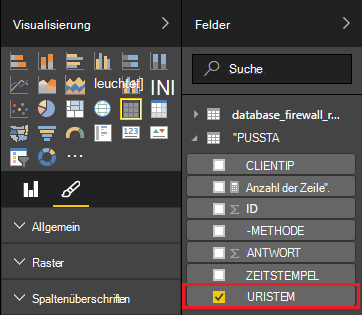

<properties
 pageTitle="Verwenden Sie Apache Storm mit Power BI | Microsoft Azure"
 description="Erstellen Sie einen Power BI-Bericht mit Daten aus einer C#-Topologie auf einem Apache Storm-Cluster in HDInsight."
 services="hdinsight"
 documentationCenter=""
 authors="Blackmist"
 manager="jhubbard"
 editor="cgronlun"
    tags="azure-portal"/>

<tags
 ms.service="hdinsight"
 ms.devlang="dotnet"
 ms.topic="article"
 ms.tgt_pltfrm="na"
 ms.workload="big-data"
 ms.date="10/27/2016"
 ms.author="larryfr"/>

# Verwenden Sie Power BI, um Daten aus einer Apache Storm-Topologie

Power BI können Sie Daten visuell Berichte anzuzeigen. Mithilfe von Visual Studio-Vorlagen für auf HDInsight können Daten einfach eine Topologie mit auf einem Apache HDInsight Cluster in SQL Azure verwenden, und stellen Sie die Daten mit Power BI.

In diesem Dokument erfahren Sie, wie Sie Power BI zum Erstellen eines Berichts aus einer Apache Storm-Topologie generiert und in Azure SQL-Datenbank gespeichert.

> [AZURE.NOTE] Die Schritte in diesem Dokument in einer windowsumgebung-Entwicklung mit Visual Studio zu verlassen, kann das kompilierte Projekt zu Linux oder Windows-basierten HDInsight Cluster gesendet werden. Linux-basierten Clustern erstellt nur nach 28/10/2016 Unterstützung SCP.NET Topologien.
>
> Um eine C#-Topologie mit Linux-basierten Cluster verwenden, müssen Sie Microsoft.SCP.Net.SDK NuGet-Paket vom Projekt verwendete Version 0.10.0.6 oder höher aktualisieren. Die Version des Pakets muss auch Hauptversion Sturm auf HDInsight installiert. Auf HDInsight Version 3.3 und 3.4 z. B. sturmversion 0.10.x, während HDInsight 3.5 Sturm verwendet 1.0.x.
> 
> C#-Topologien auf Linux-basierten Clustern müssen verwenden .NET 4.5 und Mono auf HDInsight Cluster ausgeführt. Meiste funktioniert jedoch das Dokument [Mono-Kompatibilität](http://www.mono-project.com/docs/about-mono/compatibility/) für Inkompatibilitäten überprüfen soll.
>
> Eine Java-Version von diesem Projekt auch auf Linux oder Windows-basierten Cluster funktionieren, finden Sie unter [Ereignisse von Azure Ereignis Hubs mit auf HDInsight (Java) verarbeiten](hdinsight-storm-develop-java-event-hub-topology.md).

## Erforderliche Komponenten

- Ein Azure-Abonnement. Finden Sie [kostenlose Testversion von Azure zu erhalten](https://azure.microsoft.com/documentation/videos/get-azure-free-trial-for-testing-hadoop-in-hdinsight/).

* Azure Active Directory-Benutzer mit [Power BI](https://powerbi.com)

* Visual Studio (eine der folgenden Versionen)

    * Visual Studio 2012 [update 4](http://www.microsoft.com/download/details.aspx?id=39305)

    * Visual Studio 2013 [update 4](http://www.microsoft.com/download/details.aspx?id=44921) oder [Visual Studio 2013 Community](http://go.microsoft.com/fwlink/?linkid=517284&clcid=0x409)

    * [Visual Studio 2015](https://www.visualstudio.com/downloads/download-visual-studio-vs.aspx)

* Die HDInsight-Tools für Visual Studio: Informationen finden Sie unter [Erste Schritte mit HDInsight Tools for Visual Studio](../HDInsight/hdinsight-hadoop-visual-studio-tools-get-started.md) Installationsinformationen.

## Funktionsweise

Dieses Beispiel enthält eine C# Storm-Topologie, die Internet Information Services (IIS) Protokolldaten zufällig generiert. Diese Daten dann in einer SQL-Datenbank geschrieben und von dort dient zum Generieren von Berichten in Power BI.

Folgendes ist eine Liste der Dateien, die die wichtigste Funktionen dieses Beispiels implementiert.

* **SqlAzureBolt.cs**: schreibt Informationen in der Topologie Sturm SQL-Datenbank.

* **IISLogsTable.sql**: der Transact-SQL-Anweisungen zu den Daten in der Datenbank verwendet.

> [AZURE.WARNING] Bevor die Topologie auf HDInsight Cluster müssen Sie die Tabelle in SQL-Datenbank erstellen.

## Das Beispiel herunterladen

[HDInsight C# Sturm Power BI Beispiel](https://github.com/Azure-Samples/hdinsight-dotnet-storm-powerbi)herunterladen Zum Herunterladen mit [Git](http://git-scm.com/)Verzweigung/Clone oder verwenden Sie den Link **Download** ZIP Archiv herunterladen.

## Erstellen einer Datenbank

1. Gehen Sie im [Lernprogramm für SQL](../sql-database/sql-database-get-started.md) -Dokument zum Erstellen einer neuen SQL-Datenbank.

2. Verbinden mit der Datenbank mithilfe der Schritte im Dokument [mit einer SQL-Datenbank mit Visual Studio](../sql-database/sql-database-connect-query.md) für die Verbindung mit der Datenbank.

4. Klicken Sie mit der rechten Maustaste auf die Datenbank im Objekt-Explorer und erstellen Sie eine __Neue Abfrage__. Fügen Sie den Inhalt der Datei __IISLogsTable.sql__ im heruntergeladenen Projekt in das Abfragefenster, und verwenden Sie STRG + UMSCHALT + E, um die Abfrage auszuführen. Sie erhalten eine Meldung, dass Befehl(e) erfolgreich abgeschlossen.

    Sobald dies abgeschlossen ist, wird eine neue Tabelle namens __IISLOGS__ in der Datenbank vorhanden sein.

## Konfigurieren Sie das Beispiel

1. Wählen Sie aus dem [Azure-Portal](https://portal.azure.com)Ihrer SQL-Datenbank. Wählen Sie Abschnitt __Essentials__ SQL Datenbank Blade __Datenbankverbindungszeichenfolgen anzeigen__. Kopieren Sie aus der angezeigten Liste die __ADO.NET (SQL-Authentifizierung)__ Informationen.

1. In Visual Studio öffnen. **Projektmappen-Explorer**öffnen Sie die Datei **App.config** , und suchen Sie den folgenden Eintrag:

        <add key="SqlAzureConnectionString" value="##TOBEFILLED##" />
    
    Ersetzen der __## TOBEFILLED ##__ durch die Verbindungszeichenfolge der im vorherigen Schritt kopiert. Ersetzen Sie __{Ihre\_Benutzername}__ und __{Ihre\_Kennwort}__ mit Benutzernamen und Kennwort für die Datenbank.

2. Speichern Sie und schließen Sie die Dateien.

## Das Beispiel bereitstellen

1. **Projektmappen-Explorer**das Projekt **StormToSQL** Maustaste, und wählen **Absenden an auf HDInsight**. **Storm-Cluster** Dropdown-Dialogfeld HDInsight Cluster auswählen.

    > [AZURE.NOTE] Es dauert einige Sekunden Dropdown **Storm-Cluster** mit aufgefüllt.
    >
    > Wenn Sie aufgefordert werden, geben Sie die Anmeldeinformationen für Ihr Azure-Abonnement. Wenn Sie über mehrere Abonnements verfügen, melden Sie sich Ihre Sturm HDInsight Cluster enthält.

2. Wenn die Topologie erfolgreich übermittelt wurde, erscheinen Sturm Topologien für den Cluster. Eintrag für die SqlAzureWriterTopology aus der Liste Informationen zu laufenden Topologie.

    

    In dieser Ansicht können Sie Informationen auf die Topologie oder Doppelklick auf Einträge (wie SqlAzureBolt) finden Informationen zu einer Komponente in der Topologie.

3. Nachdem die Topologie für die Minuten zurück zum Erstellen der Datenbank verwendeten SQL-Abfragefenster ausgeführt. Ersetzen der vorhandenen Anweisungen folgende.

        select * from iislogs;
    
    Mit STRG + UMSCHALT + E, zum Ausführen der Abfrage und erhalten Ergebnisse, die der folgenden ähnelt.
    
        1   2016-05-27 17:57:14.797 255.255.255.255 /bar    GET 200
        2   2016-05-27 17:57:14.843 127.0.0.1   /spam/eggs  POST    500
        3   2016-05-27 17:57:14.850 123.123.123.123 /eggs   DELETE  200
        4   2016-05-27 17:57:14.853 127.0.0.1   /foo    POST    404
        5   2016-05-27 17:57:14.853 10.9.8.7    /bar    GET 200
        6   2016-05-27 17:57:14.857 192.168.1.1 /spam   DELETE  200

    Dies ist der Storm-Topologie geschriebenen Daten.

## Erstellen eines Berichts

1. Verbinden Sie mit dem [Azure SQL Database Connector](https://app.powerbi.com/getdata/bigdata/azure-sql-database-with-live-connect) für Power BI.

2. Wählen Sie in __Datenbanken__ __Abrufen__.

3. Wählen Sie __Azure SQL-Datenbank__, und wählen Sie __Verbinden__.

4. Geben Sie die Verbindung zu Ihrem SQL Azure-Datenbank. Das finden von [Azure-Portal](https://portal.azure.com) besuchen und die SQL-Datenbank auswählen.

    > [AZURE.NOTE] Sie können auch das Aktualisierungsintervall und benutzerdefinierte Filter __Ermöglichen erweiterte Optionen__ im Dialogfeld Verbinden mit festlegen.

5. Nachdem die Verbindung hergestellt haben, sehen ein neues Dataset mit demselben Namen wie die Datenbank Sie verbundenen. Wählen Sie das Dataset, das Entwerfen eines Berichts.

3. __Felder__erweitern Sie den Eintrag __IISLOGS__ . Aktivieren Sie das Kontrollkästchen für __URISTEM__. Dadurch einen neuen Bericht, Wortstämme URI aufgeführt (/ Foo/bar, usw.) in der Datenbank protokolliert.

    

5. Als Nächstes ziehen Sie __Methode__ in den Bericht. Der Bericht wird aktualisiert Wortstämme und die entsprechenden HTTP-Methode der HTTP-Anforderung zum auflisten.

    

4. Spalte __Visualisierung__ wählen Sie __Felder__ -Symbol und wählen Sie den Pfeil nach unten neben __Methode__ im Abschnitt __Werte__ . __Wählen Sie aus der angezeigten Liste.__ Dadurch wird im Bericht die Anzahl wie oft aufgeführt, die ein bestimmten URI zugegriffen wurde geändert.

    

6. Wählen Sie __Gestapeltes Säulendiagramm__ wie die Informationen angezeigt werden.

    

7. Haben Sie den Bericht wie soll, verwenden Sie im Menü den Eintrag __Speichern__ benennen und speichern Sie den Bericht.

## Beenden der Topologie

Die Topologie weiterhin ausgeführt, bis Sie beenden oder auf HDInsight Cluster löschen. Führen Sie die folgenden Schritte aus, um die Topologie zu beenden.

1. In Visual Studio den Betrachter Topologie und Aktivieren der Topologie.

2. Wählen Sie **Beenden** die Topologie zu.

    

## Cluster löschen

[AZURE.INCLUDE [delete-cluster-warning](../../includes/hdinsight-delete-cluster-warning.md)]

## Nächste Schritte

In diesem Dokument haben Sie gelernt, wie Sie Daten aus einem Storm-Topologie mit SQL-Datenbank senden und dann die Daten mit Power BI. Informationen zum Arbeiten mit anderen Azure Technologien Sturm auf HDInsight finden Sie unter:

* [Topologien für auf HDInsight](hdinsight-storm-example-topology.md)
