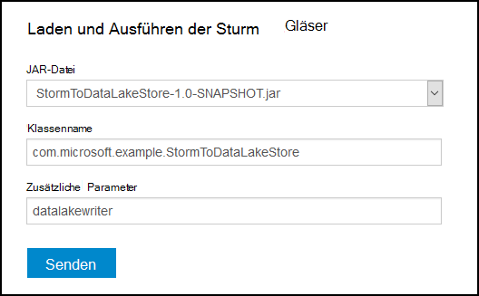
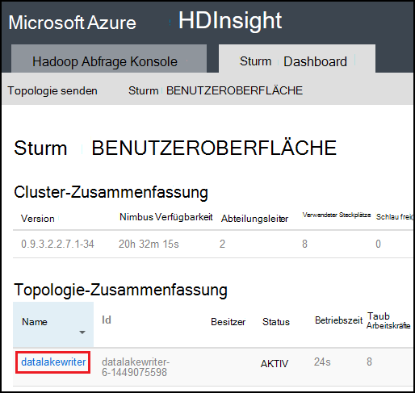

<properties
pageTitle="Mit Azure See Datenspeicher mit Apache auf Azure HDInsight"
description="Informationen Sie zum Schreiben von Daten in Azure See Datenspeicher von Apache Storm-Topologie auf HDInsight. Dieses Dokument und zugeordneten Beispiel wird wie die HdfsBolt-Komponente zur See Datenspeicher zu schreiben."
services="hdinsight"
documentationCenter="na"
authors="Blackmist"
manager="jhubbard"
editor="cgronlun"/>

<tags
ms.service="hdinsight"
ms.devlang="na"
ms.topic="article"
ms.tgt_pltfrm="na"
ms.workload="big-data"
ms.date="09/06/2016"
ms.author="larryfr"/>

#Mit Azure See Datenspeicher mit Apache mit HDInsight

Azure See Datenspeicher ist ein bietet kompatible Cloud Storage Dienst hoher Durchsatz, Verfügbarkeit, Haltbarkeit und Zuverlässigkeit für Ihre Daten. In diesem Dokument lernen Sie mit Java-basierte Storm-Topologie schreiben Daten in Azure See Datenspeicher mithilfe der [HdfsBolt](http://storm.apache.org/javadoc/apidocs/org/apache/storm/hdfs/bolt/HdfsBolt.html) -Komponente als Teil des Apache Storm bereitgestellt wird.

> [AZURE.IMPORTANT] In diesem Dokument verwendete Beispieltopologie basiert auf Komponenten, die mit auf HDInsight Cluster enthalten sind und erfordern Änderung Azure See Datenspeicher mit anderen Apache Storm-Cluster arbeiten.

##Erforderliche Komponenten

* [Java JDK 1.7](https://www.oracle.com/technetwork/java/javase/downloads/jdk7-downloads-1880260.html) oder höher
* [Maven 3.x](https://maven.apache.org/download.cgi)
* Ein Azure-Abonnement
* Ein Sturm auf HDInsight Clusterversion 3.2. Zum Erstellen eines neuen Sturms auf HDInsight Cluster gehen Sie im Dokument [mithilfe von Azure HDInsight mit dem Datenspeicher verwenden](../data-lake-store/data-lake-store-hdinsight-hadoop-use-portal.md) . Die Schritte in diesem Dokument führt Sie durch Erstellen eines neuen HDInsight-Cluster und Azure See Datenspeicher.  

    > [AZURE.IMPORTANT] Beim Erstellen des HDInsight-Clusters müssen Sie als Clustertyp und Version __3.2__ __Sturm__ auswählen. Das Betriebssystem kann Windows oder Linux.  

###Konfigurieren von Umgebungsvariablen

Die folgenden Umgebungsvariablen können bei der Installation von Java, und JDK auf Ihrer Entwicklungsarbeitsstation festgelegt werden. Jedoch sollten Sie überprüfen, dass sie vorhanden und enthalten die Werte für Ihr System.

* __JAVA_HOME__ - darauf zu dem Verzeichnis, in dem Java Runtime Environment (JRE) installiert. Beispielsweise in einer UNIX- oder Linux-Verteilung muss einen Wert wie `/usr/lib/jvm/java-7-oracle`. Unter Windows haben einen Wert wie `c:\Program Files (x86)\Java\jre1.7`.

* __Pfad__ – sollte die folgenden Pfade:

    * __JAVA\_Start__ (oder den entsprechenden Pfad)
    
    * __JAVA\_HOME\bin__ (oder den entsprechenden Pfad)
    
    * Das Verzeichnis, in dem Maven installiert ist

##Topologie-Implementierung

In diesem Beispiel ist in Java geschrieben und verwendet die folgenden Komponenten:

* __TickSpout__: die Daten von anderen Komponenten in der Topologie verwendet wird.

* __PartialCount__: Ereignisse generiert durch TickSpout ermittelt.

* __FinalCount__: Aggregate zählen Daten aus PartialCount.

* __ADLStoreBolt__: schreibt Daten in Azure See Datenspeicher mithilfe der [HdfsBolt](http://storm.apache.org/javadoc/apidocs/org/apache/storm/hdfs/bolt/HdfsBolt.html) -Komponente.

Das Projekt mit dieser Topologie ist als Download unter [https://github.com/Azure-Samples/hdinsight-storm-azure-data-lake-store](https://github.com/Azure-Samples/hdinsight-storm-azure-data-lake-store)verfügbar.

###Grundlegendes zu ADLStoreBolt

Der ADLStoreBolt ist der Name für die HdfsBolt-Instanz in der Topologie in Azure Data Lake schreibt. Dies ist keine spezielle Version von Microsoft erstellte HdfsBolt. Es beruht jedoch auf Konfigurationswerte Core-Website sowie Hadoop Komponenten in Azure HDInsight Kommunikation mit Daten enthalten.

Insbesondere beim Erstellen eines HDInsight-Clusters können Sie es einem Datenspeicher See Azure zuordnen. Dies schreibt Einträge in Kern-Website für den See-Datenspeicher, die Sie ausgewählt haben, die von Komponenten wie Hadoop Client und Hadoop bietet für die Kommunikation mit See Datenspeicher verwendet werden.

> [AZURE.NOTE] Microsoft hat Code, Apache Hadoop Sturm Projekte die Kommunikation mit Azure See Datenspeicher und Azure Blob-Speicher, aber diese Funktionalität standardmäßig in anderen Hadoop und Sturm-Distributionen enthalten sein.

Die Konfiguration für HdfsBolt in der Topologie ist wie folgt:

    // 1. Create sync and rotation policies to control when data is synched
    //    (written) to the file system and when to roll over into a new file.
    SyncPolicy syncPolicy = new CountSyncPolicy(1000);
    FileRotationPolicy rotationPolicy = new FileSizeRotationPolicy(0.5f, Units.KB);
    // 2. Set the format. In this case, comma delimited
    RecordFormat recordFormat = new DelimitedRecordFormat().withFieldDelimiter(",");
    // 3. Set the directory name. In this case, '/stormdata/'
    FileNameFormat fileNameFormat = new DefaultFileNameFormat().withPath("/stormdata/");
    // 4. Create the bolt using the previously created settings,
    //    and also tell it the base URL to your Data Lake Store.
    // NOTE! Replace 'MYDATALAKE' below with the name of your data lake store.
    HdfsBolt adlsBolt = new HdfsBolt()
        .withFsUrl("adl://MYDATALAKE.azuredatalakestore.net/")
        .withRecordFormat(recordFormat)
        .withFileNameFormat(fileNameFormat)
        .withRotationPolicy(rotationPolicy)
        .withSyncPolicy(syncPolicy);
    // 4. Give it a name and wire it up to the bolt it accepts data
    //    from. NOTE: The name used here is also used as part of the
    //    file name for the files written to Data Lake Store.
    builder.setBolt("ADLStoreBolt", adlsBolt, 1)
      .globalGrouping("finalcount");
      
Wenn Sie mit HdfsBolt vertraut sind, sehen Sie, dass diese alle standardmäßig Konfiguration mit Ausnahme der URL verwendet wird. Der URL enthält den Pfad zum Stammverzeichnis Azure See Datenspeicher.

Da See Datenspeicher HdfsBolt verwendet und nur eine URL ist, sollten Sie möglicherweise alle vorhandenen Topologie bietet oder WASB mit HdfsBolt schreibt und problemlos ändern, um Azure See Datenspeicher verwenden.

##Erstellen und Verpacken der Topologie

1. Downloaden Sie das Beispielprojekt von [https://github.com/Azure-Samples/hdinsight-storm-azure-data-lake-store](https://github.com/Azure-Samples/hdinsight-storm-azure-data-lake-store
) in Umgebung.

2. Öffnen der `StormToDataLake\src\main\java\com\microsoft\example\StormToDataLakeStore.java` -Datei in einem Editor und suchen Sie die Zeile mit `.withFsUrl("adl://MYDATALAKE.azuredatalakestore.net/")`. __MYDATALAKE__ der Name geändert von Azure See Datenspeicher verwendet, wenn den HDInsight-Server erstellen.

3. Ein Befehl, Terminal oder shellsitzung wechseln Sie zum Stamm des heruntergeladenen Projekt und führen Sie die folgenden Befehle zum Erstellen und Verpacken der Topologie.

        mvn compile
        mvn package
    
    Nach Abschluss der Erstellung und Verpackung werden ein neues Verzeichnis mit dem Namen `target`, enthält eine Datei namens `StormToDataLakeStore-1.0-SNAPSHOT.jar`. Die kompilierte Topologie enthält.

##Bereitstellen und Ausführen auf Linux-basierten HDInsight

Linux-basierten Sturm in HDInsight-Cluster erstellt wird, gehen Sie unten zum Bereitstellen und Ausführen der Topologie.

1. Verwenden Sie folgenden Befehl die Topologie auf HDInsight Cluster kopieren. Die Erstellung des Clusters verwendeten SSH-Benutzernamen ersetzen Sie __Benutzer__ . Der Name des Clusters ersetzen Sie __CLUSTERNAME__ .

        scp target\StormToDataLakeStore-1.0-SNAPSHOT.jar USER@CLUSTERNAME-ssh.azurehdinsight.net:StormToDataLakeStore-1.0-SNAPSHOT.jar
    
    Geben Sie bei Aufforderung das Kennwort den Benutzer SSH für den Cluster zu erstellen. Wenn Sie einen öffentlichen Schlüssel anstelle eines Kennworts verwendet, möglicherweise mit den `-i` Parameter, um den Pfad zu den passenden privaten Schlüssel.
    
    > [AZURE.NOTE] Wenn Sie einen Windows-Client für die Entwicklung verwenden, nicht möglicherweise ein `scp` Befehl. Wenn Ja, Sie können `pscp`, das von [http://www.chiark.greenend.org.uk/~sgtatham/putty/download.html](http://www.chiark.greenend.org.uk/~sgtatham/putty/download.html)verfügbar ist.

2. Sobald der Upload abgeschlossen ist, können Sie anhand der folgenden HDInsight über SSH herstellen. Die Erstellung des Clusters verwendeten SSH-Benutzernamen ersetzen Sie __Benutzer__ . Der Name des Clusters ersetzen Sie __CLUSTERNAME__ .

        ssh USER@CLUSTERNAME-ssh.azurehdinsight.net

    Geben Sie bei Aufforderung das Kennwort den Benutzer SSH für den Cluster zu erstellen. Wenn Sie einen öffentlichen Schlüssel anstelle eines Kennworts verwendet, möglicherweise mit den `-i` Parameter, um den Pfad zu den passenden privaten Schlüssel.
    
    > [AZURE.NOTE] Wenn Sie einen Windows-Client für die Entwicklung verwenden, folgen Sie Informationen in [Verbindung mit Linux-basierten HDInsight mit SSH Windows](hdinsight-hadoop-linux-use-ssh-windows.md) Informationen auf mit PuTTY Client herstellen
    
3. Nachdem die Verbindung hergestellt ist, anhand der folgenden Topologie starten:

        storm jar StormToDataLakeStore-1.0-SNAPSHOT.jar com.microsoft.example.StormToDataLakeStore datalakewriter
    
    Startet die Topologie mit einem angezeigten Namen von `datalakewriter`.

##Bereitstellen Sie und führen Sie der Windows-basierten HDInsight aus

1. Öffnen Sie einen Webbrowser und gehen Sie zu HTTPS://CLUSTERNAME.azurehdinsight.net ist der Name Ihres Clusters HDInsight durch __CLUSTERNAME__ . Wenn aufgefordert, geben Sie den Benutzernamen Admin (`admin`) und das Kennwort für dieses Konto bei der Erstellung des Clusters.

2. Storm-Dashboard Dropdown __-JAR-Datei__ wählen Sie __Durchsuchen__ , und wählen Sie die Datei StormToDataLakeStore-1.0-SNAPSHOT.jar der `target` Verzeichnis. Verwenden Sie die folgenden Werte für die Einträge im Formular:

    * Klassenname: com.microsoft.example.StormToDataLakeStore
    * Zusätzliche Parameter: Datalakewriter
    
    

3. Klicken Sie auf __Absenden__ , hochladen und starten die Topologie. Feld unterhalb der __Senden__ -Schaltfläche sollte ähnlich der folgenden Informationen nach dem Start der Topologie:

        Process exit code: 0
        Currently running topologies:
        Topology_name        Status     Num_tasks  Num_workers  Uptime_secs
        -------------------------------------------------------------------
        datalakewriter       ACTIVE     68         8            10        

##Anzeigen von Ausgabedaten

Es gibt mehrere Methoden zum Anzeigen der Daten. In diesem Abschnitt verwenden wir Azure-Portal und `hdfs` Befehl, um die Daten anzuzeigen.

> [AZURE.NOTE] Lassen Sie die Topologien Minuten vor der Ausgabedaten ausführen, damit Daten auf mehrere Dateien auf Azure See Datenspeicher synchronisiert wurde.

* __ [Azure-Portal](https://portal.azure.com)__: Wählen Sie im Portal Azure See Datenspeicher, die mit HDInsight verwendet.

    > [AZURE.NOTE] Wenn See Datenspeicher Azure Portal Dashboard keine pin, finden Sie es am unteren Rand der Liste auf der linken Seite, dann __Dem Datenspeicher__ __Durchsuchen__ und schließlich auswählen den Speicher.
    
    Wählen Sie die Symbole am Anfang des Datenspeichers See __Daten-Explorer__.
    
    
    
    Wählen Sie den Ordner __Stormdata__ . Eine Liste von Textdateien sollte angezeigt werden.
    
    
    
    Wählen Sie eine der Dateien, deren Inhalt anzuzeigen.

* __Aus dem Cluster__: ist mit dem HDInsight-Cluster über SSH (Linux Cluster) oder Remote Desktop (Windows Cluster) können Sie die folgenden Daten anzeigen. Ersetzen Sie __DATALAKE__ durch den Namen des Sees Datenspeicher

        hdfs dfs -cat adl://DATALAKE.azuredatalakestore.net/stormdata/*.txt

    Das Verketten Sie Textdateien im Verzeichnis und Anzeigeinformationen, die der folgenden ähnelt:
    
        406000000
        407000000
        408000000
        409000000
        410000000
        411000000
        412000000
        413000000
        414000000
        415000000
        
##Beenden der Topologie

Storm-Topologien läuft bis oder Cluster gelöscht. Stoppen Sie die Topologien setzen.

__Für Linux-basierte HDInsight__:

Verwenden Sie aus einer SSH-Sitzung zum Cluster den folgenden Befehl ein:

    storm kill datalakewriter

__Für Windows-basierte HDInsight__:

1. Storm-Dashboard (https://CLUSTERNAME.azurehdinsight.net) klicken Sie __Storm-Benutzeroberfläche__ am oberen Rand der Seite.

2. Sobald die Storm-Benutzeroberfläche lädt, klicken Sie __Datalakewriter__ .

    

3. Im Abschnitt __Topologie Aktionen__ wählen Sie __Kill__ und dann OK im Dialogfeld.

    

## Cluster löschen

[AZURE.INCLUDE [delete-cluster-warning](../../includes/hdinsight-delete-cluster-warning.md)]

##Nächste Schritte

Da mit Sturm Azure See Datenspeicher schreiben gelernt haben, entdecken Sie [Sturm Beispiele für HDInsight](hdinsight-storm-example-topology.md).
