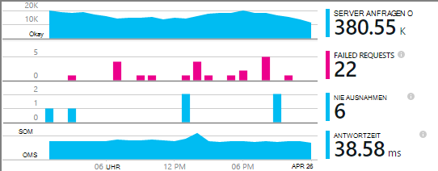

<properties
    pageTitle="MyDriving Azure IoT-Beispiel: Erstellen sie | Microsoft Azure"
    description="Erstellen Sie eine Anwendung, die eine umfassende Demonstration ein Systems IoT Architekten mit Microsoft Azure, einschließlich Stream Analytics, maschinelles lernen und Ereignis-Hubs."
    services=""
    documentationCenter=".net"
    suite=""
    authors="harikmenon"
    manager="douge"/>

<tags
    ms.service="multiple"
    ms.workload="tbd"
    ms.tgt_pltfrm="ibiza"
    ms.devlang="dotnet"
    ms.topic="article"
    ms.date="03/25/2016"
    ms.author="harikm"/>


# <a name="build-and-deploy-the-mydriving-solution-to-your-environment"></a>Erstellen und Bereitstellen der MyDriving Lösung für Ihre Umgebung

MyDriving ist ein Internet der Dinge (IoT) Lösung, die sammelt Daten aus Ihrem Auto, mit Learning Computer verarbeitet und zeigt auf Ihrem Mobiltelefon. Back-End besteht aus einer Reihe von Microsoft Azure bereitgestellten Dienste. Die Clients können Android, iOS und Windows 10 Telefone sein.

Wir erstellten Projektmappe MyDriving Geben Sie eine Jumpstart erstellen eigene IoT-System. Vom [MyDriving Repository auf GitHub](https://github.com/Azure-Samples/MyDriving)erhalten Sie Azure Resource Manager-Skripts Back-End-Architektur in Ihre eigenen Azure-Konto bereitstellen. Ab diesem Zeitpunkt können Sie die verschiedenen Dienste konfigurieren, Abfragen Ihre Daten, und usw. ändern. Sie finden diese Skripts - Code für die app Azure App Service API-Projekt, und – im Repository MyDriving.

Wenn Sie die app noch nicht ausprobiert haben, betrachten Sie [Schritte erhalten](iot-solution-get-started.md).

Es ist eine detaillierte Aufstellung der Architektur [MyDriving Reference Guide](http://aka.ms/mydrivingdocs). Zusammenfassend erstellen gibt es mehrere Stücke, die wir eingerichtet und bis festlegen wie Projekt:

* Eine **Clientanwendung** läuft auf Android, iOS und Windows 10 Telefone. Wir verwenden die Xamarin den Code freigeben auf GitHub unter gespeichert `src/MobileApp`. Die Anwendung führt tatsächlich zwei verschiedene Funktionen:
 * Diese relays Telemetrie Diagnosesysteme (OBD) Gerät und eigene Standortdienst an das System Cloud-Back-End.
 * Es ist eine Benutzeroberfläche, die Benutzer über ihre aufgezeichneten Fahrten Abfragen können.
* **Cloud-Dienst** nimmt die Reise Daten in Echtzeit und verarbeitet. Hauptarbeitsbereich Erstellen dieses Diensts ist, parametrisieren, und eine Vielzahl von Azure Services verbinden. Einige Teile müssen Skripts filtern und die eingehenden Daten verarbeiten. Wir verwenden eine Vorlage Azure-Ressourcen-Manager, um alle Teile konfigurieren.
* **Mobiler Service app** ist der Webdienst hinter der Interface-Abschnitt Gerät app. Seine Hauptaufgabe ist zum Abfragen der Datenbank gespeicherten und verarbeiteten Daten. Der Code befindet sich in GitHub unter `src/MobileAppService`.
* **Visual Studio mit Xamarin** ist unsere. Xamarin, die als Bestandteil von Visual Studio und als eine eigenständige integrierten Entwicklungsumgbung (IDE) vorhanden ist, zum Erstellen von plattformübergreifenden Gerätecode. Um iOS-Code zu erstellen, muss eine Instanz auf einem Computer OS X Xamarin. Falls erforderlich, kann ein Agent verwaltet von Visual Studio ausgeführt werden.
* Gerät Apps **Unit testing** in Xamarin Test Cloud ausgeführt.
* **GitHub** ist das Repository, in dem wir den Code, Skripts und Vorlagen speichern.
* **Visual Studio Team Services** ist ein Clouddienst, mit der fortlaufenden Build und Testen des Web Service und Gerät apps verwalten.
* **HockeyApp** wird verwendet, um Versionen des Codes Geräte verteilen. Es sammelt Absturz und Berichten und Feedback der Benutzer.
* **Visual Studio Application Insights** überwacht den mobilen Webdienst.

Mal sehen, wie wir das einrichten. Beachten Sie, dass viele der Schritte optional sind.

## <a name="sign-up-for-accounts"></a>Melden Sie sich für Konten

-   [Visual Studio Entwickler Essentials](https://www.visualstudio.com/products/visual-studio-dev-essentials-vs.aspx). Dieses kostenlose Programm bietet einfachen Zugriff auf viele Entwickler-Tools und Services, einschließlich Visual Studio, Visual Studio Team Services und Azure. Es gibt Ihnen eine Gutschrift $25 pro Monat auf Azure für 12 Monate. Darüber hinaus Abonnements für Pluralsight Schulung und der Xamarin University. Sie können auch anmelden separat für freien Ebenen von [Azure](https://azure.com) und [Visual Studio Team Services](https://www.visualstudio.com/products/visual-studio-team-services-vs.aspx), diese bieten jedoch keine Azure-Gutschriften.

-   [HockeyApp](https://rink.hockeyapp.net/) (optional) für die Verwaltung von Tests Verteilung von apps und Telemetrie.

-   [Xamarin](https://xamarin.com/) (erforderlich), für die app erstellen und Debuggen ausgeführt und Tests auf [Xamarin Test Cloud](https://xamarin.com/test-cloud)ausgeführt.

-   [GitHub](https://github.com/Azure-Samples/MyDriving/) (optional), kostenlose öffentliche Repositories für eigenen Code erstellen (private Repositories erhalten). Alternativ können Sie in Visual Studio Team Services private Repositories Basisplanes.

-   [Power BI](https://powerbi.microsoft.com/) (optional), umfassende Visualisierung von Daten im gesamten System erstellen.

> [AZURE.NOTE] Sie brauchen kein GitHub-Konto Zugriff auf die MyDriving Code im [Repository GitHub MyDriving](https://github.com/Azure-Samples/MyDriving).

## <a name="install-development-tools"></a>Installieren von Entwicklungstools

Die folgende Einrichtung ist für die vollständige Lösung: ein iOS, Android und Windows 10 Mobile plattformübergreifende Anwendung mit einer Azure back-End.

Als Alternative können Sie Xamarin Studio auf Mac oder Windows mobile apps entwickeln, wenn Sie nicht arbeiten auf der Azure-back-End.

Es ist eine [längere Beschreibung des Setup](https://msdn.microsoft.com/library/mt613162.aspx).

### <a name="windows-development-machine"></a>Windows-Entwicklungscomputer

Zentrale Tool unter Windows ist Visual Studio für die Arbeit mit MyDriving app für Android und Windows die App Service API Projekt und Microservice Extensions.

Xamarin, Git Emulatoren und andere Komponenten sind alle in Visual Studio integriert.

Installieren:

-   [Visual Studio 2015 Xamarin](https://www.visualstudio.com/products/visual-studio-community-vs) (jede Edition kostet Gemeinschaft).

-   [SQLite für universelle Windows-Plattform](https://visualstudiogallery.msdn.microsoft.com/4913e7d5-96c9-4dde-a1a1-69820d615936). Windows 10 Mobile Code erstellen müssen.

-   [Azure SDK für Visual Studio 2015](https://go.microsoft.com/fwlink/?linkid=518003&clcid=0x409). Erhalten Sie im SDK für apps mit Befehlszeilentools zum Verwalten von Azure in Azure ausgeführt.

-   [Azure Service Fabric SDK](http://www.microsoft.com/web/handlers/webpi.ashx?command=getinstallerredirect&appid=MicrosoftAzure-ServiceFabric). [Microservice](../service-fabric/service-fabric-get-started.md) -Erweiterung erstellen müssen.

Stellen Sie außerdem sicher, dass Sie die richtige Visual Studio Extensions. Überprüfen Sie unter **Extras**, **Android, iOS, Xamarin...**angezeigt. Wenn nicht, Bedienfeld öffnen, und wählen Sie **Programme und Funktionen** > **Microsoft** > **Visual Studio 2015** > **Ändern**. Wählen Sie unter **plattformübergreifende Entwicklung** **C\#/.Net (Xamarin)**. Nutzen Sie dort auch überprüfen, ob **Git für Windows** installiert ist.

### <a name="mac-development-machine"></a>Mac-Entwicklungscomputer

Mac (Yosemite oder höher) ist für iOS entwickeln. Obwohl wir Visual Studio mit Windows Xamarin entwickeln und verwalten Sie den Code verwenden, verwendet Xamarin auf einem Mac und iOS Code Signieren einen Agent installiert.


(Alternativ Xamarin Studio direkt auf dem Mac können Sie Cross-Plattform entwickeln.)

Sie brauchen den Mac, wenn iOS als Zielplattform einschließen möchten.

Installieren:

-   [Xamarin Studio für iOS](https://developer.xamarin.com/guides/ios/getting_started/installation/mac/). Sie können auch festlegen, Visual Studio und Xamarin auf einem Mac, die einen Windows-Computer ausgeführt wird. Auf MSDN finden Sie unter [Einrichtung, Installation und Überprüfung für Mac-Benutzer](https://msdn.microsoft.com/library/mt488770.aspx) .

-   [Azure-Entwicklungstools](https://azure.microsoft.com/downloads/) (optional).

Aktivieren Sie Remotebenutzernamen auf dem Mac. **Systemeinstellungen**öffnen > **Freigabe**und wählen Sie dann **Remote Login**.

Beim Öffnen einer iOS-Projekt in Visual Studio unter Windows fordert Xamarin-Plug-In für die ID des Mac Sie

## <a name="fetch-the-github-repository"></a>GitHub Repository abrufen

Rufen Sie eine lokale Kopie des [Repository GitHub MyDriving](https://github.com/Azure-Samples/MyDriving) mithilfe der Schaltfläche **Download ZIP** in GitHub, Visual Studio oder einem anderen Git Client ab.

Extrahieren Sie die Datei in einen Ordner mit einem kurzen Pfadnamen wie C:\\Code.

Alternativ Wunsch mit oder Code beitragen, Klonen Sie das Repository wie folgt:

**Git Clone https://github.com/Azure-Samples/MyDriving.git**

## <a name="get-a-bing-maps-api-key"></a>Ein Bing Maps-API Schlüssel abrufen

[Registrieren Sie sich für ein Bing Maps-API-Schlüssel](https://msdn.microsoft.com/library/ff428642.aspx).

Ersetzen in Zeile 22 müssen `src/MobileApps/MyDriving/MyDriving.Utils/Logger.cs`.


## <a name="build-the-demo-app"></a>Erstellen Sie die demoApp

Öffnen Sie dazu in Visual Studio:

-   src\MobileApps\MyDriving.sln

-   src\MobileAppService\MyDrivingService.sln

-   src\Extensions\ServiceFabric\VINLookUpApplication\VINLookUpApplication.sln

Fordert zu erhalten:

-   Vertrauen Sie einige Projekte potenziell unzuverlässige. Wählen Sie ggf. zu öffnen.

-   Festlegen Sie Entwicklermodus, wenn Sie einen frischen Windows 10 Computer arbeiten.

-   Geben Sie Ihre Anmeldeinformationen Xamarin.

-   Xamarin Mac verbinden Haben Sie einen Mac mit der rechten Maustaste des iOS-Projekts in Visual Studio, und wählen Sie **Entfernen**.

Erstellen Sie die Projektmappe neu.

Haben Sie Probleme beim Erstellen, versuchen Sie Lösungen Eigenarten, die wir gefunden haben:

-   *VINLookupApplication Projekt nicht geladen werden*: sicherstellen, dass das [Azure SDK für Visual Studio 2015](https://go.microsoft.com/fwlink/?linkid=518003&clcid=0x409)installiert.

-   *Service Fabric-Projekt nicht erstellen*: Schnittstelle Projekte zuerst erstellen und sicherstellen, dass der Service Fabric-SDK installiert.

-   *Android nicht erstellen*:

    -   Öffnen Sie **Tools** > **Android** > **Android SDK Manager**, stellen Sie sicher, dass Android 6 (API-23) und SDK-Plattform installiert.

    -   Dieses Verzeichnis löschen und anschließend neu zu erstellen:<br/>
        `%LocalAppData%\Xamarin\zips`

## <a name="get-to-know-the-code"></a>Einführung in den code

In der Lösung finden Sie:

-   Azure Extensions: Service Fabric.

-   Azure HDInsight: Skripts für Reise Daten in Azure.

-   Mobiler Apps: Gerät apps.

-   MobileAppsService/MyDrivingService: Web wieder beenden.

-   Power BI: Die Berichtsdefinition.

-   Skripts:

    -   Ressourcen-Manager: Vorlagen Azure Ressourcen erstellen.

    -   PowerShell: Skripts Ressourcenmanager Vorlagen.

    -   Azure SQL-Datenbank: Debuggen von Datenbanken.

-   SQL-Datenbank: CreateTables: Schemadefinitionen.

-   Azure Stream Analytics: Abfragen, die den eingehenden Datenstrom zu transformieren.

## <a name="run-the-apps-in-development-mode"></a>Die apps im Entwicklungsmodus ausführen

Aktion ausführen apps basierend auf das Gerät, das Sie verwenden:

-  Back-End: Set MyDrivingService als Startprojekt und drücken Sie F5, Back-End-Webdienst auszuführen. Browseransicht API-Auflistung wird geöffnet.

-  Mobile Kunden: [mobiler apps Xamarin entwickelt](https://developer.xamarin.com/guides/cross-platform/deployment,_testing,_and_metrics/debugging_with_xamarin/).
 -  Android: Weitere Informationen finden Sie unter [Android Debuggen in Xamarin](http://developer.xamarin.com/guides/android/deployment,_testing,_and_metrics/debugging_with_xamarin_android/).

 -  iOS: Weitere Informationen finden Sie unter [Debuggen in iOS](http://developer.xamarin.com/guides/ios/deployment,_testing,_and_metrics/debugging_in_xamarin_ios/).

 -  Windows Phone: Weitere Informationen finden Sie unter [Xamarin + Windows Phone](https://developer.xamarin.com/guides/cross-platform/windows/phone/).

## <a name="upload-the-mobile-app-to-hockeyapp"></a>Die app in HockeyApp hochladen

HockeyApp verwaltet die Verteilung Ihrer App Android, iOS und Windows Benutzer testen Benutzer neuer Versionen. Es werden nützliche Berichte, Benutzerfeedback mit Screenshots und Verwendung Metriken erfasst.

[Zunächst hochladen](http://support.hockeyapp.net/kb/app-management-2/how-to-create-a-new-app) Ihrer Anwendung erstellen. Dann melden Sie sich bei [HockeyApp](https://rink.hockeyapp.net) aus Ihrem Entwicklungscomputer. Dashboard Developer klicken Sie auf **Neue Anwendung**und ziehen Sie die erstellten Dateien in das Fenster. (Später automatisieren Sie den Builddienst dazu.)

Jetzt können Sie auf Ihrem Dashboard app.


Wiederholen Sie den Vorgang für jede Plattform, die auf Ihre Anwendung ausgeführt wird. Dann können Sie Folgendes:

-  Verwenden der [app-ID](http://support.hockeyapp.net/kb/app-management-2/how-to-find-the-app-id) aus dem Dashboard Absturzdaten und Feedback von Ihrer Anwendung senden. MyDriving aktualisieren Sie den IDs in src/MobileApps/MyDriving/MyDriving.Utils/Logger.cs.

-  [Einladung Testbenutzer](http://support.hockeyapp.net/kb/app-management-2/how-to-invite-beta-testers). Sie erhalten eine URL Tester Benutzer beschaffen. Sie werden für Ihr Team anmelden, herunterladen und Feedback senden.

-  Möchten Sie eine Beta-Version geöffnet, die Verteilung auf Public festgelegt. Klicken Sie auf **Anwendung verwalten** > **Verteilung** > **herunterladen = öffentliche**. Nun jeder herunterladen und Feedback senden, und sie werden eine Benachrichtigung angezeigt, wenn eine neue Version veröffentlichen. Sie erhalten einige Crash-Berichte von ihnen zu.

    

-  [Link Crash-Berichte mit Visual Studio Team Services](http://support.hockeyapp.net/kb/third-party-bug-trackers-services-and-webhooks/how-to-use-hockeyapp-with-visual-studio-team-services-vsts-or-team-foundation-server-tfs). Klicken Sie auf **Anwendung verwalten** > **Visual Studio Team Services**. HockeyApp kann automatisch Arbeitsaufgaben in Team Services erstellen, Berichte oder wenn Feedback erhalten.

Mehr auf der [Website HockeyApp](https://hockeyapp.net).

## <a name="test-the-mobile-app-on-xamarin-test-cloud"></a>Testen der app Xamarin Test Cloud

[Xamarin Test Cloud](https://developer.xamarin.com/guides/testcloud/introduction-to-test-cloud/) automatisiert UI-Tests auf reale Geräte in der Cloud. Mithilfe von NUnit Framework schreiben Sie Tests, die Ihre Anwendung über die Benutzeroberfläche.

Um Xamarin verwenden, wird [Xamarin.UITests](https://developer.xamarin.com/guides/testcloud/uitest/intro-to-uitest/) SDK in Ihrer Anwendung wie ein NuGet-Paket integrieren. Sie finden es in der demoApp und umfasst beim Erstellen neuer Projekte mit Vorlagen Xamarin.


Ein Beispiel-Projekt ist in der Anwendung im Repository enthalten. Suchen Sie im [MyDriving](https://github.com/Azure-Samples/MyDriving/tree/master/src/MobileAppService)unter [Src](https://github.com/Azure-Samples/MyDriving/tree/master/src)/MobileApps/[MyDriving](https://github.com/Azure-Samples/MyDriving/tree/master/src/MobileApps/MyDriving)/MyDriving.UITests/.

Verwenden Sie Visual Studio Team Services erstellen, ist einfach zu Xamarin UI Komponententests als Teil des Builds ausgeführt.

## <a name="deploy-azure-services"></a>Azure Services bereitstellen

Zum Ausführen einer automatischen Installation von Azure und Services Team Build finden Sie die detaillierte Anleitung im **scripts/README.md**.

Microsoft Azure bietet eine Fülle von verschiedenen Diensten, mit denen Sie Cloudanwendungen erstellen. Obwohl viele einzeln (wie App Service-Web Apps) verwendet werden können, sind sie am besten, wenn sie miteinander verbunden sind, zu ein integriertes System wie in MyDriving verwendet.

Erstellen und Azure Services manuell verbinden kann es jedoch schneller und zuverlässiger Azure verwendet Vorlagen. [Resource Manager](../azure-resource-manager/resource-group-overview.md) automatisiert die Bereitstellung einer Lösung Ressourcen und die Vernetzung.

Sie finden die Vorlage für das MyDriving-System im GitHub Repository unter [Skripts-ARM](https://github.com/Azure-Samples/MyDriving/tree/master/scripts/ARM). Gibt eine umfassende und präzise wie andere Dienste in der Architektur miteinander verbunden sind. All diese ausführlich im [Referenzhandbuch MyDriving](http://aka.ms/mydrivingdocs)erläutert, aber Informationen sehr einfach durch die Dokumentvorlage selbst lesen.

> [AZURE.NOTE] Die meisten Azure Services haben eine Kosten je nach dem Tarif. Wenn Sie neue Azure sind, können Sie [sie kostenlos testen](https://azure.microsoft.com/free/). Wenn Sie bestimmte Komponenten im System MyDriving verwenden möchten, jedoch müssen entfernt werden, um Kosten zu vermeiden. Abschnitt "Voranschlag Betriebskosten" weiter unten in diesem Artikel enthält eine Zusammenfassung der normalen Kosten.

### <a name="edit-the-template"></a>Bearbeiten Sie die Vorlage

Zum Anpassen Ihrer Bereitstellung möglicherweise nicht benötigte Komponenten entfernen oder hinzufügen, zuerst Kopien ein Szenario\_complete.params.json und Szenario\_complete.json, ändern.

Verwenden Sie das Szenario\_complete.params.json Datei verschiedene Standardwerte Service SKU oder Replikationstyp Speicher überschreiben, wie in der folgenden Tabelle beschrieben. Standardwerte auswählen die kostengünstigsten Optionen.

| **Parameter**         | **Beschreibung**                | **Standardwert** |
|--------|---------|-------|
| IoT Hub SKU           | Ebene für Azure IoT Hub-Dienst | F1                |
| Konto-Speichertyp  | Speichertyp Replikation       | Standardmäßige LRS      |
| SQL-Dienst-Ziel | Parallelität Steckplatz Verbrauch   | DW100             |
| Hosting-Plan SKU      | Serviceplan für App-Dienst   | F1                |

In Szenario\_complete.json:

-   "Basisname" Suchen und einen gewünschten Namen ändern.

-   Suchen Sie nach "Erstellen". Jeder dieser Abschnitte wird eine Ressource erstellt.

-   Festlegen Sie SqlServerAdminLogin und SqlServerAdminPassword auf geeignete Werte.

-   Vor dem Löschen eines Abschnitts, das eine Ressource erstellt, überprüfen Sie, ob es Nachfolger hat, seinen Namen in der Datei suchen. Beachten Sie, dass jeder Abschnitt einen Dienst erstellt Kapitel ein *DependsOn* , die abhängigen auflistet.

Hier ist wie die Vorlage konfiguriert. Details sind im [Referenzhandbuch](http://aka.ms/mydrivingdocs).

| **Dienst**                 | **Beschreibung**  
|---|----
| Speicherkonten            | Die Vorlage erstellt drei Konten:                                                                                                                                                                       
|| -Eine SQL-Datenbank, die Stream Analytics aggregierte Telemetrie empfängt und dient als Sicherungsspeicher für Azure App Service-Tabellen, die diese Daten über API-Endpunkte verfügbar machen.                      
|| -Blob Speicher, die sammelt Daten aus einem anderen Stream Analytics-Auftrag von HDInsight verarbeitet werden.                                                                                         
|| -SQL-Datenbank, die Ergebnisse von HDInsight mit Power BI verarbeitet wird.                                                                                                                 
| Azure IoT Hub                     | Wird eine bidirektionale Verbindung mit jedem verbundenen Gerät. MyDriving Lösung wird die app als Feld Gateway Daten an Azure IoT Hub senden. Azure IoT Hub dient dann als Eingabe für Stream Analytics. |
| Azure Event Hubs                   | Eine Ausgabe für einen Stream Analytics-Auftrag, der die Ausgabe Extensions Warteschlangen, die mit Azure Service erstellt werden.                                                                                               
| Azure SQL Datawarehouse          |                                                                                                                                                                                                            
| Stream Analytics-Aufträge | Verbinden Sie Eingänge und Ausgänge mit einer Abfrage verwendet wird, um sowohl Echtzeit- und Verlaufsdaten Daten App Service-APIs, Azure Machine Learning Extensions und Power BI aggregieren.                               
| Arbeitsbereich Computer lernen  | Versuche, R Code und API-Diensts enthält.                                                                                                                                                              
| Azure Data Factory                | Geplante maschinelles lernen Umschulung.                                                                                                                                                                     
| Hosting Service Fabric-plan | Für Extensions.                                                                                                                                                                                            
| App Service ("Mobile App")  | Enthält Mobile Apps API-Projekt, das Endpunkte für die app bereitstellt. Der API-Code muss App-Dienst von Visual Studio bereitgestellt werden.                                                         
| Warnregeln                 | Sendet e-Mail Antworten app Fehler angeben.                                                                                                                                            
| Anwendung Einblicke        | Zum Überwachen der Leistung der App Service-APIs. Sie müssen die Verbindung in Visual Studio.                                                                                          
| Azure-Tresor                   | Speichern Sie das Zertifikat des Web-Cluster.                                                                                                                                                                

### <a name="run-the-template"></a>Ausführen der Vorlage

In **scripts/README.md**werden detaillierte Informationen zum Ausführen der Vorlage.

Diese Dienste im Azure Konto mithilfe des Skripts bereitstellen, führen Sie eine der folgenden:

-   Verwenden Sie PowerShell:

    ```

    cd scripts/PowerShell;
    deploy.ps1 *location* *resourceGroupName*
    ```

 -   *Speicherort* ist der [Azure Speicherort](https://azure.microsoft.com/regions/)wie `North Europe` oder `West US`. Mit `Get-AzureLocation` eine Liste der verfügbaren Speicherorte.

 -   *ResourceGroupName* ist der Name, die zu der Gruppe, die die Ressourcen gehören sollen. Wenn Sie die Ressourcen haben, können Sie sie zusammen durch Löschen dieser Gruppe löschen.

-   DeploymentScripts/Bash/deploy.sh mit Bash ausführen.

-   Öffnen Sie und erstellen Sie die Visual Studio-Projektmappe DeploymentScripts/VS/DeployARM.sln.

Beachten Sie, dass jedes Mal die Vorlage auszuführen, erstellt einen neuen Satz von Ressourcen unter einem anderen Namen. Zum Löschen der Ressourcen zum Portal, und löschen Sie die Ressourcengruppe.

Wenn das Skript aus irgendeinem Grund fehlschlägt, können Sie es erneut ausführen.

Das Skript gibt die Möglichkeit fortlaufenden Integration in Visual Studio Team Services. Wenn ein Team Services-Projekt eingerichtet haben, müssen Sie eine URL: https://yourAccountName.visualstudio.com. Geben Sie die vollständige URL, wenn Sie gefragt werden. Sie geben sie ein neues oder vorhandenes Team Services-Projekt.

## <a name="set-up-build-and-test-definitions-in-visual-studio-team-services"></a>Build einrichten und Testen von Definitionen in Visual Studio Team Services

Wir verwenden Team Services für dieses Projekt für die Erstellung und Funktionen. Ferner Zusammenarbeit unterstützt wie mit Kanban-Vorgang jedoch Überprüfung des Codes mit Aufgaben und Versionskontrolle integriert und gated erstellt. Integriert mit anderen Tools wie GitHub, Xamarin, HockeyApp, und Visual Studio. Jederzeit einfacher wird, kann über die Weboberfläche oder Visual Studio zugreifen.

Die Schritte in den Build und Version Definitionen verwenden verschiedener Plug-In-Dienste auf dem Team Services- [Markt](https://marketplace.visualstudio.com/VSTS). Neben grundlegenden Dienstprogramme Befehlszeilen oder Dateien gibt, die Builds von Xamarin, Android und anderen Anbietern aufrufen und die mit HockeyApp verbunden.


### <a name="build-definitions"></a>Builddefinitionen

Builddefinitionen für die wichtigsten Ziele haben. Wir haben auch Variationen für Feature und Regressionstests. Erhalten:

-   MyDriving.Services (Back-End-Web app für die mobile Anwendung)

-   MyDriving.Xamarin.Android

    -   MyDriving.Xamarin.Android-Funktion

    -   Regression MyDriving.Xamarin.Android

-   MyDriving.Xamarin.iOS

    -   MyDriving.Xamarin.iOS-Funktion

    -   Regression MyDriving.Xamarin.iOS

-   MyDriving.Xamarin.UWP

    -   MyDriving.Xamarin.UWP-Funktion

    -   Regression MyDriving.Xamarin.UWP

Gegebenenfalls die Einzelheiten der Konfiguration finden im Abschnitt 4.7 [MyDriving Reference Guide](http://aka.ms/mydrivingdocs)"Build und Release-Konfiguration." Sie folgen allgemeine Muster. Skript:

1.  Stellt das NuGet-Paket. Wir lassen nicht kompilierten Code im Repository, damit die ersten Schritte jedes Builds erforderliche NuGet-Pakete wiederherstellen.

2.  Wird die Lizenz aktiviert. Build erfolgt in der Cloud so wo wir eine Lizenz - insbesondere für den Builddienst Xamarin - wir haben unsere Lizenz im aktuellen Build Computer aktivieren. Anschließend deaktivieren wir unmittelbar danach, um es auf einem anderen Computer verwendet werden kann.

3.  Erstellt mit den entsprechenden Dienst. Xamarin-Builds für mobile apps verwendet und Visual Studio für den Back-End-Dienst erstellt.

4.  Tests erstellt.

5.  Führt Tests. Wir Tests der mobilen Anwendung im Xamarin Test Cloud.

6.  Das Ergebnis des Builds veröffentlicht in den Ablagespeicherort.

Fortlaufende Integration ist der Auslöser für die wichtigsten Builds fest. Build läuft also jedem Code in master Verzweigung eingecheckt wird.


### <a name="release-definitions"></a>Release-Definitionen

Release-Definitionen werden fast genauso eingerichtet.

Für den Webdienst wird Bereitstellung als Azure Web app eingerichtet:


Und den Auslöser kontinuierliche Bereitstellung. D. h. Eincheckvorgänge gefolgt von einem erfolgreichen Build führt ein Update Web App.


Für mobile apps bringen wir auf HockeyApp:


## <a name="explore-telemetry-by-using-application-insights"></a>Zu erkunden Telemetrie Anwendung Einblicke

[Application Insights](../application-insights/app-insights-overview.md) sammelt Telemetrie über die Leistung und Verwendung von Webdiensten. Application Insights-SDK übermittelt der Ressource Anwendung Einblicke in Azure Telemetrie vom Dienst.

Wechseln Sie zu Application Insights-Ressource, die die Vorlage einrichten. Dort können Sie Diagramme, die die Leistung des [Mobile App Projekt](https://github.com/Azure-Samples/MyDriving/tree/master/src/MobileAppService)durchsuchen. Sie Anfragen und Antwortzeiten, Fehler und Ausnahme ermittelt. Es gibt auch Diagramme Abhängigkeit Reaktionszeiten – d. h. Aufrufe der Datenbank und REST-APIs wie Computer. Wenn Leistungsprobleme vorliegen, werden Sie sehen, welcher Teil des Systems verursacht wird.



Haben Sie einen Webdienst, den manuell einrichten, ist die gleiche Diagramme zu. Klicken Sie auf die Web Service-Blade- **Tools** > **Extensions** > **Hinzufügen**. Wählen Sie **Application Insights**.


Das Feature funktioniert durch das Instrumentieren der Anwendung mit Application Insights-SDK.

Sie können benutzerdefinierte Telemetrie (oder Instrumentieren einer Anwendung, die irgendwo außerhalb Azure ausgeführt wird) durch [Hinzufügen von Application Insights-SDK](../application-insights/app-insights-asp-net.md) zum Zeitpunkt der Entwicklung. Dies ist sinnvoll, Protokoll-Metriken, die die Anwendung insgesamt Meilen oder durchschnittliche Reisedauer Benutzer abhängig. In Visual Studio das Projekt Maustaste und wählen Sie **Application Insights hinzufügen**.


Application Insights werden Warnung e-Mails sieht ungewöhnliche Zahlen Failure-Antworten. Sie können auch eigene Alerts auf verschiedenen Kriterien wie Reaktionszeiten einrichten.

Nur sicher sein, dass der Webdienst ist immer [ausgeführt, Sie können Verfügbarkeitstests](../application-insights/app-insights-monitor-web-app-availability.md)einrichten. Diese Tests ping der Site von verschiedenen Standorten weltweit alle 15 Minuten. Auch erhalten Sie eine e-Mail, wenn es scheint ein Problem.

## <a name="estimate-operational-costs"></a>Geschätzte Kosten

Es ist extrem kostengünstig eine Anwendung wie bei kleinen ausgeführt. Viele Dienste ist freie für Einsteiger Ebenen, sodass Entwicklung und kleine Operation geringen Kosten. Und natürlich Ihre eigenen apps nicht alle Features, die im MyDriving verwenden.

Hier ist eine grobe Schätzung der Kosten der Entwicklung Konfiguration für MyDriving. Wir Beachten Sie einige Alternativen, die wir *nicht* verwenden. Diese Information kann hilfreich sein, wie Ihre eigenen Kostenkalkulation.

Wir übernehmen:

-   Ein Team von mehr als fünf (plus beobachten beteiligten).

-   Ungefähr ein Monat ausgeführt.

-   100 Benutzer mit vier pro Tag.

>[AZURE.NOTE] Wenn Sie neu in Azure, ist ein [kostenloses Konto](https://azure.microsoft.com/free/).

| **Service-Komponente**  | **Notizen** | **Kosten pro Monat** |
|--------|--------|----------------|
| [Visual Studio 2015 Community](https://www.visualstudio.com/products/visual-studio-community-vs) mit [Xamarin](https://visualstudiogallery.msdn.microsoft.com/dcd5b7bd-48f0-4245-80b6-002d22ea6eee) <br/>Plattformübergreifende Entwicklungsumgebung| Visual Studio-Community. (Benötigen Sie [Visual Studio Professional](https://www.visualstudio.com/vs-2015-product-editions) für [Xamarin.Forms](https://xamarin.com/forms)aus einer einzelnen Codebasis plattformübergreifende Design).  | $0   |
| [Azure IoT Hub](https://azure.microsoft.com/pricing/details/iot-hub/) <br/>Bidirektionale Verbindung mit Geräten | 8.000 Nachrichten + 0,5 KB-Meldung frei. | $0             |
| [Stream Analytics](https://azure.microsoft.com/pricing/details/stream-analytics/)  <br/>   Verarbeitung umfangreicher Daten                                                                                                                                                              | Gebühr von $0.031 pro Streaming-Einheiten pro Stunde während aktiviert. Sie wählen die Anzahl der gewünschten Streaming-Einheiten; mehr zu skalieren. | $23            |
| [Computerlernen](https://azure.microsoft.com/documentation/services/machine-learning/)<br/> Adaptive Antworten                                                                                                                                                                              |  $10 pro Arbeitsplatz/Monat. <br/>                                                                                                                                                                                 + 3 Stunden Experiment \* $1 Experiment Stunde. <br/>                                                                                                                                                           + 3,5 Stunden API CPU \* $2 / Produktion CPU Stunde. <br/>                                                                                                                                                          API-CPU-Zeit 5 Minuten täglich Umschulung geht davon aus, wenn diese mit mehr Daten steigen.                   <br/>                                                                                                                                                                     + 2 Minuten pro Tag Zählsystems 400 Besuche pro Tag verarbeiten.  | $20            |
| [App Service](https://azure.microsoft.com/pricing/details/app-service/)  <br/> Host für mobile Back-end                                                                                                                                                                              | Tier-B1 - Produktion webapps. | $56            |
| [Visual Studio Team Services](https://azure.microsoft.com/pricing/details/visual-studio-team-services/)  <br/> Erstellen Sie, Komponententests und releasemanagement; Verwalten | Private Agenten fünf Benutzer.| $0             |
| [Anwendung Einblicke](https://azure.microsoft.com/pricing/details/application-insights/) <br/>Überwachung der Auslastung und Performance der Webdienste und Seiten| Freie Ebene.  | $0             |
| [HockeyApp](http://hockeyapp.net/pricing/) <br/> Verteilung der Beta-apps und Sammlung von Feedback, Verwendung und Absturzdaten                                                                                                                                      | Zwei kostenlose apps für neue Benutzer.<br/> $30 pro Monat danach.  | $0    |
| [Xamarin](https://store.xamarin.com/)<br/> Code in einer einheitlichen Plattform für mehrere Geräte | Kostenlose Testversion. <br/>$25 pro Monat danach.| $0    |
| [SQL-Datenbank](https://azure.microsoft.com/pricing/details/sql-database/) für Azure App| Grundlegende Ebene; Datenbank-Modell. | $5             |
| [Service Fabric](https://azure.microsoft.com/pricing/details/service-fabric/) (optional)  | Führen Sie einen lokalen Cluster. | $0             |
| [Power BI](https://powerbi.microsoft.com/pricing/)<br/> Vielseitige zeigt und Streaming und statische Daten| Kostenlos: 1 GB 10.000 Zeilen pro Stunde, täglich aktualisieren. <br/> $10 pro Benutzer/Monat für [Höhere Grenzen](https://powerbi.microsoft.com/documentation/powerbi-power-bi-pro-content-what-is-it/)mehr Verbindungsoptionen, Zusammenarbeit.    | $0             |
| [Speicher](https://azure.microsoft.com/pricing/details/storage/)   | L (lokal redundant) &lt; 100 G 0,024 $/ GB.  | $3             |
| [Data Factory](https://azure.microsoft.com/pricing/details/data-factory/)                                                                                                                       | 0,60 $ pro Aktivität \* (8-5 bak).| $2             |
| [HDInsight](https://azure.microsoft.com/pricing/details/hdinsight/) <br/>  Bei Bedarf täglich Umschulung cluster   | Drei A3 Knoten $0,32 pro Stunde für 1 Stunde täglich * 31 Tage. | $30            |
| [Ereignis-Hubs](https://azure.microsoft.com/pricing/details/event-hubs/)  | Basic $11 monatlich durchsatzeinheit + $0,028 eindringen. | $11            |
| OBD-dongle  || $12            |
| **Insgesamt**|    | **$157**       |

Weitere Informationen finden Sie unter:

-   Zusammenfassung der [Azure Service-Vorgaben und Grenzwerte](../azure-subscription-service-limits.md#iot-hub-limits)

-   Azure- [Preisrechner](https://azure.microsoft.com/pricing/calculator/)

## <a name="send-us-your-feedback"></a>Senden Sie uns feedback

Da wir MyDriving Jumpstart unterstützen Ihre eigenen Systeme IoT erstellt, möchte es gerne von Ihnen wissen, wie gut funktioniert. Lassen Sie uns wissen Sie, wenn:

-  Probleme oder Probleme ausführen.

-  Gibt eine Erweiterung, die sie für Ihr Szenario machen.

-  Finden Sie bestimmte Bedürfnisse effizienter.

-  Sie haben weitere Vorschläge zur Verbesserung dieser Dokumentation oder MyDriving.

Geben Sie Feedback ein [Problem auf GitHub] Datei oder einen Kommentar unten (En-us Edition).

Wir freuen uns auf Sie!

## <a name="next-steps"></a>Nächste Schritte

Wir empfehlen [MyDriving Reference Guide](http://aka.ms/mydrivingdocs)ist eine umfassende Beschreibung des Entwurfs des Systems und seiner Komponenten.
