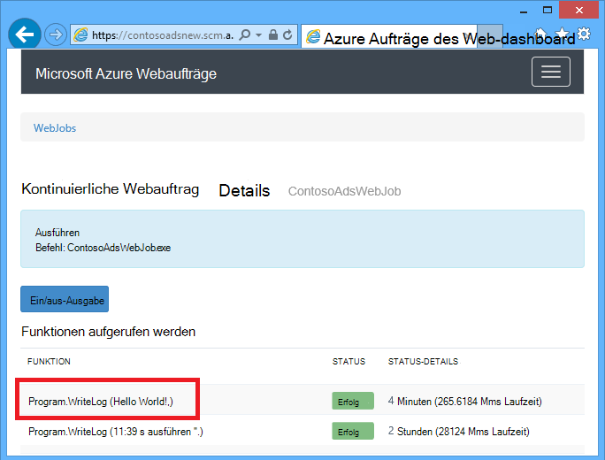
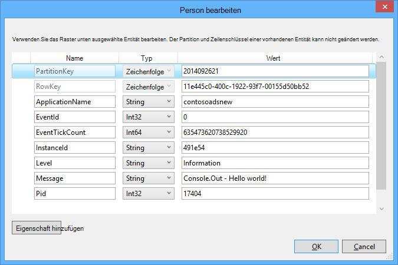

<properties
    pageTitle="Erste Schritte mit Warteschlangenspeicher und Visual Studio verbunden Services (Webauftrags Projekte) | Microsoft Azure"
    description="Einstieg in Azure Warteschlangenspeicher Webauftrags Projekt nach dem Anschließen an ein Speicherkonto mit Visual Studio verbunden services"
    services="storage"
    documentationCenter=""
    authors="TomArcher"
    manager="douge"
    editor=""/>

<tags
    ms.service="storage"
    ms.workload="web"
    ms.tgt_pltfrm="vs-getting-started"
    ms.devlang="na"
    ms.topic="article"
    ms.date="07/18/2016"
    ms.author="tarcher"/>

# Erste Schritte mit Azure Queue Storage und Visual Studio verbunden Services (Webauftrags Projekte)

[AZURE.INCLUDE [storage-try-azure-tools-queues](../../includes/storage-try-azure-tools-queues.md)]

## Übersicht

Dieser Artikel beschreibt, wie Einstieg nach erstellt und auf die Azure Speicherkonto Visual Studio **Verbunden Dienste hinzufügen** im Dialogfeld Azure Queue Storage in einem Visual Studio Azure Webauftrags verwenden. Wenn Sie ein Speicherkonto Webauftrags Projekt über das Dialogfeld Visual Studio **Verbunden Dienste hinzufügen** hinzufügen, die entsprechenden Azure Storage NuGet-Pakete installiert entsprechenden .NET Verweise zum Projekt hinzugefügt und Verbindungszeichenfolgen für das Speicherkonto werden in der Datei App.config.  

Dieser Artikel stellt C# Code-Beispiele, die zeigen, wie Azure Webaufträge SDK Version 1.x mit dem Speicherdienst Azure-Warteschlange.

Azure Queue Storage ist ein Dienst zum Speichern von großen Anzahl von Nachrichten, die von überall auf der Welt über authentifizierte Aufrufe mit HTTP oder HTTPS zugegriffen werden können. Eine einzelne warteschlangennachricht kann bis zu 64 KB und eine Warteschlange enthalten Millionen Nachrichten bis zu insgesamt maximal ein Speicherkonto. Weitere Informationen finden Sie unter [Erste Schritte mit Azure Queue Storage mit .NET](storage-dotnet-how-to-use-queues.md) . Weitere Informationen zu ASP.NET finden Sie unter [ASP.NET](http://www.asp.net).

## Wie eine Funktion ausgelöst wird, wenn eine Warteschlange Nachricht

Um eine Funktion zu schreiben, die WebJobs SDK aufruft, wenn eine Warteschlange Nachricht mithilfe des **QueueTrigger** -Attributs. Der Attributkonstruktor hat einen Zeichenfolgenparameter mit dem Namen der Warteschlange abgefragt. Wie der Name der Warteschlange dynamisch überprüfen Sie, [wie festlegen](#how-to-set-configuration-options).

### Warteschlangennachrichten Zeichenfolge

Im folgenden Beispiel enthält die Warteschlange eine Zeichenfolgennachricht **QueueTrigger** auf einen Parameter namens **LogMessage** enthält den Inhalt der warteschlangennachricht angewendet wird. Die Funktion, [schreibt eine Nachricht wird an das Dashboard](#how-to-write-logs).

        public static void ProcessQueueMessage([QueueTrigger("logqueue")] string logMessage, TextWriter logger)
        {
            logger.WriteLine(logMessage);
        }

Neben **Zeichenfolge**möglicherweise Parameters ein Byte-Array, ein **CloudQueueMessage** -Objekt oder ein POCO definieren.

### POCO [(Plain Old CLR-Objekt](http://en.wikipedia.org/wiki/Plain_Old_CLR_Object)) Nachrichten in die Warteschlange

Im folgenden Beispiel enthält die warteschlangennachricht JSON für ein **BlobInformation** -Objekt enthält eine **BlobName** -Eigenschaft. Das SDK wird automatisch das Objekt deserialisiert.

        public static void WriteLogPOCO([QueueTrigger("logqueue")] BlobInformation blobInfo, TextWriter logger)
        {
            logger.WriteLine("Queue message refers to blob: " + blobInfo.BlobName);
        }

Das SDK verwendet [Newtonsoft.Json NuGet-Paket](http://www.nuget.org/packages/Newtonsoft.Json) zum Serialisieren und Deserialisieren von Nachrichten. Wenn Sie Nachrichten in Warteschlange in einem Programm, das WebJobs SDK nicht erstellen, können Sie Code wie im folgenden Beispiel eine POCO warteschlangennachricht erstellen, die das SDK analysieren kann schreiben.

        BlobInformation blobInfo = new BlobInformation() { BlobName = "log.txt" };
        var queueMessage = new CloudQueueMessage(JsonConvert.SerializeObject(blobInfo));
        logQueue.AddMessage(queueMessage);

### Async-Funktion

Die folgenden asynchronen Funktion [schreibt ein Protokoll zum Dashboard](#how-to-write-logs).

        public async static Task ProcessQueueMessageAsync([QueueTrigger("logqueue")] string logMessage, TextWriter logger)
        {
            await logger.WriteLineAsync(logMessage);
        }

Async-Funktionen können ein [Abbruchtoken](http://www.asp.net/mvc/overview/performance/using-asynchronous-methods-in-aspnet-mvc-4#CancelToken), wie im folgenden Beispiel dargestellt, in dem einen Blob kopiert. (Eine Erläuterung der Platzhalter **QueueTrigger** finden Sie im Abschnitt [Blobs](#how-to-read-and-write-blobs-and-tables-while-processing-a-queue-message) .)

        public async static Task ProcessQueueMessageAsyncCancellationToken(
            [QueueTrigger("blobcopyqueue")] string blobName,
            [Blob("textblobs/{queueTrigger}",FileAccess.Read)] Stream blobInput,
            [Blob("textblobs/{queueTrigger}-new",FileAccess.Write)] Stream blobOutput,
            CancellationToken token)
        {
            await blobInput.CopyToAsync(blobOutput, 4096, token);
        }

## Typen verwendet das QueueTrigger-Attribut

Sie können **QueueTrigger** mit den folgenden Typen:

* **Zeichenfolge**
* Ein POCO als JSON serialisiert
* **Byte]**
* **CloudQueueMessage**

## Abruf-Algorithmus

Das SDK implementiert einen zufälligen exponentiellen Backoff-Algorithmus, um die Wirkung der Leerlauf-Warteschlange Speicherkosten Transaktion abrufen.  Findet eine Nachricht SDK wartet zwei Sekunden und dann auf eine andere Nachricht; Wenn keine Nachricht gefunden wartet ungefähr vier Sekunden vor dem erneuten Versuch. Nachdem nachfolgende Versuche zu einer warteschlangennachricht weiterhin die Wartezeit bis auf die maximale Wartezeit von einer Minute verwendet. [Die maximale Wartezeit ist konfigurierbar](#how-to-set-configuration-options).

## Mehrere Instanzen

Wenn Ihrer Anwendung auf mehrere Instanzen ausgeführt wird, fortlaufende Webaufträge auf jedem Computer ausgeführt wird und jedem Computer warten Sie Trigger und Funktionen ausführen. In einigen Szenarien können einige Funktionen dieselben Daten zweimal Verarbeitung führen also Funktionen Idempotent sein (so geschrieben, dass wiederholt aufgerufen, mit der gleichen Eingabedaten doppelte Ergebnisse nicht).  

## Parallele Ausführung

Haben Sie mehrere Funktionen auf verschiedene Warteschlangen rufen SDK sie parallel gleichzeitig Nachrichten.

Das gilt für eine einzelne Warteschlange mehrere Nachrichten empfangen werden. Das SDK standardmäßig 16 Warteschlange Nachrichten gleichzeitig ruft und führt die Funktion, die sie parallel verarbeitet. [Die Batchgröße ist konfigurierbar](#how-to-set-configuration-options). Wenn die Anzahl verarbeiteten Hälfte die Batchgröße unten, SDK ein anderes und beginnt Nachrichten verarbeiten. Daher ist die maximale Anzahl der pro Funktion verarbeiteten Nachrichten gleichzeitig eine zweieinhalb Mal die Batchgröße. Dieser Grenzwert gilt separat für jede Funktion, die ein **QueueTrigger** -Attribut verfügt. Möchten Sie parallele Ausführung für Nachrichten in einer Warteschlange, die Batchgröße auf 1 festgelegt.

## Warteschlange oder Warteschlange Nachrichtenmetadaten abrufen

Die folgenden Nachrichteneigenschaften erhalten Sie die Methodensignatur Parameter hinzufügen:

* **DateTimeOffset** expirationTime
* **DateTimeOffset** -insertionTime
* **DateTimeOffset** -nextVisibleTime
* **String** QueueTrigger (enthält Meldungstext)
* **Zeichenfolgen** -id
* **String** popReceipt
* **Int** dequeueCount

Wenn Sie direkt mit den Azure-Speicher-API arbeiten möchten, können Sie auch **CloudStorageAccount** Parameter hinzufügen.

Im folgende Beispiel schreibt diese Metadaten in ein Anwendungsprotokoll INFO. Im Beispiel enthalten LogMessage und QueueTrigger den Inhalt der warteschlangennachricht.

        public static void WriteLog([QueueTrigger("logqueue")] string logMessage,
            DateTimeOffset expirationTime,
            DateTimeOffset insertionTime,
            DateTimeOffset nextVisibleTime,
            string id,
            string popReceipt,
            int dequeueCount,
            string queueTrigger,
            CloudStorageAccount cloudStorageAccount,
            TextWriter logger)
        {
            logger.WriteLine(
                "logMessage={0}\n" +
            "expirationTime={1}\ninsertionTime={2}\n" +
                "nextVisibleTime={3}\n" +
                "id={4}\npopReceipt={5}\ndequeueCount={6}\n" +
                "queue endpoint={7} queueTrigger={8}",
                logMessage, expirationTime,
                insertionTime,
                nextVisibleTime, id,
                popReceipt, dequeueCount,
                cloudStorageAccount.QueueEndpoint,
                queueTrigger);
        }

Hier ist ein Beispielprotokoll vom Beispielcode:

        logMessage=Hello world!
        expirationTime=10/14/2014 10:31:04 PM +00:00
        insertionTime=10/7/2014 10:31:04 PM +00:00
        nextVisibleTime=10/7/2014 10:41:23 PM +00:00
        id=262e49cd-26d3-4303-ae88-33baf8796d91
        popReceipt=AgAAAAMAAAAAAAAAfc9H0n/izwE=
        dequeueCount=1
        queue endpoint=https://contosoads.queue.core.windows.net/
        queueTrigger=Hello world!

## Ordnungsgemäßes Herunterfahren

Eine Funktion, die in einem kontinuierlichen Webauftrags akzeptiert **CancellationToken** Parameter ermöglicht das Betriebssystem die Funktion benachrichtigt den Webauftrag wird beendet. Diese Benachrichtigung können Sie sicherstellen, dass die Funktion auf eine Weise, die Daten in einem inkonsistenten Zustand verlassen, unerwartet beendet nicht.

Im folgenden Beispiel wird veranschaulicht, wie Beschäftigungsende bevorstehenden Webauftrags in einer Funktion überprüft.

    public static void GracefulShutdownDemo(
                [QueueTrigger("inputqueue")] string inputText,
                TextWriter logger,
                CancellationToken token)
    {
        for (int i = 0; i < 100; i++)
        {
            if (token.IsCancellationRequested)
            {
                logger.WriteLine("Function was cancelled at iteration {0}", i);
                break;
            }
            Thread.Sleep(1000);
            logger.WriteLine("Normal processing for queue message={0}", inputText);
        }
    }

**Hinweis:** Das Dashboard kann den Status und die Ausgabe der Funktionen, die beendet wurden nicht richtig angezeigt.

Weitere Informationen finden Sie unter [Webaufträge heruntergefahren](http://blog.amitapple.com/post/2014/05/webjobs-graceful-shutdown/#.VCt1GXl0wpR).   

## Erstellen eine warteschlangennachricht beim Verarbeiten einer warteschlangennachricht

Verwenden Sie eine Funktion schreiben, die eine neue warteschlangennachricht erstellt, das **Warteschlange** Attribut. Wie **QueueTrigger**in den Warteschlangennamen als Zeichenfolge übergeben, oder Sie können [den Warteschlangennamen dynamisch festlegen](#how-to-set-configuration-options).

### Warteschlangennachrichten Zeichenfolge

Das folgende Codebeispiel nicht Async erstellt eine neue warteschlangennachricht in der Warteschlange mit dem Namen "Outputqueue" mit denselben Inhalt wie die Warteschlange Meldung in der Warteschlange mit dem Namen "Inputqueue". (Für asynchrone Funktionen verwenden **IAsyncCollector<T> ** siehe weiter unten in diesem Abschnitt.)

        public static void CreateQueueMessage(
            [QueueTrigger("inputqueue")] string queueMessage,
            [Queue("outputqueue")] out string outputQueueMessage )
        {
            outputQueueMessage = queueMessage;
        }

### POCO [(Plain Old CLR-Objekt](http://en.wikipedia.org/wiki/Plain_Old_CLR_Object)) Nachrichten in die Warteschlange

Zum Erstellen einer warteschlangennachricht, die ein POCO anstelle einer Zeichenfolge enthält übergeben Sie POCO-Typ als Ausgabeparameter an **Warteschlange** Attributkonstruktor.

        public static void CreateQueueMessage(
            [QueueTrigger("inputqueue")] BlobInformation blobInfoInput,
            [Queue("outputqueue")] out BlobInformation blobInfoOutput )
        {
            blobInfoOutput = blobInfoInput;
        }

Das SDK wird automatisch Objekt JSON serialisiert. Eine warteschlangennachricht wird immer erstellt, auch wenn das Objekt null ist.

### Erstellen Sie mehrere Nachrichten oder Async-Funktionen

Erstellen Sie mehrere Nachrichten stellen den Parametertyp der Ausgabewarteschlange **ICollector<T> ** oder **IAsyncCollector<T>**, wie im folgenden Beispiel gezeigt.

        public static void CreateQueueMessages(
            [QueueTrigger("inputqueue")] string queueMessage,
            [Queue("outputqueue")] ICollector<string> outputQueueMessage,
            TextWriter logger)
        {
            logger.WriteLine("Creating 2 messages in outputqueue");
            outputQueueMessage.Add(queueMessage + "1");
            outputQueueMessage.Add(queueMessage + "2");
        }

Jede warteschlangennachricht wird erstellt, sobald die **Add** -Methode aufgerufen wird.

### Typen, denen Warteschlange Attribut zusammenarbeitet

**Warteschlange** -Attribut können Sie auf folgende Parameter:

* **Zeichenfolge** (erstellt Message Queue Parameterwert nicht Null ist, wenn die Funktion beendet)
* **Byte]** (funktioniert **wie**)
* **CloudQueueMessage** (funktioniert **wie**)
* **Sie POCO** (ein serialisierbarer Typ erstellt eine Nachricht mit einem null-Objekt ist der Parameter null nach Beendigung der Funktion)
* **ICollector**
* **IAsyncCollector**
* **CloudQueue** (zum manuellen Erstellen von Nachrichten mithilfe der Azure-Speicher-API direkt)

### WebJobs SDK Attribute im Hauptteil einer Funktion

Möchten Sie Ihre Funktion vor Verwendung eines Attributs WebJobs SDK oder **Warteschlange**, **Blob**, **Tabelle**arbeiten, können Sie die **IBinder** -Schnittstelle.

Im folgenden Beispiel wird eine Eingangswarteschlange Nachricht und erstellt eine neue Nachricht mit dem gleichen Inhalt in eine Ausgabewarteschlange. Der Name der Warteschlange wird durch Code im Text der Funktion festgelegt.

        public static void CreateQueueMessage(
            [QueueTrigger("inputqueue")] string queueMessage,
            IBinder binder)
        {
            string outputQueueName = "outputqueue" + DateTime.Now.Month.ToString();
            QueueAttribute queueAttribute = new QueueAttribute(outputQueueName);
            CloudQueue outputQueue = binder.Bind<CloudQueue>(queueAttribute);
            outputQueue.AddMessage(new CloudQueueMessage(queueMessage));
        }

**IBinder** -Schnittstelle kann auch mit **Tabellen-** und **Blob** -Attribute verwendet werden.

## Lesen und Schreiben von Blobs und Tabellen beim Verarbeiten einer warteschlangennachricht

** **BLOB-** und** Attribute ermöglichen das Lesen und Schreiben von Blobs und Tabellen. Die Beispiele in diesem Abschnitt gelten für Blobs. Codebeispiele, die zeigen, wie Prozesse auslösen, wenn Blobs erstellt oder aktualisiert werden, finden Sie unter [Verwenden von Azure BLOB-Speicher Webaufträge SDK](../app-service-web/websites-dotnet-webjobs-sdk-storage-blobs-how-to.md)und Codebeispiele, die lesen und Schreiben von Tabellen finden Sie unter [Azure-Tabellenspeicher Webaufträge SDK verwenden](../app-service-web/websites-dotnet-webjobs-sdk-storage-tables-how-to.md).

### Zeichenfolge Warteschlangennachrichten Blob Vorgänge auslösen

Eine Warteschlange-Nachricht, die eine Zeichenfolge enthält, steht **QueueTrigger** verwendeten **BLOB-** Attribut **BlobPath** -Parameter mit dem Inhalt der Nachricht.

Das folgende Beispiel verwendet zum Lesen und Schreiben von Blobs **Streamobjekte** . Message Queue ist der Name eines Blob im Container Textblobs befindet. Eine Kopie des Blob mit "-new" angefügt der Name wird im selben Container erstellt.

        public static void ProcessQueueMessage(
            [QueueTrigger("blobcopyqueue")] string blobName,
            [Blob("textblobs/{queueTrigger}",FileAccess.Read)] Stream blobInput,
            [Blob("textblobs/{queueTrigger}-new",FileAccess.Write)] Stream blobOutput)
        {
            blobInput.CopyTo(blobOutput, 4096);
        }

**Blob** -Attributkonstruktor verwendet einen **BlobPath** -Parameter, der Container und BLOB-Namen angibt. Weitere Informationen über diese Platzhalter finden Sie unter [Azure BLOB-Speicher Webaufträge SDK verwenden](../app-service-web/websites-dotnet-webjobs-sdk-storage-blobs-how-to.md).

Wenn das Attribut **ein Streamobjekt** wird, gibt einen anderen Konstruktorparameter **FileAccess** Modus als Lese-, Schreib- oder Lese-/Schreibzugriff.

Das folgende Beispiel verwendet ein **CloudBlockBlob** Objekt Blob löschen. Die Message Queue ist der Name des BLOBs.

        public static void DeleteBlob(
            [QueueTrigger("deleteblobqueue")] string blobName,
            [Blob("textblobs/{queueTrigger}")] CloudBlockBlob blobToDelete)
        {
            blobToDelete.Delete();
        }

### POCO [(Plain Old CLR-Objekt](http://en.wikipedia.org/wiki/Plain_Old_CLR_Object)) Nachrichten in die Warteschlange

Ein POCO als JSON in der warteschlangennachricht gespeichert können Sie für Platzhalter, Eigenschaften des Objekts in der **Warteschlange** Attributparameter **BlobPath** . Sie können auch Warteschlangen Metadaten-Eigenschaftennamen als Platzhalter verwenden. Sehen Sie, [Warteschlange oder Warteschlange Nachrichtenmetadaten](#get-queue-or-queue-message-metadata).

Das folgende Beispiel kopiert einen Blob in ein neues Blob mit einer anderen Erweiterung. Die Warteschlange wird ein **BlobInformation** -Objekt, das Eigenschaften **BlobName** und **BlobNameWithoutExtension** enthält. Die Namen werden als Platzhalter im BLOB-Pfad für **Blob** -Attribute verwendet.

        public static void CopyBlobPOCO(
            [QueueTrigger("copyblobqueue")] BlobInformation blobInfo,
            [Blob("textblobs/{BlobName}", FileAccess.Read)] Stream blobInput,
            [Blob("textblobs/{BlobNameWithoutExtension}.txt", FileAccess.Write)] Stream blobOutput)
        {
            blobInput.CopyTo(blobOutput, 4096);
        }

Das SDK verwendet [Newtonsoft.Json NuGet-Paket](http://www.nuget.org/packages/Newtonsoft.Json) zum Serialisieren und Deserialisieren von Nachrichten. Wenn Sie Nachrichten in Warteschlange in einem Programm, das WebJobs SDK nicht erstellen, können Sie Code wie im folgenden Beispiel eine POCO warteschlangennachricht erstellen, die das SDK analysieren kann schreiben.

        BlobInformation blobInfo = new BlobInformation() { BlobName = "boot.log", BlobNameWithoutExtension = "boot" };
        var queueMessage = new CloudQueueMessage(JsonConvert.SerializeObject(blobInfo));
        logQueue.AddMessage(queueMessage);

Benötigen Sie in Ihrer Funktion vor dem Binden eines BLOBs ein Objekt arbeiten, können Sie das Attribut in den Hauptteil der Funktion Siehe [Webaufträge SDK verwenden Attribute im Hauptteil einer Funktion](#use-webjobs-sdk-attributes-in-the-body-of-a-function).

###Die Verwendung des Attributs Blob mit Typen

**Blob** -Attribut kann mit folgenden verwendet werden:

* **Stream** (Lesen Sie oder Schreiben Sie mithilfe des Konstruktorparameters FileAccess angegeben)
* **TextReader**
* **TextWriter**
* **Zeichenfolge** (Lesen)
* **Zeichenfolge** (schreiben, erstellt einen Blob nur, wenn der Parameter nicht Null ist, gibt die Funktion)
* POCO (Lesen)
* Sie POCO (schreiben, immer einen Blob erstellt, wird als null-Objekt erstellt, wenn POCO-Parameter null ist, gibt die Funktion)
* **CloudBlobStream** (Schreiben)
* **ICloudBlob** (Lesen oder Schreiben)
* **CloudBlockBlob** (Lesen oder Schreiben)
* **CloudPageBlob** (Lesen oder Schreiben)

##Unzustellbare Nachrichten behandelt

Nachrichten, deren Inhalt eine Funktion fehlschlagen verursacht, werden *unzustellbare Nachrichten*bezeichnet. Wenn die Funktion fehlschlägt, wird die warteschlangennachricht nicht gelöscht und schließlich wird wieder aufgenommen, verursacht des Zyklus wiederholt werden. Das SDK kann Zyklus automatisch nach einer begrenzten Anzahl von Iterationen unterbrechen oder manuell vornehmen.

### Automatische unzustellbare Nachrichten

Das SDK rufen eine Funktion bis zu 5 Mal eine Warteschlange Nachricht. Fünfte Versuch fehlschlägt, wird die Nachricht unzustellbar Warteschlange verschoben. Finden Sie unter So konfigurieren Sie die maximale Anzahl der Wiederholungsversuche wie [festlegen](#how-to-set-configuration-options).

Gifte Warteschlange lautet *{Originalqueuename}*-Gift. Sie können eine Funktion zum Verarbeiten von Nachrichten aus der Warteschlange Gift zusa¨tzlich oder einer Benachrichtigung, dass manuelle Aufmerksamkeit benötigt schreiben.

Im folgenden Beispiel wird **CopyBlob** schlägt die Funktion fehl, wenn eine warteschlangennachricht den Namen eines Blob, das nicht vorhanden ist. In diesem Fall wird die Nachricht aus der Warteschlange Copyblobqueue Copyblobqueue Poison-Warteschlange verschoben. **ProcessPoisonMessage** meldet die Nachricht.

        public static void CopyBlob(
            [QueueTrigger("copyblobqueue")] string blobName,
            [Blob("textblobs/{queueTrigger}", FileAccess.Read)] Stream blobInput,
            [Blob("textblobs/{queueTrigger}-new", FileAccess.Write)] Stream blobOutput)
        {
            blobInput.CopyTo(blobOutput, 4096);
        }

        public static void ProcessPoisonMessage(
            [QueueTrigger("copyblobqueue-poison")] string blobName, TextWriter logger)
        {
            logger.WriteLine("Failed to copy blob, name=" + blobName);
        }

Die folgende Abbildung zeigt die Konsolenausgabe von Funktionen bei der Verarbeitung einer nicht verarbeitbare Nachricht.

### Manuelle unzustellbare Nachrichten

Wie oft eine Nachricht abgeholt wurde zur Verarbeitung zu erhalten, einen **Int** -Parameter mit dem Namen **DequeueCount** zu Ihrer Funktion hinzufügen. Dann können Sie Dequeue Anzahl in den Code überprüfen und führen eigene Gift Nachrichtenbehandlung einen Schwellenwert überschreitet die Anzahl wie im folgenden Beispiel gezeigt.

        public static void CopyBlob(
            [QueueTrigger("copyblobqueue")] string blobName, int dequeueCount,
            [Blob("textblobs/{queueTrigger}", FileAccess.Read)] Stream blobInput,
            [Blob("textblobs/{queueTrigger}-new", FileAccess.Write)] Stream blobOutput,
            TextWriter logger)
        {
            if (dequeueCount > 3)
            {
                logger.WriteLine("Failed to copy blob, name=" + blobName);
            }
            else
            {
            blobInput.CopyTo(blobOutput, 4096);
            }
        }

## Gewusst wie: Festlegen

Welche **JobHostConfiguration** können Sie die folgenden Konfigurationsoptionen:

* Festlegen Sie die SDK-Verbindungszeichenfolgen im Code.
* Konfigurieren von **QueueTrigger** wie maximale Anzahl entfernen.
* Konfiguration erhalten Sie Namen.

###SDK-Verbindungszeichenfolgen im Code festlegen

SDK-Verbindungszeichenfolgen im Code festlegen können Sie eigene Verbindung Zeichenfolgennamen in Konfigurationsdateien oder Umgebungsvariablen verwenden wie im folgenden Beispiel gezeigt.

        static void Main(string[] args)
        {
            var _storageConn = ConfigurationManager
                .ConnectionStrings["MyStorageConnection"].ConnectionString;

            var _dashboardConn = ConfigurationManager
                .ConnectionStrings["MyDashboardConnection"].ConnectionString;

            var _serviceBusConn = ConfigurationManager
                .ConnectionStrings["MyServiceBusConnection"].ConnectionString;

            JobHostConfiguration config = new JobHostConfiguration();
            config.StorageConnectionString = _storageConn;
            config.DashboardConnectionString = _dashboardConn;
            config.ServiceBusConnectionString = _serviceBusConn;
            JobHost host = new JobHost(config);
            host.RunAndBlock();
        }

### QueueTrigger konfigurieren

Sie können Folgendes konfigurieren, die für die Verarbeitung von Nachrichten Warteschlange gelten:

- Die maximale Anzahl gleichzeitig abgeholt werden parallel auszuführenden Warteschlangennachrichten (Standardwert ist 16).
- Die maximale Anzahl der Wiederholungsversuche vor dem Senden einer warteschlangennachricht unzustellbar Warteschlange (Standard ist 5).
- Die maximale Wartezeit erneut abrufen, wenn eine Warteschlange leer ist (Standardwert ist 1 Minute).

Das folgende Beispiel zeigt, wie diese Einstellungen:

        static void Main(string[] args)
        {
            JobHostConfiguration config = new JobHostConfiguration();
            config.Queues.BatchSize = 8;
            config.Queues.MaxDequeueCount = 4;
            config.Queues.MaxPollingInterval = TimeSpan.FromSeconds(15);
            JobHost host = new JobHost(config);
            host.RunAndBlock();
        }

### Legen Sie Werte für WebJobs SDK Parameter im code

Manchmal soll einen Warteschlangennamen, eine BLOB-Name oder ein Container oder eine Tabelle Namen im Code anstelle der hartcodieren. Sie möchten z. B. den Warteschlangennamen für **QueueTrigger** in Konfigurationsvariable Datei oder Umgebung angeben.

Sie möglich übergeben ein **NameResolver** -Objekt in dem Typ **JobHostConfiguration** . Sie spezielle Platzhalter in Prozentzeichen (%) in WebJobs SDK Parameter und **NameResolver** Code gibt die tatsächliche Werte anstelle diese Platzhalter verwendet werden.

Beispielsweise möchten Sie eine Warteschlange mit dem Namen Logqueuetest im Testmodus und einer benannten Logqueueprod in der Produktion verwenden. Statt eine hartcodierte Warteschlangenname möchten Sie den Namen eines Eintrags im **AppSettings** -Auflistung angeben, die den Namen der aktuellen Warteschlange. Ist der Schlüssel **AppSettings** Logqueue, könnte die Funktion wie im folgenden Beispiel aussehen.

        public static void WriteLog([QueueTrigger("%logqueue%")] string logMessage)
        {
            Console.WriteLine(logMessage);
        }

Die **NameResolver** -Klasse konnte den Namen der Warteschlange von **AppSettings** dann wie im folgenden Beispiel gezeigt:

        public class QueueNameResolver : INameResolver
        {
            public string Resolve(string name)
            {
                return ConfigurationManager.AppSettings[name].ToString();
            }
        }

Sie übergeben die **NameResolver** -Klasse in **JobHost** Objekt wie im folgenden Beispiel gezeigt.

        static void Main(string[] args)
        {
            JobHostConfiguration config = new JobHostConfiguration();
            config.NameResolver = new QueueNameResolver();
            JobHost host = new JobHost(config);
            host.RunAndBlock();
        }

**Hinweis:** Warteschlange, Tabelle und BLOB-Namen werden jeweils eine Funktion aber Containernamen BLOBs werden nur beim Starten der Anwendung aufgelöst aufgelöst. Containernamen Blob kann nicht geändert werden, während der Auftrag ausgeführt wird.

## Wie eine Funktion manuell auslösen

Um eine Funktion manuell auszulösen, verwenden Sie Methode **aufrufen** oder **CallAsync** auf das **JobHost** -Objekt und das **NoAutomaticTrigger** -Attribut auf die Funktion wie im folgenden Beispiel gezeigt.

        public class Program
        {
            static void Main(string[] args)
            {
                JobHost host = new JobHost();
                host.Call(typeof(Program).GetMethod("CreateQueueMessage"), new { value = "Hello world!" });
            }

            [NoAutomaticTrigger]
            public static void CreateQueueMessage(
                TextWriter logger,
                string value,
                [Queue("outputqueue")] out string message)
            {
                message = value;
                logger.WriteLine("Creating queue message: ", message);
            }
        }

## Protokolle schreiben

Das Dashboard zeigt Protokolle an zwei Stellen: die Seite für den Webauftrag und die Seite für einen bestimmten Aufruf Webauftrag.

Ausgabe von Konsole Methoden, die Sie in einer Funktion oder in der Methode **Main()** wird der Dashboard-Seite für den Webauftrag, nicht auf der Seite für einen bestimmten Aufruf. Ausgabe der TextWriter-Objekt, das auf einen Parameter in der Signatur der Methode erhalten der Dashboard-Seite für einen Methodenaufruf wird angezeigt.

Konsole kann nicht an einen bestimmten Aufruf verknüpft werden, ist die Konsole Singlethreaded, während viele Funktionen gleichzeitig ausgeführt werden. Deshalb das SDK enthält jeder Funktionsaufruf mit eigenen eindeutigen Protokoll-Writerobjekt.

Verwenden Sie [Ablaufverfolgungsprotokolle Anwendung](web-sites-dotnet-troubleshoot-visual-studio.md#logsoverview)schreiben **Console.Out** (Protokollen als INFO erstellt) und **Console.Error** (Protokollen als Fehler markiert erstellt). Eine Alternative ist [Trace oder TraceSource](http://blogs.msdn.com/b/mcsuksoldev/archive/2014/09/04/adding-trace-to-azure-web-sites-and-web-jobs.aspx)verwenden Verbose, Warnung und kritisch Ebenen neben Informationen und Fehler. Ablaufverfolgungsprotokolle Anwendung im Web app Protokolldateien Azure Tabellen oder je nach Ihrer Anwendung Azure Konfiguration Azure-blobs. Wie alle Konsolenausgaben, werden die letzten 100 Anwendungsprotokolle auch in der Dashboardseite für Webauftrag nicht auf die Seite für einen Funktionsaufruf.

Ausgabe in der Konsole wird im Dashboard nur, wenn das Programm in einem Webauftrags Azure ausgeführt wird, nicht, wenn die Anwendung lokal ausgeführt wird oder in einer anderen Umgebung.

Dashboard-Verbindungszeichenfolge auf null festlegen, um Protokollierung zu deaktivieren. Weitere Informationen finden Sie unter [festlegen](#how-to-set-configuration-options).

Das folgende Beispiel zeigt verschiedene Protokolle schreiben:

        public static void WriteLog(
            [QueueTrigger("logqueue")] string logMessage,
            TextWriter logger)
        {
            Console.WriteLine("Console.Write - " + logMessage);
            Console.Out.WriteLine("Console.Out - " + logMessage);
            Console.Error.WriteLine("Console.Error - " + logMessage);
            logger.WriteLine("TextWriter - " + logMessage);
        }

Im Dashboard SDK Webaufträge zeigt die Ausgabe **TextWriter** -Objekt Wenn Sie Seite für den Aufruf einer bestimmten Funktion zur und **Ein/aus-Ausgabe**:

Im Dashboard SDK Webaufträge Ausgabe die letzten 100 Zeilen der Konsole anzeigen wenn Sie Seite für den Webauftrag (nicht für den Funktionsaufruf zur) und **Ausgabe umschalten**.

In einem kontinuierlichen Webauftrags werden Anwendungsprotokolle in/Daten Aufträge kontinuierlichen /*{Webjobname}*/job_log.txt im Web app-Dateisystem.

        [09/26/2014 21:01:13 > 491e54: INFO] Console.Write - Hello world!
        [09/26/2014 21:01:13 > 491e54: ERR ] Console.Error - Hello world!
        [09/26/2014 21:01:13 > 491e54: INFO] Console.Out - Hello world!

In einer Azure blob die Anwendung Protokolle aussehen: 2014-09-26T21:01:13,Information,contosoadsnew,491e54,635473620738373502,0,17404,17,Console.Write - Hello World!, 2014-09-26T21:01:13,Error,contosoadsnew,491e54,635473620738373502,0,17404,19,Console.Error - Hello World!, 2014-09-26T21:01:13,Information,contosoadsnew,491e54,635473620738529920,0,17404,17,Console.Out - Hello World!,

Und Azure Tabelle **Console.Out** und **Console.Error** Protokolle wie folgt aussehen:

##Nächste Schritte

Dieser Artikel hat Codebeispiele, die veranschaulichen Standardszenarien bei der Arbeit mit Azure-Warteschlangen. Weitere Informationen zur Verwendung von Azure Webaufträge und WebJobs SDK finden Sie unter [Azure Webaufträge Dokumentationsressourcen](http://go.microsoft.com/fwlink/?linkid=390226).
