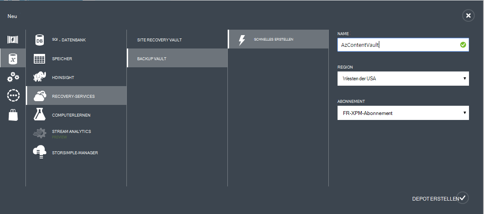

## Erstellen Sie ein Backup Depot
Zum Sichern von Dateien und Daten von Windows Server oder Data Protection Manager (DPM) in Azure oder IaaS VMs in Azure sichern, müssen Sie ein backup Depot in der Region erstellen Daten gespeichert werden soll.

Die folgenden Schritte gehen Sie durch die Erstellung von Vault zum Speichern von Backups.

1. Melden Sie sich im [Verwaltungsportal](https://manage.windowsazure.com/)
2. Klicken Sie auf **neu** > **Data Services** > **Recovery Services** > **Sicherung Depot** und **Schnell**erstellen.

    

3. Geben Sie für den Parameter **Name** einen Anzeigenamen zu backup Depot. Für jedes Abonnement eindeutig sein müssen.

4. Wählen Sie für **den Bereichsparameter** geografische Region für das backup Depot. Die Auswahl bestimmt das geografische Gebiet der backup-Daten an. Wählen Sie eine Region der Nähe, reduzieren Sie die Netzwerkwartezeit Azure sichern.

5. Klicken Sie auf **Vault erstellen** Workflow abgeschlossen. Es dauert eine Weile backup Depot erstellt werden. Überwachen Sie zum Überprüfen des Status die Benachrichtigungen am unteren Rand des Portals.

    

6. Nach dem Erstellen das backup Depot wird eine Meldung angezeigt, dass das Depot erfolgreich erstellt wurde. Das Depot wird auch in den Ressourcen für Recovery-Services als **aktiv**aufgeführt.

    

### Azure Backup - Redundanz Speicheroptionen

>[AZURE.IMPORTANT] Die beste Zeit zum Identifizieren der Speicheroption Redundanz ist direkt nach dem Depot erstellen und Maschinen Depot registriert sind. Sobald ein Depot registriert wurde, Redundanz Speicheroption ist gesperrt und kann nicht geändert werden.

Ihren Bedarf ermitteln Speicherredundanz Azure Backup Back-End-Speicher. Bei Verwendung von Azure als Endpunkt primäre backup-Speicher (z. B. Sichern in Azure aus einem Windows-Server), sollten Sie Geo-Redundant Storage Option auswählen (Standard). Dies gilt unter der Option **Konfigurieren** der Sicherung Vault.

#### Geo-redundanten Speicher (GRS)
GRS verwaltet sechs Kopien Ihrer Daten. Mit GRS Ihre Daten ist dreimal im Bereich für primäre und auch dreimal in einer sekundären Hunderte Meilen von der primären Region auf höchstem Niveau Haltbarkeit repliziert werden. Bei einem Ausfall der primären Region in g gespeichert, sorgt Azure Backup Daten in zwei separaten Bereichen haltbar ist.

#### Lokal redundanten Speicher (LRS)
Lokal redundanter Speicher (LRS) verwaltet drei Datenkopien. LRS wird drei Mal in einer Anlage in einem einzigen Bereich repliziert. LRS schützt Ihre Daten normalen Hardwareausfällen, jedoch nicht von den Ausfall einer ganzen Azure Anlage.

Bei Verwendung von Azure als Endpunkt tertiären backup-Speicher (z.B. verwenden Sie SCDPM, eine lokale Sicherung lokalen & mit Azure für die langfristige Aufbewahrung muss kopieren), sollten Sie die Option **Konfigurieren** der Sicherung Vault lokal redundanter Speicher auswählen. Dies senkt die Kosten zum Speichern von Daten in Azure gleichzeitig geringeren Haltbarkeit für die Daten, die möglicherweise für Dritte Kopien.

