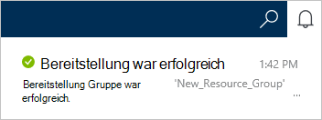

1.  Mit der [Azure-Portal](https://portal.azure.com/)anmelden.
2.  Klicken Sie in der Indexleiste auf **neu**, klicken Sie auf **Daten + Speicher**und klicken Sie auf **DocumentDB (NoSQL)**.

      

3. **Neues Konto** Blatt geben Sie die gewünschte Konfiguration für das DocumentDB-Konto an

    

    - Geben Sie im Feld **ID** einen Namen für das Konto DocumentDB.  Wenn die **ID** überprüft wird, wird ein grünes Häkchen im Feld **ID** angezeigt. Der **ID-** Wert wird der Hostname in der URI. Die **ID** enthalten nur Kleinbuchstaben, Zahlen und '-' Zeichen und muss zwischen 3 und 50 Zeichen lang sein. Beachten Sie, dass dieser *documents.azure.com* gewählte Endpunktnamen angefügt wird das Ergebnis der DocumentDB Konto Endpunkt wird.

    - Wählen Sie im Feld **NoSQL-API-** **DocumentDB**.  

    - Wählen Sie für **Abonnements**des Azure-Abonnements, das Sie für das DocumentDB-Konto verwenden möchten. Wenn Ihr Konto nur ein Abonnement verfügt, wird dieses Konto standardmäßig aktiviert.

    - Wählen Sie in **Ressourcengruppe**oder erstellen Sie eine Ressourcengruppe für Ihr Konto DocumentDB.  Standardmäßig wird eine neue Ressourcengruppe erstellt. Weitere Informationen finden Sie unter [Verwenden des Azure-Portals Azure Ressourcen verwalten](../articles/azure-portal/resource-group-portal.md).

    - Verwenden Sie **Speicherort** an den geografischen Standort, Ihr Konto DocumentDB host. 

4.  Sobald die neuen DocumentDB Optionen konfiguriert sind, klicken Sie auf **Erstellen**. Überprüfen Sie den Status der Bereitstellung überprüfen Sie Benachrichtigungen Hub.  

      

    

5.  Nach der Erstellung des DocumentDB-Kontos ist bereit für die Verwendung mit den Standardeinstellungen. **Sitzung**wird standardmäßig Konsistenz des DocumentDB-Kontos festgelegt.  Sie können die Standard-Konsistenz anpassen **Standard Konsistenz** im ressourcenmenü. Erfahren Sie mehr über die angebotenen DocumentDB Konsistenz Sicherheitsstufen Siehe [Konsistenz in DocumentDB](../articles/documentdb/documentdb-consistency-levels.md).

      

      

[How to: Create a DocumentDB account]: #Howto
[Next steps]: #NextSteps
[documentdb-manage]:../articles/documentdb/documentdb-manage.md
