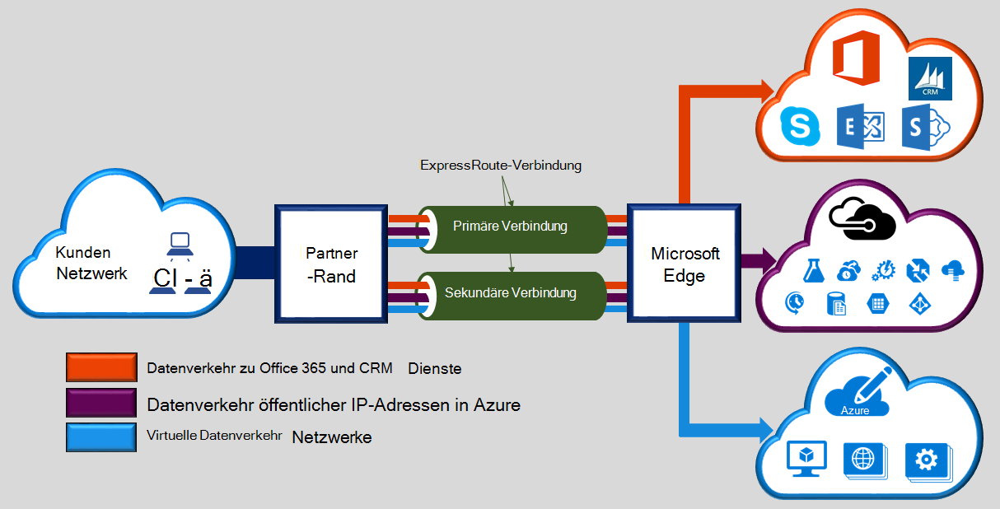

Microsoft Azure ExpressRoute ermöglicht die lokalen Netzwerken in der Cloud von Microsoft über eine dedizierte private Verbindung von einem konnektivitätsanbieter erleichtert. Mit ExpressRoute können Sie die Verbindung mit Microsoft-Cloud-Diensten wie Microsoft Azure, Office 365 und CRM Online herstellen. Verbindung kann eine n: n-Netzwerk (IP VPN), einem Punkt Ethernet-Netzwerk oder virtuellen Cross-Verbindung von einem Konnektivität an einem gemeinsam. ExpressRoute-Verbindung gehen nicht über das öffentliche Internet. Dadurch können ExpressRoute Verbindungen mehr Zuverlässigkeit, höhere Geschwindigkeit niedriger Latenz und höhere Sicherheit als normalen Verbindungen über das Internet anbieten.  

